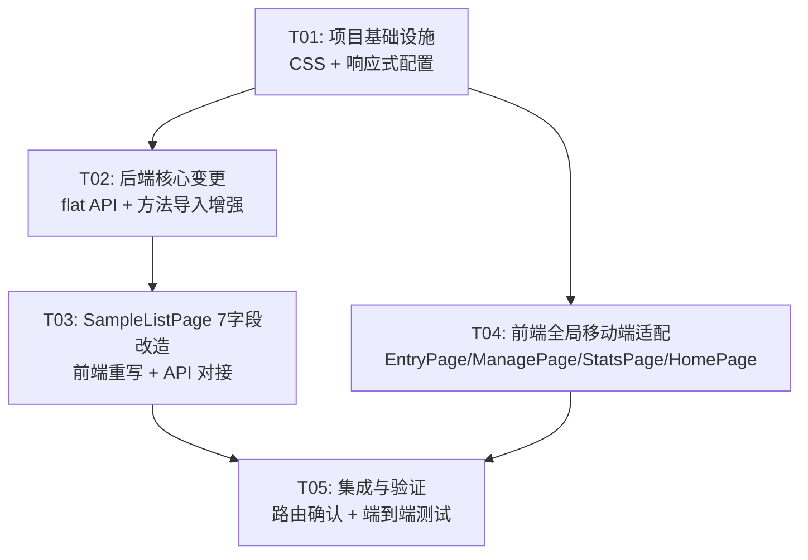

# 工作量统计工具 v0.4.0 — 系统架构设计文档

> **Architect**: Bob | **Date**: 2025-07-03 | **基于 PRD**: v0.4.0-draft2

---

## Part A: 系统设计

### 1. 实现方案

#### 1.1 核心技术挑战

| # | 挑战 | 分析 |
|---|------|------|
| 1 | **方法导入智能识别** | 当前实现依赖 `import_mappings` 表通配符匹配，需新增"中文方法关键词"自动检测逻辑 |
| 2 | **列头类型自动提取** | 列头名去掉"方法"后缀 → 类型名，需自动创建不存在的 `method_types` |
| 3 | **SampleListPage 7字段 JOIN** | `work_records` 仅存 `project_id`，需通过 `projects → project_method_links → methods → method_type_links → method_types` 五表 JOIN 获取方法和类型 |
| 4 | **移动端全页面适配** | 5 个页面需不同程度的响应式改造，核心是表格横向滚动 + 布局切换 |

#### 1.2 框架和库选型

| 层 | 技术 | 版本 | 选型理由 |
|----|------|------|----------|
| 后端 | Rust + Axum | 0.7.9 | 存量，无需变更 |
| Excel 解析 | calamine | 存量 | 已在 `method_handler.rs` 中使用，直接复用 |
| 前端 | React 18 + MUI + TypeScript | 存量 | 存量，MUI 内置响应式断点系统 (`useMediaQuery`) |
| CSS | Tailwind CSS | 存量 | 存量，配合自定义 CSS 实现响应式 |

**无新增第三方依赖**，完全在现有技术栈内实现。

#### 1.3 架构模式

- **后端**: Repository Pattern（handler → repo → DB），保持现有分层
- **前端**: Page-Component 模式 + MUI `sx` prop 响应式
- **响应式策略**: CSS 断点（`max-width: 768px`）+ MUI `useMediaQuery` + Tailwind `sm:`/`md:` 前缀

---

### 2. 文件列表

#### 2.1 新建文件

| 文件路径 | 说明 |
|----------|------|
| （无） | 本次无新建文件 |

#### 2.2 修改文件

**后端 (Rust)**

| 文件路径 | 修改内容 |
|----------|----------|
| `src/api/method_handler.rs` | `method_import` 函数：新增"方法"关键词列头检测 + 类型自动提取逻辑 |
| `src/repo/method_repo.rs` | `batch_import_column_split` 函数：新增自动创建 method_type 逻辑（当前仅关联已存在的类型） |
| `src/repo/record_repo.rs` | 新增 `list_flat` 函数：五表 JOIN 返回扁平化记录列表 |
| `src/api/record_handler.rs` | 新增 `GET /api/records/flat` 路由 + `FlatRecordQuery` 结构体 |
| `src/models/record.rs` | 新增 `FlatRecordResponse` 结构体 |
| `src/api/mod.rs` | （无需修改，record_handler 路由已通过 `merge` 注册） |

**前端 (React + TypeScript)**

| 文件路径 | 修改内容 |
|----------|----------|
| `src/styles/index.css` | 新增移动端全局规则：`body` 防溢出、表格横向滚动、文字换行、安全区域 |
| `src/pages/SampleListPage.tsx` | **重写**：展示 7 字段扁平化记录列表，桌面端全量 + 移动端固定列滚动 |
| `src/pages/EntryPage.tsx` | 移动端适配：多列→单列，提交按钮全宽 |
| `src/pages/ManagePage.tsx` | 移动端适配：三卡片网格→单列堆叠，Dialog 全屏优化 |
| `src/pages/StatsPage.tsx` | 移动端适配：图表自适应，筛选区折叠 Accordion |
| `src/pages/HomePage.tsx` | 移动端适配：卡片堆叠 |
| `src/api/client.ts` | 新增 `getFlatRecords` API 函数 |
| `src/types/index.ts` | 新增 `FlatRecord` 类型定义 |

---

### 3. 数据结构和接口

#### 3.1 后端新增数据结构

```rust
// src/models/record.rs — 新增

/// v0.4.0: 扁平化记录响应（含方法名 + 方法类型名）
#[derive(Debug, Serialize)]
pub struct FlatRecordResponse {
    pub id: i64,
    pub project_id: i64,
    pub project_name: String,      // projects.name
    pub group_name: String,        // project_groups.name
    pub user_name: String,         // work_records.user_name
    pub quantity: i32,
    pub recorded_at: String,       // 录入时间
    pub created_at: String,
    pub deleted_at: Option<String>,
    pub method_name: String,       // methods.name (JOIN via project_method_links)
    pub method_type_name: String,  // method_types.name (JOIN via method_type_links)
}
```

```rust
// src/api/record_handler.rs — 新增查询参数

#[derive(Deserialize)]
pub struct FlatRecordQuery {
    pub page: Option<i64>,
    pub page_size: Option<i64>,
    pub user_name: Option<String>,
    pub group_id: Option<i64>,
    pub start: Option<String>,
    pub end: Option<String>,
    pub include_deleted: Option<bool>,
}
```

#### 3.2 API 契约变更

##### 新增 API: `GET /api/records/flat`

| 项目 | 内容 |
|------|------|
| **Method** | GET |
| **Path** | `/api/records/flat` |
| **Query Params** | `page`(默认1), `page_size`(默认20, 最大500), `user_name`, `group_id`, `start`, `end`, `include_deleted` |
| **Response** | `ApiResponse<PaginatedResponse<FlatRecordResponse>>` |
| **说明** | 返回含 method_name + method_type_name 的扁平化记录列表 |

##### 增强 API: `POST /api/methods/import`

| 项目 | 内容 |
|------|------|
| **增强点** | 列头检测新增"中文方法关键词"规则，优先级高于 `import_mappings` 表匹配 |
| **检测逻辑** | `if header.contains("方法") → method 列，类型 = header.replace("方法", "")` |
| **向后兼容** | 不含"方法"的列头仍走 `import_mappings` 通配符匹配 |
| **Response** | 不变，仍返回 `ApiResponse<ImportSummary>` |

#### 3.3 前端新增类型定义

```typescript
// src/types/index.ts — 新增

export interface FlatRecord {
  id: number;
  project_id: number;
  project_name: string;       // 研发项目
  group_name: string;         // 实验室
  user_name: string;          // 录入人
  quantity: number;           // 数量
  recorded_at: string;        // 录入时间
  created_at: string;
  deleted_at: string | null;
  method_name: string;        // 方法
  method_type_name: string;   // 类型
}
```

---

### 4. 程序调用流程

#### 4.1 方法导入智能识别流程

```
POST /api/methods/import (multipart/form-data)
│
├─ 1. calamine 读取 Excel
│     └─ 获取 headers[] 和 rows[][]
│
├─ 2. 列头分类（新逻辑）
│     for each header in headers:
│       ├─ if header.contains("方法"):           ← P0-2
│       │     type_name = header.replace("方法", "")  ← P0-3
│       │     → 标记为 method 列 (auto_type = type_name)
│       │
│       └─ else:
│             → 走 import_mappings 通配符匹配（原有逻辑）
│
├─ 3. 数据提取
│     for each method 列:
│       for each row:
│         ├─ 方法名去重检查 (methods.name)       ← P0-5
│         │    ├─ 已存在 → 跳过
│         │    └─ 不存在 → INSERT methods
│         ├─ 查/建 method_type (auto_type)       ← P0-3
│         └─ INSERT method_type_links
│
│     for each project_groups/projects 列:
│       → 走 batch_import_column_split 原有逻辑
│
└─ 4. 返回 ImportSummary
```

#### 4.2 扁平化记录查询流程

```
GET /api/records/flat?page=1&page_size=20
│
├─ record_repo::list_flat(pool, query)
│     │
│     ├─ SQL:
│     │   SELECT wr.id, wr.project_id, p.name AS project_name,
│     │          pg.name AS group_name, wr.user_name, wr.quantity,
│     │          wr.recorded_at, wr.created_at, wr.deleted_at,
│     │          COALESCE(m.name, '—') AS method_name,
│     │          COALESCE(mt.name, '—') AS method_type_name
│     │   FROM work_records wr
│     │   JOIN projects p ON wr.project_id = p.id
│     │   JOIN project_groups pg ON p.group_id = pg.id
│     │   LEFT JOIN project_method_links pml ON p.id = pml.project_id
│     │   LEFT JOIN methods m ON pml.method_id = m.id
│     │   LEFT JOIN method_type_links mtl ON m.id = mtl.method_id
│     │   LEFT JOIN method_types mt ON mtl.method_type_id = mt.id
│     │   [WHERE ...] ORDER BY wr.recorded_at DESC
│     │   LIMIT ? OFFSET ?
│     │
│     └─ 返回 (Vec<FlatRecordResponse>, total)
│
└─ record_handler::list_flat()
      └─ 返回 ApiResponse<PaginatedResponse<FlatRecordResponse>>
```

---

### 5. 待明确事项

| # | 问题 | 假设 | 影响 |
|---|------|------|------|
| 1 | **work_records 不存 method_id**：`work_records` 仅存 `project_id`，一个项目可能关联多个方法。通过 `project_method_links` JOIN 时可能产生重复行 | 当前业务中绝大多数项目仅关联 1 个方法（从 EntryPage 代码可见：`const linkedProject = projects.find(p => p.method_ids.includes(method.id))` 取第一个）。SQL 使用 `LEFT JOIN` + `GROUP BY wr.id` + `GROUP_CONCAT` 做去重聚合 | 如果未来一个项目关联多方法的比例增加，需在 `work_records` 上加 `method_id` 字段 |
| 2 | **"方法"关键词仅匹配中文** | 按 PRD 明确要求："仅匹配中文「方法」，英文列头不触发" | 英文 "Method"/"方法" 列头不触发新逻辑 |
| 3 | **SampleListPage 当前展示"送样记录"** | PRD 要求将其改造为展示 "工作量记录"（work_records），但保持路由 `<Route path="/sample/list" element={<SampleListPage />} />` 不变 | 页面语义从"送样记录"变为"记录列表" |
| 4 | **多方法时的展示策略** | 使用 `GROUP_CONCAT(DISTINCT m.name)` 将多个方法名用顿号拼接显示 | 如某项目关联 3 个方法，方法列显示 "方法A、方法B、方法C" |

---

## Part B: 任务分解

### 6. 依赖包列表

**无新增依赖**。所有功能在现有技术栈内实现。

---

### 7. 任务列表

#### T01: 项目基础设施 — 移动端全局 CSS + 响应式配置

| 项 | 内容 |
|----|------|
| **Task ID** | T01 |
| **优先级** | P0 |
| **依赖** | 无 |
| **源文件** | `src/styles/index.css` (修改), `tailwind.config.ts` (修改), `src/main.tsx` (修改) |

**具体工作**：
1. `index.css`：添加 `body { overflow-x: hidden; max-width: 100vw; word-wrap: break-word; }`，补全移动端安全区域、表格横向滚动增强
2. `tailwind.config.ts`：确认 `screens` 断点配置 (`sm: '640px'`, `md: '768px'`)
3. `src/main.tsx`：添加 `<meta name="viewport" content="width=device-width, initial-scale=1.0, maximum-scale=1.0, user-scalable=no">` 的 viewport 配置（确认 index.html 中已存在）

---

#### T02: 后端核心变更 — 扁平化记录 API + 方法导入增强

| 项 | 内容 |
|----|------|
| **Task ID** | T02 |
| **优先级** | P0 |
| **依赖** | T01 |
| **源文件** | `src/models/record.rs` (修改), `src/repo/record_repo.rs` (修改), `src/api/record_handler.rs` (修改), `src/api/method_handler.rs` (修改), `src/repo/method_repo.rs` (修改) |

**具体工作**：
1. **`src/models/record.rs`**：新增 `FlatRecordResponse` 结构体（含 method_name, method_type_name）
2. **`src/repo/record_repo.rs`**：新增 `list_flat` 函数 — 五表 LEFT JOIN + GROUP BY + GROUP_CONCAT 聚合；支持分页、筛选（user_name/group_id/日期范围）
3. **`src/api/record_handler.rs`**：新增 `GET /api/records/flat` 路由和 `FlatRecordQuery` 查询参数；在 `router()` 中注册
4. **`src/api/method_handler.rs`**：`method_import` 函数增强 — 在列头扫描阶段，优先检测 `header.contains("方法")`，提取 `type_name = header.replace("方法", "")`，将列标记为 method 列（auto_type）
5. **`src/repo/method_repo.rs`**：`batch_import_column_split` 增强 — 对于 method 列，当 `method_type` 非空时，自动 `INSERT OR IGNORE INTO method_types` 创建不存在的类型

---

#### T03: 前端 SampleListPage 全面改造 — 7 字段展示 + API 对接

| 项 | 内容 |
|----|------|
| **Task ID** | T03 |
| **优先级** | P0 |
| **依赖** | T02 |
| **源文件** | `src/pages/SampleListPage.tsx` (重写), `src/api/client.ts` (修改), `src/types/index.ts` (修改) |

**具体工作**：
1. **`src/types/index.ts`**：新增 `FlatRecord` 接口
2. **`src/api/client.ts`**：新增 `getFlatRecords(params)` 函数，调用 `GET /api/records/flat`
3. **`src/pages/SampleListPage.tsx`**：整体重写
   - 移除现有样品记录相关逻辑（sample_name, sample_count, unit, batch_no）
   - 替换为工作量记录 7 字段展示逻辑
   - **桌面端 (≥768px)**：标准 7 列表格（录入时间 | 实验室 | 研发项目 | 录入人 | 方法 | 类型 | 数量）
   - **移动端 (<768px)**：前 3 列（时间/实验室/项目）固定在左侧，后 4 列（录入人/方法/类型/数量）在可横向滚动区域
   - 保留筛选功能（按实验室、录入人）
   - 移除编辑/删除操作（该页面仅展示，编辑在 StatsPage `user-log` 标签页完成）
   - 分页保留

---

#### T04: 前端全局移动端适配 — 所有剩余页面响应式优化

| 项 | 内容 |
|----|------|
| **Task ID** | T04 |
| **优先级** | P1 |
| **依赖** | T01 |
| **源文件** | `src/pages/EntryPage.tsx` (修改), `src/pages/ManagePage.tsx` (修改), `src/pages/StatsPage.tsx` (修改), `src/pages/HomePage.tsx` (修改), `src/components/Layout.tsx` (修改) |

**具体工作**：
1. **`EntryPage.tsx`**：`<600px` 时用户/日期输入框多列→单列堆叠；方法行 `MethodRow` 组件内部元素自适应（名称截断、数量输入框固定宽度）
2. **`ManagePage.tsx`**：三卡片网格 `<768px` 时 `gridTemplateColumns: '1fr'`（已部分实现 `xs: '1fr'`）；Dialog 在移动端 `fullScreen`；表格 `overflow-x: auto`
3. **`StatsPage.tsx`**：筛选区在 `<600px` 时折叠为 Accordion；统计卡片 `Grid` 响应式列数；用户录入记录表格横向滚动
4. **`HomePage.tsx`**：入口卡片在窄屏下全宽堆叠（已有 `flexDirection: { xs: 'column', sm: 'row' }`）
5. **`Layout.tsx`**：Container `px` 在移动端减小为 `{ xs: 0.5, sm: 2 }` 节省横向空间

---

#### T05: 集成与验证 — 路由确认 + 端到端测试

| 项 | 内容 |
|----|------|
| **Task ID** | T05 |
| **优先级** | P0 |
| **依赖** | T03, T04 |
| **源文件** | `src/App.tsx` (确认), `src/pages/SampleListPage.tsx` (验证), `src/styles/index.css` (验证) |

**具体工作**：
1. 确认 `App.tsx` 路由配置不变：`/sample/list` → `SampleListPage`，但其行为已改为展示工作量记录
2. Chrome DevTools iPhone 12 模拟器（375×812）验证所有页面无横向溢出
3. 方法导入端到端验证：
   - 准备含"液相方法""气相方法"列的测试 Excel
   - 验证方法正确写入 methods 表
   - 验证 method_types 自动创建
   - 验证 method_type_links 正确建立
   - 重复导入验证去重（P0-5）
4. SampleListPage 验证：确认 7 字段正确显示，移动端前 3 列固定 + 后 4 列滚动

---

### 8. 共享知识

#### 8.1 API 响应格式

```typescript
// 所有 API 响应统一格式
interface ApiResponse<T> {
  code: number;    // 0=成功
  message: string;
  data: T | null;
}

// 分页响应
interface PaginatedResponse<T> {
  items: T[];
  total: number;
  page: number;
  page_size: number;
}
```

#### 8.2 响应式断点

| 断点 | 宽度 | 用途 |
|------|------|------|
| `xs` | <600px | 手机竖屏 — 单列布局 |
| `sm` | 600-768px | 手机横屏/小平板 — 双列 |
| `md` | 768-900px | 平板竖屏 — 表格全量展示 |
| `lg` | ≥900px | 桌面端 |

#### 8.3 移动端 CSS 规则（全局）

```css
/* 移动端防溢出 */
@media (max-width: 767px) {
  body {
    overflow-x: hidden;
    max-width: 100vw;
  }

  * {
    word-wrap: break-word;
    overflow-wrap: break-word;
  }

  .table-responsive {
    width: 100%;
    overflow-x: auto;
    -webkit-overflow-scrolling: touch;
    display: block;
  }

  /* MUI 组件微调 */
  .MuiTableCell-root {
    white-space: nowrap;
  }
}
```

#### 8.4 方法导入列头检测规则（优先级从高到低）

| 优先级 | 规则 | 目标表 | 类型提取 |
|--------|------|--------|----------|
| 1 (最高) | 列头包含中文"方法" | methods | `header.replace("方法", "")` → 自动建 method_type |
| 2 | `import_mappings` 表匹配 (wildcard) | 按配置路由 | 按配置 default_type |
| 3 (兜底) | 未匹配任何规则 | methods | "其他" |

#### 8.5 数据库约定

- 所有时间字段存为 ISO 8601 格式 (`YYYY-MM-DDTHH:mm:ss`)
- `deleted_at` 为 NULL 表示未删除（软删除）
- `method_type_links` 使用 `INSERT OR IGNORE` 防止重复关联

#### 8.6 注意事项

- **SampleListPage 语义变更**：页面路由 `/sample/list` 不变，但展示内容从"送样记录"变为"工作量记录"。如需要保留送样记录查看功能，后续版本可新增路由
- **多方法项目**：SQL 使用 `GROUP_CONCAT(DISTINCT m.name, '、')` 将同一项目的多个方法名拼接显示
- **方法去重**：以 `methods.name` 为准，已存在则跳过（不更新、不覆盖）

---

### 9. 任务依赖图 (Mermaid)



---

> **文档版本**: v1.0 | **下次更新**: 实现过程中如有变更同步更新
