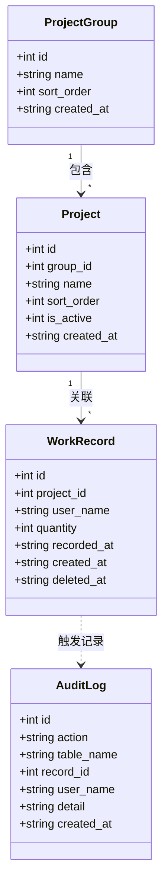
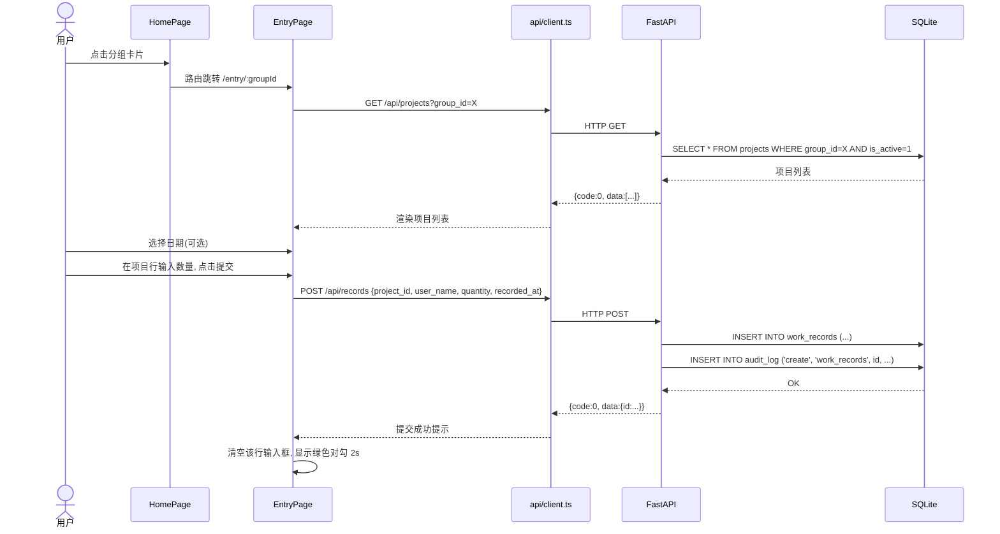
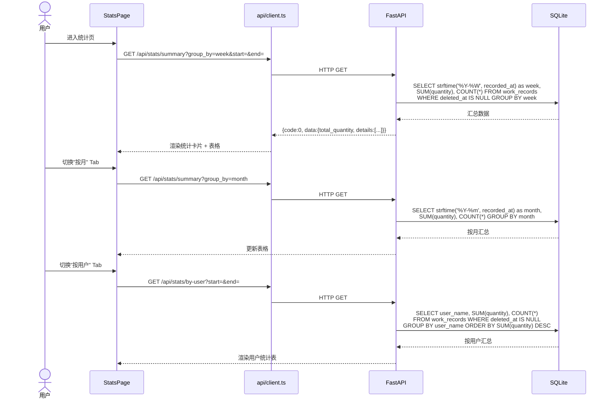
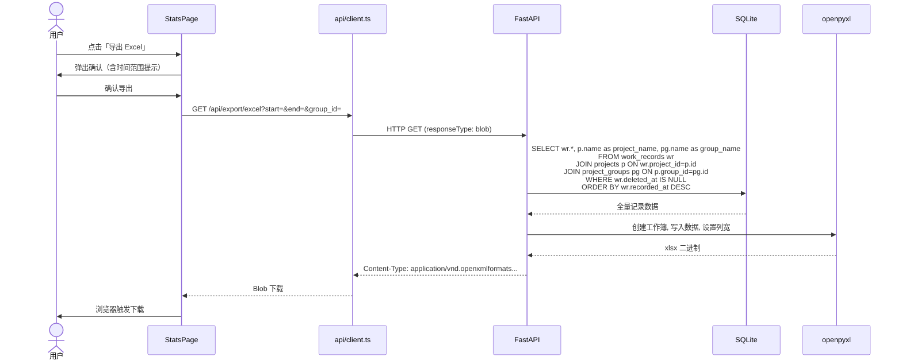
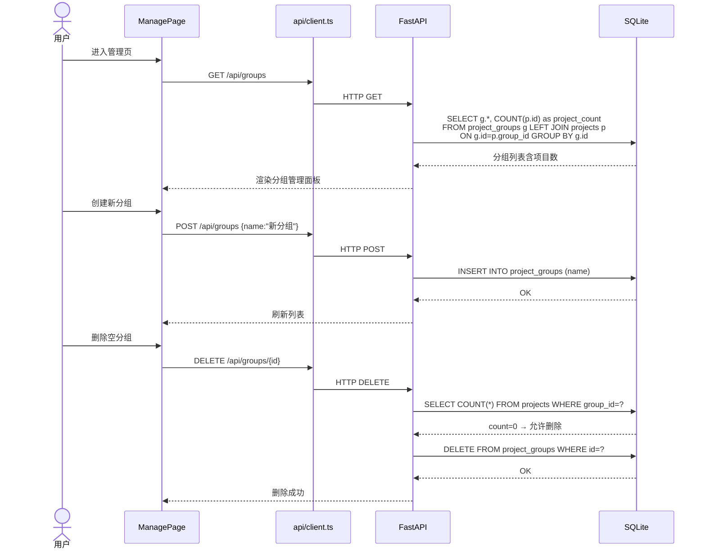
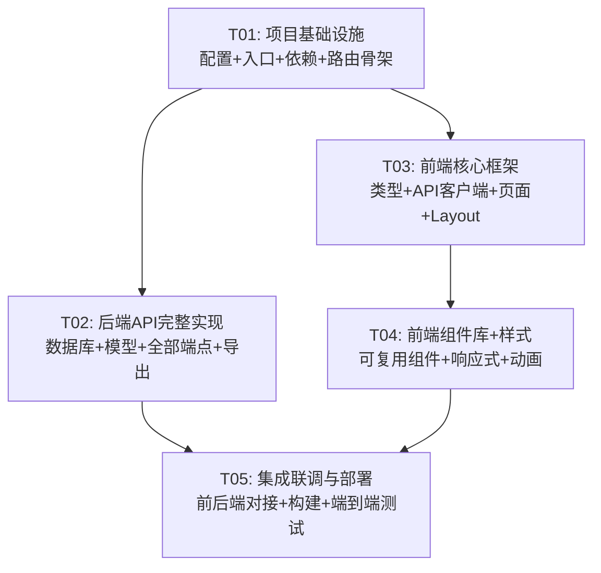

# 工作量统计 Web 应用 — 系统架构设计

> 设计者：Bob（Architect）  
> 日期：2025-07-17  
> 版本：v1.0

---

## Part A: 系统设计

---

### 1. 实现方案 + 框架选型

#### 1.1 核心技术挑战

| 挑战 | 分析 | 对策 |
|------|------|------|
| 即填即走的录入体验 | 每次录入仅需 1~2 次点击，零等待 | 前端 SPA + 项目列表行内提交，API 响应 <50ms |
| 多维度交叉统计 | 按周/月/自定义范围 × 按用户 × 按项目的三维汇总 | 后端 SQL GROUP BY 聚合，前端仅负责展示 |
| SQLite 并发写入 | 10 人偶尔同时写入，SQLite 写锁 | FastAPI 默认单线程可串行化写入，SQLite WAL 模式兜底 |
| 响应式适配 | PC 管理端 + 手机录入端 | 移动优先 + Tailwind 断点 + MUI 组件的响应式内置支持 |
| 单文件部署 | 一条命令启动 | FastAPI 内嵌静态文件服务，Vite 构建产物放 `backend/static/` |

#### 1.2 框架选型

**前端**：

| 层 | 选型 | 版本 | 理由 |
|----|------|------|------|
| 构建工具 | Vite | ^5.x | 快速 HMR，零配置开箱即用 |
| UI 框架 | React | ^18.x | 生态成熟，组件化开发 |
| 组件库 | MUI (Material UI) | ^5.14.x | 内置响应式支持、完善的表单/表格/对话框组件；移动端适配成熟 |
| 样式工具 | Tailwind CSS | ^3.4.x | 原子化 CSS，配合 MUI sx prop 互补 |
| 路由 | React Router | ^6.x | SPA 页面切换 |
| HTTP 客户端 | Axios | ^1.6.x | 拦截器、错误处理、兼容性好 |
| 日期处理 | dayjs | ^1.11.x | 轻量（2KB），足够处理日期格式化/范围计算 |

**后端**：

| 层 | 选型 | 版本 | 理由 |
|----|------|------|------|
| Web 框架 | FastAPI | ^0.104.x | 异步支持、自动生成 OpenAPI 文档、类型安全 |
| ORM | 原生 sqlite3 + 手写 SQL | — | SQLite 查询简单，避免 ORM 开销；SQL 直接可读可调 |
| 数据库 | SQLite | 内置 | 零运维、单文件、WAL 模式提升并发 |
| Excel 导出 | openpyxl | ^3.1.x | 纯 Python、支持样式、社区活跃 |
| 静态文件 | FastAPI StaticFiles | 内置 | 生产环境直接 serve 前端构建产物 |

#### 1.3 架构模式

```
┌─────────────────────────────────────────────────┐
│                    浏览器                         │
│  ┌───────────────────────────────────────────┐  │
│  │         React SPA (Vite build)             │  │
│  │  ┌─────┐ ┌─────┐ ┌──────┐ ┌──────────┐  │  │
│  │  │Home │ │Entry│ │Stats │ │ Manage   │  │  │
│  │  │Page │ │Page │ │Page  │ │ Page     │  │  │
│  │  └──┬──┘ └──┬──┘ └──┬───┘ └────┬─────┘  │  │
│  │     │       │       │          │         │  │
│  │  ┌──┴───────┴───────┴──────────┴──────┐  │  │
│  │  │        API Client (Axios)          │  │  │
│  │  └────────────────┬───────────────────┘  │  │
│  └───────────────────┼───────────────────────┘  │
└──────────────────────┼──────────────────────────┘
                       │ HTTP REST
┌──────────────────────┼──────────────────────────┐
│               FastAPI Server                      │
│  ┌───────────────────┼───────────────────────┐  │
│  │           /api/*  REST API                 │  │
│  │  ┌──────┐ ┌──────┐ ┌──────┐ ┌─────────┐  │  │
│  │  │groups│ │proj. │ │records│ │stats    │  │  │
│  │  └──┬───┘ └──┬───┘ └──┬───┘ └────┬────┘  │  │
│  │     │        │        │          │        │  │
│  │  ┌──┴────────┴────────┴──────────┴─────┐  │  │
│  │  │         sqlite3 (database.py)        │  │  │
│  │  └────────────────┬────────────────────┘  │  │
│  └───────────────────┼───────────────────────┘  │
│                      │                           │
│  ┌───────────────────┼───────────────────────┐  │
│  │  /static/*  (Vite build output)            │  │
│  └───────────────────────────────────────────┘  │
└──────────────────────┼──────────────────────────┘
                       │
              ┌────────┴────────┐
              │  workload.db    │
              │  (SQLite WAL)   │
              └─────────────────┘
```

**架构说明**：
- **开发模式**：Vite dev server (localhost:5173) → 代理 API 请求到 FastAPI (localhost:8000)
- **生产模式**：FastAPI 直接 serve `backend/static/` 下的前端构建产物，单进程运行
- **数据库**：SQLite 文件存于 `backend/data/workload.db`，WAL 模式开启

---

### 2. 文件列表

```
project-root/
│
├── backend/
│   ├── main.py                  # FastAPI 应用入口 + 静态文件 serve + 生命周期
│   ├── database.py              # SQLite 连接管理 + 建表 DDL + WAL 模式配置
│   ├── models.py                # Pydantic 请求/响应模型 (schemas)
│   ├── requirements.txt         # Python 依赖
│   ├── api/
│   │   ├── __init__.py          # APIRouter 聚合
│   │   ├── groups.py            # 项目分组 CRUD + 级联检查
│   │   ├── projects.py          # 项目 CRUD + 按分组筛选
│   │   ├── records.py           # 工作量记录 CRUD + 软删除 + 恢复 + 审计日志
│   │   ├── stats.py             # 多维度统计查询（周/月/自定义/分用户/分项目）
│   │   └── export.py            # Excel 导出（openpyxl）
│   ├── data/                    # 运行时数据目录（自动创建）
│   │   └── workload.db          # SQLite 数据库文件
│   └── static/                  # 前端构建产物（Vite build 输出到此）
│       └── index.html
│
├── frontend/
│   ├── index.html               # Vite 入口 HTML
│   ├── package.json             # Node 依赖 + 脚本
│   ├── vite.config.ts           # Vite 配置（代理 + 构建输出路径）
│   ├── tsconfig.json            # TypeScript 配置
│   ├── tsconfig.node.json       # TS Node 配置
│   ├── tailwind.config.ts       # Tailwind CSS 配置
│   ├── postcss.config.js        # PostCSS 配置
│   ├── src/
│   │   ├── main.tsx             # React 入口 + MUI ThemeProvider
│   │   ├── App.tsx              # 路由配置 + 全局 Layout
│   │   ├── types/
│   │   │   └── index.ts         # 所有 TypeScript 类型定义
│   │   ├── api/
│   │   │   └── client.ts        # Axios 实例 + API 方法封装
│   │   ├── pages/
│   │   │   ├── HomePage.tsx      # 主页：项目分组卡片列表 + 统计入口
│   │   │   ├── EntryPage.tsx     # 录入页：分组下项目列表 + 数量输入 + 一键提交
│   │   │   ├── StatsPage.tsx     # 统计页：周/月/自定义汇总 + 交叉统计表 + 导出按钮
│   │   │   └── ManagePage.tsx    # 管理页：分组管理 + 项目管理 + 回收站
│   │   ├── components/
│   │   │   ├── Layout.tsx        # 全局布局（顶栏 + 底部导航 + 内容区）
│   │   │   ├── GroupCard.tsx     # 分组卡片组件（首页用）
│   │   │   ├── ProjectRow.tsx    # 项目行组件（录入页用，含数量输入 + 提交按钮）
│   │   │   ├── StatsCards.tsx    # 统计卡片组（总数、人均等概要指标）
│   │   │   ├── DateRangePicker.tsx  # 日期范围选择器
│   │   │   └── ConfirmDialog.tsx    # 确认对话框（删除/恢复用）
│   │   └── styles/
│   │       └── index.css         # 全局样式 + Tailwind 指令
│   └── dist/                     # Vite 构建输出（自动生成，复制到 backend/static/）
│
└── docs/
    ├── system_design.md          # 本文档
    ├── class-diagram.mermaid     # 数据模型类图
    └── sequence-diagram.mermaid  # 核心流程时序图
```

---

### 3. 数据结构和接口

#### 3.1 数据库表结构（DDL）

```sql
-- 开启 WAL 模式（在 database.py 中执行）
PRAGMA journal_mode=WAL;
PRAGMA foreign_keys=ON;

CREATE TABLE IF NOT EXISTS project_groups (
    id         INTEGER PRIMARY KEY AUTOINCREMENT,
    name       TEXT    NOT NULL UNIQUE,
    sort_order INTEGER NOT NULL DEFAULT 0,
    created_at DATETIME NOT NULL DEFAULT (datetime('now', 'localtime'))
);

CREATE TABLE IF NOT EXISTS projects (
    id         INTEGER PRIMARY KEY AUTOINCREMENT,
    group_id   INTEGER NOT NULL,
    name       TEXT    NOT NULL,
    sort_order INTEGER NOT NULL DEFAULT 0,
    is_active  INTEGER NOT NULL DEFAULT 1,
    created_at DATETIME NOT NULL DEFAULT (datetime('now', 'localtime')),
    FOREIGN KEY (group_id) REFERENCES project_groups(id)
);

CREATE TABLE IF NOT EXISTS work_records (
    id          INTEGER PRIMARY KEY AUTOINCREMENT,
    project_id  INTEGER  NOT NULL,
    user_name   TEXT     NOT NULL,
    quantity    INTEGER  NOT NULL,
    recorded_at DATETIME NOT NULL,
    created_at  DATETIME NOT NULL DEFAULT (datetime('now', 'localtime')),
    deleted_at  DATETIME NULL,
    FOREIGN KEY (project_id) REFERENCES projects(id)
);

CREATE TABLE IF NOT EXISTS audit_log (
    id         INTEGER PRIMARY KEY AUTOINCREMENT,
    action     TEXT     NOT NULL,
    table_name TEXT     NOT NULL,
    record_id  INTEGER,
    user_name  TEXT     NOT NULL DEFAULT 'system',
    detail     TEXT,
    created_at DATETIME NOT NULL DEFAULT (datetime('now', 'localtime'))
);

CREATE INDEX IF NOT EXISTS idx_projects_group ON projects(group_id);
CREATE INDEX IF NOT EXISTS idx_records_project ON work_records(project_id);
CREATE INDEX IF NOT EXISTS idx_records_date ON work_records(recorded_at);
CREATE INDEX IF NOT EXISTS idx_records_user ON work_records(user_name);
CREATE INDEX IF NOT EXISTS idx_records_deleted ON work_records(deleted_at);
```

#### 3.2 数据模型类图（Mermaid）



#### 3.3 API 接口定义

**通用响应格式**：
```json
{"code": 0, "data": {...}, "message": "ok"}
```
- `code=0` 表示成功，非 0 表示业务错误
- HTTP 状态码始终为 200（业务错误通过 code 区分）

**完整 API 列表**：

| 方法 | 路径 | 说明 | 参数 |
|------|------|------|------|
| **分组管理** |
| GET | `/api/groups` | 获取分组列表 | — |
| POST | `/api/groups` | 创建分组 | `{name, sort_order?}` |
| PUT | `/api/groups/{id}` | 更新分组 | `{name?, sort_order?}` |
| DELETE | `/api/groups/{id}` | 删除分组（检查无项目） | — |
| **项目管理** |
| GET | `/api/projects` | 获取项目列表 | `?group_id=&active_only=true` |
| POST | `/api/projects` | 创建项目 | `{group_id, name, sort_order?}` |
| PUT | `/api/projects/{id}` | 更新项目 | `{name?, sort_order?, is_active?}` |
| DELETE | `/api/projects/{id}` | 删除项目（检查无记录） | — |
| **记录管理** |
| GET | `/api/records` | 查询记录列表 | `?project_id=&user_name=&start=&end=&page=&page_size=&include_deleted=false` |
| POST | `/api/records` | 创建记录 | `{project_id, user_name, quantity, recorded_at}` |
| DELETE | `/api/records/{id}` | 软删除记录 | — |
| POST | `/api/records/{id}/restore` | 恢复软删除记录 | — |
| **统计分析** |
| GET | `/api/stats/summary` | 综合汇总 | `?start=&end=&group_by=week|month|day` |
| GET | `/api/stats/by-user` | 按用户统计 | `?start=&end=` |
| GET | `/api/stats/by-project` | 按项目统计 | `?start=&end=&group_id=` |
| **导出** |
| GET | `/api/export/excel` | 导出 Excel | `?start=&end=&group_id=` |
| **审计** |
| GET | `/api/audit-logs` | 操作日志列表 | `?page=&page_size=` |

#### 3.4 Pydantic 模型定义

```python
# models.py

from pydantic import BaseModel, Field
from typing import Optional
from datetime import datetime

# --- 分组 ---
class GroupCreate(BaseModel):
    name: str = Field(..., min_length=1, max_length=50)
    sort_order: Optional[int] = 0

class GroupUpdate(BaseModel):
    name: Optional[str] = Field(None, min_length=1, max_length=50)
    sort_order: Optional[int] = None

class GroupResponse(BaseModel):
    id: int
    name: str
    sort_order: int
    project_count: int = 0
    created_at: str

# --- 项目 ---
class ProjectCreate(BaseModel):
    group_id: int
    name: str = Field(..., min_length=1, max_length=100)
    sort_order: Optional[int] = 0

class ProjectUpdate(BaseModel):
    name: Optional[str] = Field(None, min_length=1, max_length=100)
    sort_order: Optional[int] = None
    is_active: Optional[int] = None

class ProjectResponse(BaseModel):
    id: int
    group_id: int
    group_name: str = ""
    name: str
    sort_order: int
    is_active: int
    created_at: str

# --- 记录 ---
class RecordCreate(BaseModel):
    project_id: int
    user_name: str = Field(..., min_length=1, max_length=50)
    quantity: int = Field(..., ge=1)
    recorded_at: str  # ISO 8601: "2025-07-17T14:30:00"

class RecordResponse(BaseModel):
    id: int
    project_id: int
    project_name: str = ""
    group_name: str = ""
    user_name: str
    quantity: int
    recorded_at: str
    created_at: str
    deleted_at: Optional[str] = None

# --- 统计 ---
class StatsSummary(BaseModel):
    total_quantity: int
    total_records: int
    user_count: int
    project_count: int
    details: list  # 按 group_by 聚合的明细

class UserStats(BaseModel):
    user_name: str
    total_quantity: int
    record_count: int

class ProjectStats(BaseModel):
    project_id: int
    project_name: str
    group_name: str
    total_quantity: int
    record_count: int

# --- 通用 ---
class ApiResponse(BaseModel):
    code: int = 0
    data: Optional[any] = None
    message: str = "ok"

class PaginatedResponse(BaseModel):
    items: list
    total: int
    page: int
    page_size: int
```

---

### 4. 程序调用流程

#### 4.1 录入流程（Sequence Diagram）



#### 4.2 统计查询流程（Sequence Diagram）



#### 4.3 Excel 导出流程（Sequence Diagram）



#### 4.4 项目分组管理流程（Sequence Diagram）



---

### 5. 待明确事项

| # | 事项 | 当前假设 | 建议 |
|---|------|---------|------|
| A1 | `user_name` 是自由输入还是下拉选择？ | **当前设计为自由输入**（文本框），因为 PRD 要求无登录 | 若后续需要用户管理，可加 `users` 表并在录入时下拉选择 |
| A2 | 回收站中记录保留多久？ | **当前设计为永久保留**（仅标记 deleted_at） | 若需要自动清理，可加定时任务或手动「清空回收站」按钮 |
| A3 | 统计页默认时间范围 | **当前设计：本周**（周一~周日） | 可改为「最近 7 天」或「本月」 |
| A4 | Excel 导出的列顺序和文件名 | **当前设计**：分组 → 项目 → 用户名 → 数量 → 日期 | 暂无定制需求，后续可加模板配置 |
| A5 | 手机端是否需要底部导航栏？ | **当前设计：是**（录入 / 统计 / 管理 三个 Tab） | 若觉得录入页应独占，可改为仅主页 + 录入页 |
| A6 | 同一项目同一用户同一时间戳是否允许重复录入？ | **当前设计：允许**（每次录入独立记录） | 若需去重，可在录入时弹窗提示「该时段已有记录」 |
| A7 | 管理页是否需要权限控制？ | **当前设计：不需要**（无登录，全员可管理） | 若后续需要，可加简单密码或 IP 白名单 |

---

## Part B: 任务分解

---

### 6. 依赖包列表

#### Python（backend/requirements.txt）
```
fastapi==0.104.1
uvicorn[standard]==0.24.0
openpyxl==3.1.2
```

#### Node.js（frontend/package.json）
```
- react@^18.2.0                    # UI 框架
- react-dom@^18.2.0                # React DOM 渲染
- react-router-dom@^6.20.0         # SPA 路由
- @mui/material@^5.14.20           # MUI 组件库
- @mui/icons-material@^5.14.19     # MUI 图标
- @emotion/react@^11.11.1          # MUI 依赖
- @emotion/styled@^11.11.0         # MUI 依赖
- axios@^1.6.2                     # HTTP 客户端
- dayjs@^1.11.10                   # 日期处理
- tailwindcss@^3.4.0               # 原子化 CSS
- autoprefixer@^10.4.16            # Tailwind 依赖
- postcss@^8.4.32                  # Tailwind 依赖
- @types/react@^18.2.43            # React TS 类型
- @types/react-dom@^18.2.17        # ReactDOM TS 类型
- typescript@^5.3.3                # TypeScript
- vite@^5.0.8                      # 构建工具
- @vitejs/plugin-react@^4.2.1      # Vite React 插件
```

---

### 7. 任务列表（按依赖排序）

#### T01: 项目基础设施（P0）
**说明**：搭建前后端项目骨架，包含所有配置文件、入口文件、占位组件、路由框架。

**源文件**：
- `frontend/package.json` — 依赖声明
- `frontend/vite.config.ts` — Vite 配置（含 API 代理）
- `frontend/tailwind.config.ts` — Tailwind 配置（含 MUI 兼容）
- `frontend/postcss.config.js` — PostCSS 配置
- `frontend/tsconfig.json` — TypeScript 配置
- `frontend/tsconfig.node.json` — TS Node 配置
- `frontend/index.html` — 入口 HTML（移动端 viewport meta）
- `frontend/src/main.tsx` — React 入口（MUI ThemeProvider + CssBaseline）
- `frontend/src/App.tsx` — 路由骨架（/ /entry/:groupId /stats /manage）
- `frontend/src/styles/index.css` — Tailwind 指令 + 全局基础样式
- `backend/requirements.txt` — Python 依赖
- `backend/main.py` — FastAPI 应用骨架（CORS、路由注册、静态文件预留）
- `backend/database.py` — SQLite 连接管理 + 建表 DDL + WAL 模式

**依赖**：无  
**产出验收**：`npm run dev` 启动前端（空白页面，路由可切换）；`python main.py` 启动后端（/docs 可见 Swagger UI）

---

#### T02: 后端 API 完整实现（P0）
**说明**：实现全部后端 API 端点：分组管理、项目管理、记录管理（含软删除+审计日志）、统计分析、Excel 导出。

**源文件**：
- `backend/models.py` — 所有 Pydantic 请求/响应模型
- `backend/api/__init__.py` — APIRouter 聚合注册
- `backend/api/groups.py` — 分组 CRUD（含级联项目数统计、删除前检查）
- `backend/api/projects.py` — 项目 CRUD（含按分组筛选、启用/停用、删除前检查）
- `backend/api/records.py` — 记录 CRUD（含分页查询、软删除、恢复、审计日志写入）
- `backend/api/stats.py` — 多维度统计（按周/按月/按日汇总、按用户/按项目交叉统计）
- `backend/api/export.py` — Excel 导出（openpyxl 生成 xlsx，流式返回）

**依赖**：T01（需要 main.py 和 database.py 就绪）  
**产出验收**：
- Swagger UI 可测试全部 API
- 分组 CRUD 正确（删除非空分组返回错误）
- 录入记录后审计日志自动写入
- 统计接口返回正确汇总数据
- `GET /api/export/excel` 下载有效 xlsx 文件

---

#### T03: 前端核心框架（P0）
**说明**：实现类型定义、API 客户端封装、全局 Layout 组件、四个页面组件的完整业务逻辑。

**源文件**：
- `frontend/src/types/index.ts` — 所有 TS 接口/类型（与后端 Pydantic 模型对应）
- `frontend/src/api/client.ts` — Axios 实例（baseURL、拦截器、全部 API 方法封装）
- `frontend/src/components/Layout.tsx` — 全局布局（AppBar + 底部导航 + 内容区 + 响应式抽屉）
- `frontend/src/pages/HomePage.tsx` — 主页（分组卡片网格、项目计数、点击进入录入、底部统计入口按钮）
- `frontend/src/pages/EntryPage.tsx` — 录入页（日期选择器、项目列表+数量输入+行内提交、用户名输入、提交反馈动画）
- `frontend/src/pages/StatsPage.tsx` — 统计页（Tab 切换：按周/按月/按用户/按项目、概要卡片、数据表格、导出按钮）
- `frontend/src/pages/ManagePage.tsx` — 管理页（分组管理面板 + 项目管理面板 + 回收站列表 + 恢复操作）

**依赖**：T01（路由和基础框架就绪）、T02 可并行但集成测试需 T02  
**产出验收**：
- 四页面均可正常渲染，路由切换流畅
- 录入页可正常录入记录（需 T02 后端就绪）
- 统计页 Tab 切换正常，数据正确展示
- 管理页分组/项目增删改正常

---

#### T04: 前端 UI 组件库 + 响应式样式（P1）
**说明**：实现全部可复用业务组件，完善移动端响应式布局和交互动效。

**源文件**：
- `frontend/src/components/GroupCard.tsx` — 分组卡片（MUI Card + 项目数徽章 + 悬浮动效 + 点击涟漪）
- `frontend/src/components/ProjectRow.tsx` — 项目行（项目名 + 数量输入 + 提交按钮 + 加载状态 + 成功动画）
- `frontend/src/components/StatsCards.tsx` — 统计卡片组（总数/人均/项目数，响应式网格 1~4 列）
- `frontend/src/components/DateRangePicker.tsx` — 日期范围选择器（快捷选项：本周/本月/上月 + 自定义）
- `frontend/src/components/ConfirmDialog.tsx` — 确认对话框（统一风格，用于删除/恢复确认）
- `frontend/src/styles/index.css` — 完善全局样式（响应式断点工具类、表单样式、滚动条美化、过渡动画）

**依赖**：T03（需要页面组件和类型定义就绪）  
**产出验收**：
- 所有组件在 375px ~ 1440px 宽度下表现正常
- 录入行提交后绿色对勾动画流畅
- 删除操作弹出确认对话框
- 日期选择器快捷选项正常工作

---

#### T05: 集成联调与部署（P1）
**说明**：前后端完整对接、生产构建配置、单命令启动脚本、端到端测试所有用户故事。

**源文件**（修改）：
- `frontend/vite.config.ts` — 确认 API 代理配置正确
- `frontend/src/App.tsx` — 最终路由确认、404 处理、错误边界
- `backend/main.py` — 静态文件 serve 配置、生产模式启动逻辑
- `backend/database.py` — 确认 WAL 模式、外键约束已开启
- 新增 `backend/run.sh` / `run.bat` — 一键启动脚本（可选）

**依赖**：T02 + T03 + T04（所有功能模块就绪）  
**产出验收**：
- `python main.py` 启动后浏览器访问可正常使用全部功能
- US1~US5 全部用户故事可通过
- 手机端（Chrome DevTools 模拟）操作流畅
- Excel 导出文件可用 Excel/WPS 正常打开
- SQLite WAL 模式确认开启（`PRAGMA journal_mode` 返回 `wal`）

---

### 8. 共享知识

#### 8.1 API 约定
- **响应格式**：所有 API 统一返回 `{"code": 0, "data": ..., "message": "ok"}`
- **成功**：`code=0`，`data` 包含业务数据
- **业务错误**：`code>0`，`message` 描述错误原因（如 "分组不存在"、"该分组下还有项目，无法删除"）
- **HTTP 状态码**：始终 200（业务错误不通过 HTTP 状态码区分）
- **分页参数**：`page` 从 1 开始，`page_size` 默认 50
- **空值处理**：`None`/`null` 字段在 JSON 中省略（不传 `"field": null`）

#### 8.2 日期时间约定
- **API 传输格式**：ISO 8601 字符串 `"2025-07-17T14:30:00"`
- **数据库存储**：SQLite DATETIME 类型，存储为 `"2025-07-17 14:30:00"`（无时区，本地时间）
- **前端展示**：使用 dayjs 格式化，按用户本地时区显示
- **周的定义**：周一 ~ 周日（ISO week）

#### 8.3 命名规范
- **文件命名**：PascalCase（组件）、camelCase（工具函数）、kebab-case（配置文件）
- **API 路径**：kebab-case（`/api/audit-logs`）
- **数据库表名/字段**：snake_case
- **TypeScript 类型**：PascalCase（`interface WorkRecord`）
- **Python 类**：PascalCase（`class RecordCreate`）
- **Python 函数/变量**：snake_case（`def get_db()`）

#### 8.4 前端约定
- **状态管理**：无需全局状态库，每个页面通过 `useState` + `useEffect` + API 调用自行管理数据
- **错误处理**：Axios 响应拦截器统一处理网络错误，业务错误在各页面内 `code !== 0` 分支处理
- **MUI 与 Tailwind 协作**：布局/间距优先用 Tailwind 原子类，复杂交互组件（Dialog、Table、Tabs）用 MUI 组件 + sx prop
- **移动端断点**：sm=640px, md=768px（主要分界点）, lg=1024px

#### 8.5 后端约定
- **数据库连接**：每个请求通过 FastAPI 依赖注入获取连接，请求结束自动关闭
- **SQL 注入防护**：全部使用参数化查询（`?` 占位符），绝不拼接 SQL 字符串
- **审计日志**：每次 create/delete/restore 操作自动写入 `audit_log` 表
- **软删除**：删除记录时不物理删除，仅设置 `deleted_at`；查询默认过滤 `deleted_at IS NULL`；统计不包括已删除记录

#### 8.6 部署约定
- **数据库位置**：`backend/data/workload.db`（首次启动自动创建目录和文件）
- **前端构建**：`cd frontend && npm run build` 输出到 `frontend/dist/`，手动复制到 `backend/static/`
- **一键构建脚本**（后续可加）：自动执行前端构建 + 复制 + 启动后端

---

### 9. 任务依赖图



**并行化建议**：
- T02 和 T03 可并行开发（后端开发者做 T02，前端开发者做 T03）
- T04 在 T03 完成后开始
- T05 在所有模块完成后进行集成

---

## 附录：PRD 需求覆盖矩阵

| PRD 需求 | 对应模块 | 任务 |
|----------|---------|------|
| US1 成员快速录入 | EntryPage + POST /api/records | T03, T02 |
| US2 组长查看周/月汇总 | StatsPage + GET /api/stats/summary | T03, T02 |
| US3 导出 Excel | StatsPage 导出按钮 + GET /api/export/excel | T03, T02, T05 |
| US4 按时间段+项目筛选 | StatsPage DateRangePicker + API 参数 | T04, T03 |
| US5 手机端适配 | Layout + Tailwind 响应式 + MUI 断点 | T03, T04 |
| Q2 项目管理 | ManagePage + /api/groups + /api/projects | T03, T02 |
| Q3 回收站+审计日志 | ManagePage 回收站 + audit_log 表 | T02, T03 |
| Q7 完整时间戳 | recorded_at DATETIME 字段 | T01, T02 |
