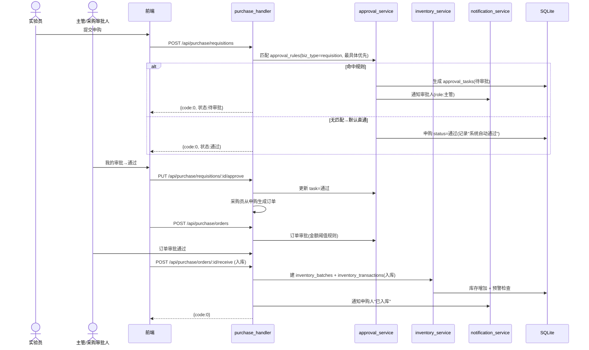
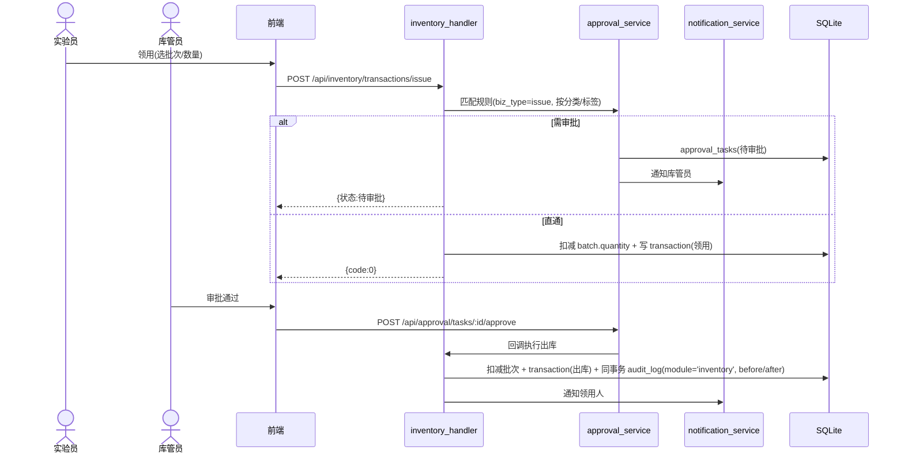
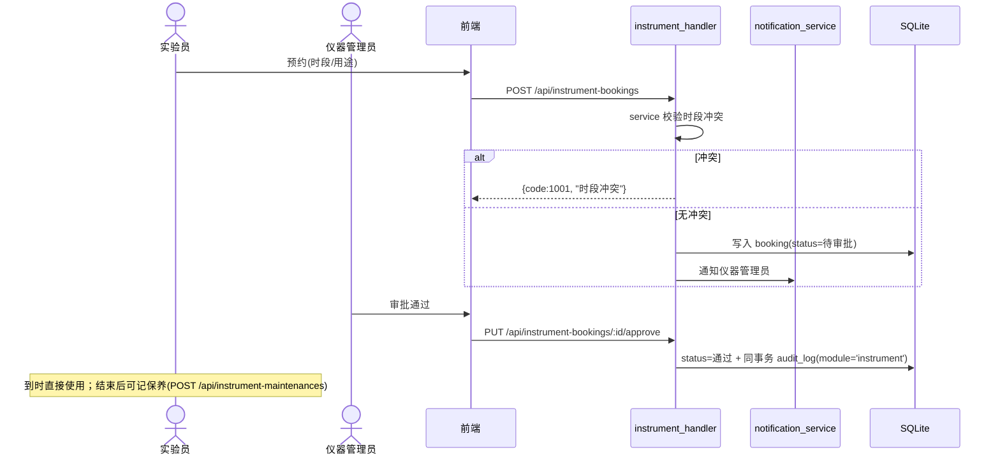

# 本地化 LIMS（路线 C · 混合本地 LIMS）架构设计与任务分解

> 文档版本：v0.1（SOP 第二阶段交付）
> 作者：架构师 高见远（software-architect）
> 日期：2026-07-08
> 基线：本地化LIMS_PRD.md + iLab功能梳理报告.md + v0.4.20 源码只读分析
> 技术栈：Rust + Axum 0.7 / React 18 + Vite 5 + MUI 5 + Tailwind 3 / SQLite（rusqlite 0.31 bundled + r2d2 + WAL）
> **设计原则**：增量开发；沿用既有 `.merge()` 平铺路由、handler/service/repo 分层、`ApiResponse` 统一响应（HTTP 200）。除已确认的 4 项改造（JWT 鉴权、WORM 审计、module 修正、前端登录改造）外，新增文件为主，既有文件仅最小化修改。

---

## 1. 实现方案与框架选型

### 1.1 总体架构（沿用 + 新增）

```
浏览器(React SPA)  ──HTTPS/HTTP(localhost)──▶  Axum 0.7 (workload-tool v0.4.21)
  axios + Bearer JWT                              │
                                                  ├─ 现有模块: groups/projects/methods/records/rd-records/stats/export/audit/articles/backup(不动)
                                                  ├─ 新增模块: auth/JWT中间件 + users/roles/role_permissions(RBAC)
                                                  │            instruments / inventory / purchase / approval / notifications
                                                  └─ SQLite (data/workload.db, WAL, r2d2 连接池)
                                                      每个写操作: conn.transaction() 内 业务SQL + audit_log 同事务(append-only + WORM触发器)
```

### 1.2 关键技术选型与依据

| 关注点 | 选型 | 版本 | 理由 |
|--------|------|------|------|
| Web 框架 | Axum 0.7 | 沿用 | 已有平铺 `.merge()` 路由风格，零改造接入 |
| 数据库 | SQLite + r2d2 + WAL | 沿用 | 单机离线、零依赖；沿用 `db::init_pool` |
| **JWT 鉴权** | `jsonwebtoken` | `9` | 无状态、易离线、前端 localStorage 易存；HS256 |
| **密码哈希** | `argon2` (Argon2id) | `0.5` | 抗暴力破解；替换明文 `admin/admin123`；`password_hash` 入 `users` 表 |
| **二维码** | `qrcode` | `0.12` | 生成仪器二维码；PNG 渲染复用既有 `image` crate（已依赖），存 `data/docs/instruments/{id}.png` |
| **WORM 审计** | SQLite `BEFORE UPDATE/DELETE` 触发器 + `RAISE(ABORT)` | 原生 | 物理只增，应用层禁止 UPDATE/DELETE；零额外依赖 |
| 输入校验 | `validator` | `0.18` | 已依赖；用于登录/表单 DTO 校验 |
| 前端 | React18+Vite5+MUI5+Tailwind3 | 沿用 | 沿用 `api/client.ts` 与 BrowserRouter |
| 前端 token 拦截 | `axios` 拦截器 | 沿用 | 请求注入 `Authorization: Bearer`，响应 401/403 清 token 跳登录 |

**JWT 密钥存储（默认方案）**：首启若 `data/.jwt_secret` 不存在，则生成 32 字节随机串写入该文件（Unix 下 `chmod 600`）；`config.toml` 的 `[auth] jwt_secret` 可覆盖。HS256 签名。详见第 9 节待明确。

**WORM 实现方式**：在 `db/migrations.rs` 的 `run()` 末尾（在所有回填 SQL 之后）创建两个触发器，对 `audit_log` 的 `UPDATE/DELETE` 一律 `RAISE(ABORT, 'WORM: audit_log is append-only')`。应用层新增 `audit_repo::log_with_module_on_conn`（带 `before/after` JSON），且**全仓不再对 audit_log 发 UPDATE/DELETE**。历史 module 回填必须在触发器创建**之前**执行（见 9.3）。

---

## 2. 版本与目录策略

### 2.1 后端版本快照（沿用项目惯例）

```
workload-tool-rust/
├── v0.4.20/        # 现有基线（只读参考）
└── v0.4.21/        # 从 v0.4.20 复制后增量修改（本次交付）
    ├── Cargo.toml  # version = "0.4.21"
    └── src/
        ├── main.rs              # 微调：api_router 外包 AuthLayer（或 AuthState 注入）
        ├── config.rs            # 改：废弃 admin_user/admin_pass 作为鉴权；新增 jwt_secret
        ├── error.rs             # 改：新增 AppError::Unauthorized(401) / Forbidden(403)
        ├── audit.rs             # 改：新增 log_with_module_on_conn(含 before/after)
        ├── db/migrations.rs     # 改：追加 v0.4.21 建表 + audit 触发器 + module 回填
        ├── middleware/auth.rs   # 新：AuthLayer + AuthedUser 提取器 + require(perm)
        ├── models/              # 新：auth.rs user.rs role.rs instrument.rs inventory.rs purchase.rs approval.rs notification.rs audit.rs(扩)
        ├── repo/                # 新：user_repo role_repo instrument_repo inventory_repo purchase_repo approval_repo notification_repo
        ├── service/             # 新：auth_service user_service instrument_service inventory_service purchase_service approval_service notification_service
        └── api/                 # 新：auth_handler(改) user_handler role_handler instrument_handler inventory_handler purchase_handler approval_handler notification_handler
```

### 2.2 前端增量（沿用 `project-root/frontend/` 现有结构，不新建大目录）

```
project-root/frontend/src/
├── api/client.ts            # 改：axios 请求拦截器注入 Bearer；新增运营模块 API 函数
├── context/AuthContext.tsx  # 新：token + 当前用户 + 权限（localStorage）
├── types/lims.ts            # 新：User/Role/Instrument/InventoryItem/... 类型
├── styles/theme.ts          # 新：运营绿 / 系统灰 主题常量
├── components/ModuleCard.tsx, PermissionGate.tsx  # 新
├── pages/                   # 新：LoginPage / DashboardPage / InstrumentPage / InventoryPage /
│                            #      PurchasePage / ApprovalCenterPage / AdminUsersPage /
│                            #      AdminApprovalRulesPage / AuditPage / NotificationsPage / ProfilePage
├── App.tsx                  # 改：注册新路由
└── components/Layout.tsx    # 改：用 AuthContext 替换 admin_token 弹窗，新增运营导航
```

### 2.3 数据库迁移策略

- **沿用渐进 ALTER 风格**：所有新表/新列追加在 `db/migrations.rs` 的 `run()` 末尾，以 `// v0.4.21: ...` 注释分块。
- **新增表位置**：在 `// ══ v0.4.21: 运营模块 + RBAC + 审计WORM ══` 段集中创建 `users/roles/role_permissions/instruments/.../notifications`。
- **审计改造顺序（关键）**：先回填历史 module → 再追加 before/after 列 → 最后创建 WORM 触发器（保证回填 UPDATE 不被拦截）。
- **种子**：`db/seed.rs` 改为在 `users` 为空时插入 `admin`（密码哈希 `admin123`，`must_change_password=1`）与 6 个预置角色及其默认权限点。

### 2.4 路由注册方式（仿 `rd_record_handler::router(pool)`）

在 `api/mod.rs` 的 `api_router()` 内追加（保持平铺 `.merge()`）：

```rust
// v0.4.21 新增模块
.merge(auth_handler::router(pool.clone(), config.clone()))   // 登录/改密/me（login 公开）
.merge(user_handler::router(pool.clone()))
.merge(role_handler::router(pool.clone()))
.merge(instrument_handler::router(pool.clone()))
.merge(inventory_handler::router(pool.clone()))
.merge(purchase_handler::router(pool.clone()))
.merge(approval_handler::router(pool.clone()))
.merge(notification_handler::router(pool.clone()))
```

`main.rs` 中将 `AuthState{pool, config}` 通过 `api_router(pool, config_arc)` 传入，并在返回前套 `.layer(middleware::from_fn_with_state(auth_state.clone(), auth_middleware))`，白名单路径透传（见第 8 节）。

---

## 3. 文件列表（新增 / 修改，按模块分组）

> 标记：**〔新〕** 全新文件；**〔改〕** 既有文件最小化修改。

### 3.1 鉴权 / RBAC（P0-01 / P0-02）
| 文件 | 类型 | 说明 |
|------|------|------|
| `src/config.rs` | 〔改〕 | 新增 `jwt_secret`；`admin_user/admin_pass` 标记弃用（不再作为鉴权依据） |
| `src/error.rs` | 〔改〕 | 新增 `AppError::Unauthorized(String)`(code 401)、`AppError::Forbidden(String)`(code 403) |
| `src/middleware/auth.rs` | 〔新〕 | `AuthState`、`auth_middleware`、`AuthedUser` 提取器、`require(perm)` 守卫 |
| `src/models/auth.rs` | 〔新〕 | `Claims`、`LoginRequest`、`LoginResponse`、`ChangePasswordRequest`、`MeResponse` |
| `src/models/user.rs` | 〔新〕 | `User`、`UserCreate`、`UserUpdate`、`UserPublic` |
| `src/models/role.rs` | 〔新〕 | `Role`、`RolePermission`、`PERMISSIONS` 常量、`ROLE_DEFAULT_PERMISSIONS` 映射 |
| `src/repo/user_repo.rs` | 〔新〕 | 用户 CRUD、按名查、校验密码、改密、首登标记 |
| `src/repo/role_repo.rs` | 〔新〕 | 角色 CRUD、权限读写、按角色取权限集 |
| `src/service/auth_service.rs` | 〔新〕 | 签发/校验 JWT、登录（含首登强制改密）、改密、权限聚合 |
| `src/api/auth_handler.rs` | 〔改〕 | 改为 JWT 登录 + `/auth/change-password` + `/auth/me`（login 公开） |
| `src/api/user_handler.rs` | 〔新〕 | 用户 CRUD（仅 `user:manage`） |
| `src/api/role_handler.rs` | 〔新〕 | 角色与权限点管理（仅 `role:manage`） |
| `src/db/migrations.rs` | 〔改〕 | 建 `users/roles/role_permissions` |
| `src/db/seed.rs` | 〔改〕 | 首启种子 admin + 6 角色 + 默认权限 |
| `src/api/mod.rs`、`src/main.rs` | 〔改〕 | 注册路由 + 套 AuthLayer |

### 3.2 审计 WORM + module 修复（P0-07）
| 文件 | 类型 | 说明 |
|------|------|------|
| `src/db/migrations.rs` | 〔改〕 | `audit_log` 追加 `before_json/after_json`；历史 module 回填；WORM 触发器 |
| `src/audit.rs` | 〔改〕 | 新增 `log_with_module_on_conn(conn, action, table, id, user, detail, module, before, after)` |
| `src/repo/record_repo.rs` | 〔改〕 | 写审计改调 `module='work'`（修复共享默认导致 rd 视图泄露） |
| `src/repo/rd_record_repo.rs` | 〔改〕 | 确认 `module='rd'`（保持，不写 shared/work） |
| `src/models/audit.rs` | 〔改〕 | `AuditLogResponse` 追加 `before_json/after_json` |

### 3.3 仪器管理（P0-03，运营·绿）
| 文件 | 类型 | 说明 |
|------|------|------|
| `src/models/instrument.rs`、`src/repo/instrument_repo.rs`、`src/service/instrument_service.rs`、`src/api/instrument_handler.rs` | 〔新〕 | 台账/预约/审批/保养 + 二维码生成 |
| `src/utils/qrcode_util.rs` | 〔新〕 | 生成并保存仪器二维码 PNG 到 `data/docs/instruments/` |
| `src/db/migrations.rs` | 〔改〕 | 建 `instruments/instrument_bookings/instrument_maintenances` |

### 3.4 库存管理（P0-04，运营·绿）
| 文件 | 类型 | 说明 |
|------|------|------|
| `src/models/inventory.rs`、`src/repo/inventory_repo.rs`、`src/service/inventory_service.rs`、`src/api/inventory_handler.rs` | 〔新〕 | 分类/标签/批次/领用/出库/归还/报损/预警/追溯 |
| `src/db/migrations.rs` | 〔改〕 | 建 `inventory_categories/inventory_items/inventory_batches/inventory_transactions` |

### 3.5 采购管理（P0-05，运营·绿）
| 文件 | 类型 | 说明 |
|------|------|------|
| `src/models/purchase.rs`、`src/repo/purchase_repo.rs`、`src/service/purchase_service.rs`、`src/api/purchase_handler.rs` | 〔新〕 | 申购→订单→发送→入库回写库存；供应商 |
| `src/db/migrations.rs` | 〔改〕 | 建 `suppliers/purchase_requisitions/purchase_orders/purchase_order_items` |

### 3.6 审批流引擎（P0-06，运营·绿，跨库存/采购）
| 文件 | 类型 | 说明 |
|------|------|------|
| `src/models/approval.rs`、`src/repo/approval_repo.rs`、`src/service/approval_service.rs`、`src/api/approval_handler.rs` | 〔新〕 | 三类规则、待办生成、审批、无规则默认直通 |
| `src/db/migrations.rs` | 〔改〕 | 建 `approval_rules/approval_tasks` |

### 3.7 通知 / 站内信（P0 收尾）
| 文件 | 类型 | 说明 |
|------|------|------|
| `src/models/notification.rs`、`src/repo/notification_repo.rs`、`src/service/notification_service.rs`、`src/api/notification_handler.rs` | 〔新〕 | 站内信表、红点、审批/预警触达 |
| `src/db/migrations.rs` | 〔改〕 | 建 `notifications` |

### 3.8 前端页面（P0-02/03/04/05/06）
| 文件 | 类型 | 说明 |
|------|------|------|
| `src/api/client.ts` | 〔改〕 | 请求拦截器注入 Bearer；新增运营模块 API |
| `src/context/AuthContext.tsx` | 〔新〕 | 登录态/权限 |
| `src/types/lims.ts` | 〔新〕 | 类型定义 |
| `src/styles/theme.ts` | 〔新〕 | 运营绿/系统灰主题 |
| `src/components/ModuleCard.tsx`、`PermissionGate.tsx` | 〔新〕 | 卡片/权限门 |
| `src/pages/LoginPage.tsx`、`DashboardPage.tsx`、`InstrumentPage.tsx`、`InventoryPage.tsx`、`PurchasePage.tsx`、`ApprovalCenterPage.tsx`、`AdminUsersPage.tsx`、`AdminApprovalRulesPage.tsx`、`AuditPage.tsx`、`NotificationsPage.tsx`、`ProfilePage.tsx` | 〔新〕 | 各模块页面 |
| `src/App.tsx`、`src/components/Layout.tsx` | 〔改〕 | 路由 + 导航 + 角色显隐 |

---

## 4. 数据结构和接口

### 4.1 新增表 DDL（SQLite，草稿）

```sql
-- ═══════════════════════════════════════════════════════════
-- v0.4.21: RBAC
-- ═══════════════════════════════════════════════════════════
CREATE TABLE IF NOT EXISTS roles (
  id          INTEGER PRIMARY KEY AUTOINCREMENT,
  name        TEXT NOT NULL UNIQUE,            -- 系统管理员/主管/库管员/采购员/实验员/仪器管理员
  description TEXT DEFAULT '',
  is_system   INTEGER NOT NULL DEFAULT 0,
  sort_order  INTEGER DEFAULT 0
);
CREATE TABLE IF NOT EXISTS role_permissions (
  id         INTEGER PRIMARY KEY AUTOINCREMENT,
  role_id    INTEGER NOT NULL REFERENCES roles(id) ON DELETE CASCADE,
  permission TEXT NOT NULL,
  UNIQUE(role_id, permission)
);
CREATE TABLE IF NOT EXISTS users (
  id                   INTEGER PRIMARY KEY AUTOINCREMENT,
  username             TEXT NOT NULL UNIQUE,
  display_name         TEXT NOT NULL DEFAULT '',
  password_hash        TEXT NOT NULL,
  role_id              INTEGER NOT NULL REFERENCES roles(id),
  lab_id               INTEGER,                -- 预留多实验室，首版可空
  must_change_password INTEGER NOT NULL DEFAULT 0,
  is_active            INTEGER NOT NULL DEFAULT 1,
  created_at           TEXT NOT NULL DEFAULT (datetime('now','localtime')),
  updated_at           TEXT NOT NULL DEFAULT (datetime('now','localtime'))
);
CREATE INDEX IF NOT EXISTS idx_users_role ON users(role_id);

-- ═══════════════════════════════════════════════════════════
-- v0.4.21: 仪器
-- ═══════════════════════════════════════════════════════════
CREATE TABLE IF NOT EXISTS instruments (
  id          INTEGER PRIMARY KEY AUTOINCREMENT,
  name        TEXT NOT NULL,
  model       TEXT DEFAULT '',
  location    TEXT DEFAULT '',
  manager     TEXT DEFAULT '',
  status      TEXT NOT NULL DEFAULT '正常',   -- 正常/维修中/报废
  photo_path  TEXT DEFAULT '',
  qr_code_path TEXT DEFAULT '',
  notes       TEXT DEFAULT '',
  created_by  TEXT DEFAULT '',
  created_at  TEXT NOT NULL DEFAULT (datetime('now','localtime')),
  deleted_at  TEXT
);
CREATE TABLE IF NOT EXISTS instrument_bookings (
  id          INTEGER PRIMARY KEY AUTOINCREMENT,
  instrument_id INTEGER NOT NULL REFERENCES instruments(id),
  applicant   TEXT NOT NULL,
  start_time  TEXT NOT NULL,
  end_time    TEXT NOT NULL,
  purpose     TEXT DEFAULT '',
  status      TEXT NOT NULL DEFAULT '待审批',  -- 待审批/通过/拒绝/完成/取消
  approver    TEXT,
  approved_at TEXT,
  approver_note TEXT DEFAULT '',
  created_at  TEXT NOT NULL DEFAULT (datetime('now','localtime')),
  deleted_at  TEXT
);
CREATE TABLE IF NOT EXISTS instrument_maintenances (
  id            INTEGER PRIMARY KEY AUTOINCREMENT,
  instrument_id INTEGER NOT NULL REFERENCES instruments(id),
  maintainer    TEXT NOT NULL,
  maintained_at TEXT NOT NULL,
  content       TEXT DEFAULT '',
  cost          REAL DEFAULT 0,
  created_at    TEXT NOT NULL DEFAULT (datetime('now','localtime')),
  deleted_at    TEXT
);

-- ═══════════════════════════════════════════════════════════
-- v0.4.21: 库存
-- ═══════════════════════════════════════════════════════════
CREATE TABLE IF NOT EXISTS inventory_categories (
  id         INTEGER PRIMARY KEY AUTOINCREMENT,
  name       TEXT NOT NULL,
  parent_id  INTEGER REFERENCES inventory_categories(id),
  sort_order INTEGER DEFAULT 0
);
CREATE TABLE IF NOT EXISTS inventory_items (
  id                   INTEGER PRIMARY KEY AUTOINCREMENT,
  name                 TEXT NOT NULL,
  brand                TEXT DEFAULT '',
  unit                 TEXT NOT NULL DEFAULT '个',
  category_id          INTEGER REFERENCES inventory_categories(id),
  tags                 TEXT DEFAULT '',            -- 逗号分隔
  location             TEXT DEFAULT '',
  spec                 TEXT DEFAULT '',
  safety_stock         REAL DEFAULT 0,             -- 安全库存阈值
  expiry_threshold_days INTEGER DEFAULT 0,         -- 近效期阈值(天)
  created_by           TEXT DEFAULT '',
  created_at           TEXT NOT NULL DEFAULT (datetime('now','localtime')),
  deleted_at           TEXT
);
CREATE TABLE IF NOT EXISTS inventory_batches (
  id           INTEGER PRIMARY KEY AUTOINCREMENT,
  item_id      INTEGER NOT NULL REFERENCES inventory_items(id),
  batch_no     TEXT DEFAULT '',
  quantity     REAL NOT NULL DEFAULT 0,
  unit_price   REAL DEFAULT 0,
  produced_at  TEXT,
  expiry_date  TEXT,
  source_type  TEXT DEFAULT '',   -- purchase/adjust/manual
  source_id    INTEGER,
  created_at   TEXT NOT NULL DEFAULT (datetime('now','localtime')),
  deleted_at   TEXT
);
CREATE TABLE IF NOT EXISTS inventory_transactions (
  id              INTEGER PRIMARY KEY AUTOINCREMENT,
  item_id         INTEGER NOT NULL REFERENCES inventory_items(id),
  batch_id        INTEGER REFERENCES inventory_batches(id),
  tx_type         TEXT NOT NULL,  -- 入库/领用/出库/归还/报损/调整
  quantity        REAL NOT NULL,
  applicant       TEXT DEFAULT '',
  approver        TEXT DEFAULT '',
  approval_task_id INTEGER,
  related_id      INTEGER,        -- 关联申购/订单
  note            TEXT DEFAULT '',
  created_by      TEXT DEFAULT '',
  created_at      TEXT NOT NULL DEFAULT (datetime('now','localtime'))
);
CREATE INDEX IF NOT EXISTS idx_inv_item_cat ON inventory_items(category_id);
CREATE INDEX IF NOT EXISTS idx_inv_batch_item ON inventory_batches(item_id);

-- ═══════════════════════════════════════════════════════════
-- v0.4.21: 采购（含最小 suppliers 以支持订单外键；经费/文档留待 P1）
-- ═══════════════════════════════════════════════════════════
CREATE TABLE IF NOT EXISTS suppliers (
  id            INTEGER PRIMARY KEY AUTOINCREMENT,
  name          TEXT NOT NULL,
  contact       TEXT DEFAULT '',
  phone         TEXT DEFAULT '',
  email         TEXT DEFAULT '',
  qualification TEXT DEFAULT '',
  status        TEXT NOT NULL DEFAULT '待审核',  -- 待审核/通过/拒绝
  notes         TEXT DEFAULT '',
  created_at    TEXT NOT NULL DEFAULT (datetime('now','localtime')),
  deleted_at    TEXT
);
CREATE TABLE IF NOT EXISTS purchase_requisitions (
  id              INTEGER PRIMARY KEY AUTOINCREMENT,
  requester       TEXT NOT NULL,
  item_name       TEXT NOT NULL,
  spec            TEXT DEFAULT '',
  quantity        REAL NOT NULL,
  unit            TEXT DEFAULT '',
  purpose         TEXT DEFAULT '',
  expected_supplier TEXT DEFAULT '',
  status          TEXT NOT NULL DEFAULT '待审批',  -- 待审批/通过/驳回/已转订单
  approval_task_id INTEGER,
  created_by      TEXT DEFAULT '',
  created_at      TEXT NOT NULL DEFAULT (datetime('now','localtime')),
  deleted_at      TEXT
);
CREATE TABLE IF NOT EXISTS purchase_orders (
  id            INTEGER PRIMARY KEY AUTOINCREMENT,
  order_no      TEXT NOT NULL UNIQUE,
  supplier_id   INTEGER REFERENCES suppliers(id),
  requisition_ids TEXT DEFAULT '',   -- 逗号分隔关联申购
  total_amount  REAL DEFAULT 0,
  status        TEXT NOT NULL DEFAULT '待审批',  -- 待审批/已批/已发送/已入库/驳回
  approval_task_id INTEGER,
  sent_at       TEXT,
  received_at   TEXT,
  note          TEXT DEFAULT '',
  created_by    TEXT DEFAULT '',
  created_at    TEXT NOT NULL DEFAULT (datetime('now','localtime')),
  deleted_at    TEXT
);
CREATE TABLE IF NOT EXISTS purchase_order_items (
  id           INTEGER PRIMARY KEY AUTOINCREMENT,
  order_id     INTEGER NOT NULL REFERENCES purchase_orders(id) ON DELETE CASCADE,
  item_name    TEXT NOT NULL,
  spec         TEXT DEFAULT '',
  quantity     REAL NOT NULL,
  unit_price   REAL DEFAULT 0,
  amount       REAL DEFAULT 0,
  requisition_id INTEGER
);

-- ═══════════════════════════════════════════════════════════
-- v0.4.21: 审批流
-- ═══════════════════════════════════════════════════════════
CREATE TABLE IF NOT EXISTS approval_rules (
  id            INTEGER PRIMARY KEY AUTOINCREMENT,
  biz_type      TEXT NOT NULL,   -- issue(领用)/requisition(申购)/purchase_order(采购)
  name          TEXT NOT NULL DEFAULT '',
  applicant_role TEXT,           -- 发起人角色(可空)
  applicant     TEXT,            -- 具体发起人(可空)
  object_type   TEXT,            -- category/tag/amount
  object_value  TEXT,            -- 分类ID/标签/金额阈值
  approver_role TEXT,            -- 审批人角色
  approver      TEXT,            -- 具体审批人
  priority      INTEGER NOT NULL DEFAULT 100,  -- 最具体优先
  is_active     INTEGER NOT NULL DEFAULT 1,
  created_at    TEXT NOT NULL DEFAULT (datetime('now','localtime'))
);
CREATE TABLE IF NOT EXISTS approval_tasks (
  id          INTEGER PRIMARY KEY AUTOINCREMENT,
  biz_type    TEXT NOT NULL,
  biz_id      INTEGER NOT NULL,
  title       TEXT NOT NULL,
  applicant   TEXT NOT NULL,
  approver    TEXT,              -- 解析出的审批人(角色或人名)
  approver_role TEXT,
  status      TEXT NOT NULL DEFAULT '待审批',  -- 待审批/通过/驳回
  rule_id     INTEGER,
  decision_note TEXT DEFAULT '',
  decided_at  TEXT,
  created_at  TEXT NOT NULL DEFAULT (datetime('now','localtime'))
);
CREATE INDEX IF NOT EXISTS idx_appr_task_status ON approval_tasks(status, approver, approver_role);

-- ═══════════════════════════════════════════════════════════
-- v0.4.21: 通知/站内信
-- ═══════════════════════════════════════════════════════════
CREATE TABLE IF NOT EXISTS notifications (
  id         INTEGER PRIMARY KEY AUTOINCREMENT,
  recipient  TEXT NOT NULL,   -- 用户名 / role:角色 / all
  sender     TEXT DEFAULT 'system',
  title      TEXT NOT NULL,
  content    TEXT DEFAULT '',
  link       TEXT DEFAULT '',
  module     TEXT DEFAULT 'system',  -- inventory/purchase/approval/instrument/...
  is_read    INTEGER NOT NULL DEFAULT 0,
  created_at TEXT NOT NULL DEFAULT (datetime('now','localtime'))
);
CREATE INDEX IF NOT EXISTS idx_notif_recipient ON notifications(recipient, is_read);

-- ═══════════════════════════════════════════════════════════
-- v0.4.21: 审计 WORM 改造 + module 修正（顺序：先回填 → 加列 → 触发器）
-- ═══════════════════════════════════════════════════════════
-- 1) 历史 module 回填（在触发器创建之前执行）：work 侧原默认 shared → work
UPDATE audit_log SET module='work'
  WHERE module='shared'
    AND table_name IN ('work_records','project_groups','projects','methods',
                       'project_lab_links','project_method_links','method_type_links',
                       'method_types','import_mappings');
-- 2) 字段级 diff
ALTER TABLE audit_log ADD COLUMN before_json TEXT;
ALTER TABLE audit_log ADD COLUMN after_json TEXT;
-- 3) WORM 触发器（物理只增）
CREATE TRIGGER IF NOT EXISTS audit_log_no_update BEFORE UPDATE ON audit_log
  BEGIN SELECT RAISE(ABORT, 'WORM: audit_log is append-only'); END;
CREATE TRIGGER IF NOT EXISTS audit_log_no_delete BEFORE DELETE ON audit_log
  BEGIN SELECT RAISE(ABORT, 'WORM: audit_log is append-only'); END;
```

### 4.2 关键 API 端点清单（路径 / 方法 / 所需权限）

> 公开（无需 JWT）：`GET /api/version`、`GET /api/health`、`POST /api/auth/login`、静态资源 `/assets`、`/`（index.html）。其余一律需有效 JWT，缺/无效返回 **401**；权限不足返回 **403**。

| 模块 | 方法 & 路径 | 权限点 | 说明 |
|------|-------------|--------|------|
| 鉴权 | `POST /api/auth/login` | 公开 | 返回 JWT（首登 `must_change_password` 时前端强制改密） |
| 鉴权 | `POST /api/auth/change-password` | 自身(已登录) | 首次/普通改密；校验旧密码（首登可免旧密码） |
| 鉴权 | `GET /api/auth/me` | 已登录 | 返回用户+角色+权限集 |
| 用户 | `GET/POST/PUT/DELETE /api/users[/:id]` | `user:manage` | 用户 CRUD；`POST /api/users/:id/reset-password` 重置 |
| 角色 | `GET/POST/PUT/DELETE /api/roles[/:id]` | `role:manage` | 角色与权限点管理（系统角色不可删） |
| 角色 | `GET/PUT /api/roles/:id/permissions` | `role:manage` | 权限点读写 |
| 仪器 | `GET/POST /api/instruments` | `instrument:read` / `instrument:write` | 台账列表/新增 |
| 仪器 | `PUT/DELETE /api/instruments/:id` | `instrument:write` | 编辑/软删 |
| 仪器 | `GET /api/instruments/:id/qrcode` | `instrument:read` | 获取/生成二维码 |
| 仪器 | `POST /api/instrument-bookings` | `instrument:book` | 提交预约（任意登录用户） |
| 仪器 | `PUT /api/instrument-bookings/:id/approve\|reject` | `instrument:approve` | 预约审批（冲突时段拦截在 service 层） |
| 仪器 | `POST /api/instrument-maintenances` | `instrument:write` | 保养记录 |
| 库存 | `GET /api/inventory/items` | `inventory:read` | 物品列表 |
| 库存 | `POST/PUT/DELETE /api/inventory/items[/:id]` | `inventory:write` | 物品 CRUD |
| 库存 | `GET/POST /api/inventory/batches` | `inventory:read`/`inventory:write` | 批次查看/建立 |
| 库存 | `POST /api/inventory/transactions/issue` | `inventory:read`+触发审批 | 领用（按规则生成审批待办） |
| 库存 | `POST /api/inventory/transactions/out\|return\|scrap` | `inventory:write` | 统一出库/归还/报损 |
| 库存 | `GET /api/inventory/warnings` | `inventory:read` | 低库存/近效期预警 |
| 采购 | `GET/POST /api/purchase/requisitions` | `purchase:read`/`purchase:request` | 申购列表/提交 |
| 采购 | `PUT/DELETE /api/purchase/requisitions/:id` | `purchase:write` | 编辑/删（申请人或采购员） |
| 采购 | `PUT /api/purchase/requisitions/:id/approve\|reject` | `approval:approve` | 申购审批 |
| 采购 | `GET/POST /api/purchase/orders` | `purchase:read`/`purchase:write` | 订单列表/从申购生成 |
| 采购 | `PUT /api/purchase/orders/:id/approve\|reject` | `approval:approve` | 订单审批（金额阈值） |
| 采购 | `POST /api/purchase/orders/:id/send` | `purchase:write` | 发送（站内信+本地SMTP占位） |
| 采购 | `POST /api/purchase/orders/:id/receive` | `purchase:write`+`inventory:write` | 入库回写库存（建批次+交易+预警） |
| 供应商 | `GET/POST/PUT/DELETE /api/suppliers[/:id]` | `supplier:read`/`supplier:write` | 供应商目录（P1 功能，本版建表） |
| 审批 | `GET/POST/PUT/DELETE /api/approval/rules` | `approval_rule:read`/`approval_rule:manage` | 规则配置 |
| 审批 | `GET /api/approval/tasks/mine` | `approval:read` | 待我审批 |
| 审批 | `GET /api/approval/requests/mine` | 已登录 | 我的申请 |
| 审批 | `POST /api/approval/tasks/:id/approve\|reject` | `approval:approve`(或任务归属人) | 处理待办 |
| 通知 | `GET /api/notifications` | `notification:read` | 我的站内信 |
| 通知 | `POST /api/notifications/mark-read\|mark-all-read` | `notification:read` | 标记已读 |
| 通知 | `POST /api/notifications` | `notification:manage` | 管理员广播 |
| 审计 | `GET /api/audit-logs?module=` | `audit:read` | 含 before/after，按 module 过滤（rd 不含 work） |
| 统计 | `GET /api/ops-stats/summary` | 各模块 `:read` | 运营多维统计（复用 stats 范式） |

**角色 → 默认权限点映射（种子，见 `models/role.rs`）**

| 角色 | 默认权限点 |
|------|-----------|
| 系统管理员 | `*`(全部，含 user/role/audit/approval_rule:manage) |
| 主管 | inventory/instrument/purchase:read、approval:read、approval:approve、ops_stats:read、audit:read、notification:read |
| 库管员 | inventory:read/write、instrument:read、purchase:read、approval:read、notification:read |
| 采购员 | purchase:read/write/approve、supplier:read/write、inventory:read、approval:read、notification:read |
| 实验员 | inventory/instrument:read、instrument:book、purchase:read/request、approval:read、notification:read |
| 仪器管理员 | instrument:read/write/approve/book_manage、inventory:read、approval:read、notification:read |

---

## 5. 程序调用流程（Mermaid 时序图）

### 5.1 登录拿 JWT → 写接口中间件校验

```mermaid
sequenceDiagram
    actor U as 用户
    participant FE as 前端(axios)
    participant MW as AuthLayer(中间件)
    participant H as 业务Handler
    participant S as Service/Repo
    participant DB as SQLite

    U->>FE: 输入账号密码
    FE->>H: POST /api/auth/login
    H->>DB: 查 users + 校验 argon2
    H-->>FE: {code:0, data:{token, must_change_password}}
    FE->>FE: localStorage 存 token
    Note over FE: 后续请求拦截器注入 Authorization: Bearer
    FE->>MW: POST /api/inventory/items (带 Bearer)
    MW->>MW: 解析JWT→Claims(role,perms)
    alt 无/无效token
        MW-->>FE: {code:401, message:"未登录"}
    else 权限不足
        MW-->>FE: {code:403, message:"无权限"}
    else 通过
        MW->>H: 注入 AuthedUser
        H->>H: require("inventory:write")
        H->>S->>DB: 写业务 + 同事务写 audit_log(module='inventory')
        S-->>FE: {code:0, data:...}
    end
```

### 5.2 采购闭环（申购→审批→订单→入库回写库存）



### 5.3 库存领用 → 审批 → 出库 → 审计



### 5.4 仪器预约 → 审批 → 使用



---

## 6. 任务列表（核心交付，有序 + 依赖 + 验收）

> 编号 T01–T11 按实现顺序排列；依赖指必须先完成的前置任务。验收标准对应 PRD 的 SC/P0 项。

### T01 地基：JWT 中间件 + RBAC 表 + 用户/角色 CRUD + 登录改密  【P0-01/P0-02】
- **目标文件**：`config.rs`〔改〕、`error.rs`〔改〕、`middleware/auth.rs`〔新〕、`models/auth.rs`、`models/user.rs`、`models/role.rs`〔新〕、`repo/user_repo.rs`、`repo/role_repo.rs`〔新〕、`service/auth_service.rs`〔新〕、`api/auth_handler.rs`〔改〕、`api/user_handler.rs`、`api/role_handler.rs`〔新〕、`db/migrations.rs`〔改〕、`db/seed.rs`〔改〕、`api/mod.rs`〔改〕、`main.rs`〔改〕
- **依赖**：无
- **优先级**：P0
- **验收**：① 所有写接口需有效 JWT，缺/无效→401，越权→403（HTTP 仍 200）；② 6 角色种子 + 默认权限点写入 `role_permissions`；③ `admin/admin123` 不再作为鉴权依据，首启种子 admin 且 `must_change_password=1`，首次登录强制改密；④ `/auth/me` 返回角色与权限集。

### T02 审计 WORM 改造 + module 修复  【P0-07】
- **目标文件**：`db/migrations.rs`〔改〕、`audit.rs`〔改〕、`repo/record_repo.rs`〔改〕、`repo/rd_record_repo.rs`〔改〕、`models/audit.rs`〔改〕
- **依赖**：无（建议 T01 之后，可并行）
- **优先级**：P0
- **验收**：① `audit_log` 触发器使 UPDATE/DELETE 均 `RAISE(ABORT)`；② work 侧写 `module='work'`、rd 侧 `'rd'`，rd 视图(`module IN ('rd','shared')`)不含 work 记录；③ 核心写操作审计含 `before_json/after_json` 字段级 diff；④ 现有检测核心写操作同样进入修正后审计。

### T03 仪器模块  【P0-03】
- **目标文件**：`models/instrument.rs`、`repo/instrument_repo.rs`、`service/instrument_service.rs`、`api/instrument_handler.rs`〔新〕、`utils/qrcode_util.rs`〔新〕、`db/migrations.rs`〔改〕、`api/mod.rs`〔改〕
- **依赖**：T01
- **优先级**：P0
- **验收**：① 仪器增删改查 + 照片路径 + 生成可打印二维码 PNG（`data/docs/instruments/`）；② 预约提交/审批人审批/冲突时段拦截；③ 保养/使用记录落库并写 `module='instrument'` 审计。

### T04 库存模块  【P0-04】
- **目标文件**：`models/inventory.rs`、`repo/inventory_repo.rs`、`service/inventory_service.rs`、`api/inventory_handler.rs`〔新〕、`db/migrations.rs`〔改〕、`api/mod.rs`〔改〕
- **依赖**：T01
- **优先级**：P0
- **验收**：① 多级分类 + 批量标签 + 手动/Excel 导入建库存（复用导入范式）；② 领用(按批次)/统一出库/归还/报损流程可走通并写 `module='inventory'` 审计；③ 低库存/近效期预警（接口 + 待办）；④ 单品 `申购→入库→领用` 全链路可查可导出。

### T05 审批流引擎  【P0-06】
- **目标文件**：`models/approval.rs`、`repo/approval_repo.rs`、`service/approval_service.rs`、`api/approval_handler.rs`〔新〕、`db/migrations.rs`〔改〕、`api/mod.rs`〔改〕
- **依赖**：T01
- **优先级**：P0
- **验收**：① 三类规则(领用/申购/采购)可配置持久化，按「最具体优先」匹配；② 业务提交后按规则生成 `approval_tasks`；③ 无匹配规则默认直通（记录"系统自动通过"）；④ 审批结果与通知联动。

### T06 采购模块 + 入库回写  【P0-05】
- **目标文件**：`models/purchase.rs`、`repo/purchase_repo.rs`、`service/purchase_service.rs`、`api/purchase_handler.rs`〔新〕、`db/migrations.rs`〔改〕、`api/mod.rs`〔改〕
- **依赖**：T04（库存回写）、T05（审批驱动）
- **优先级**：P0
- **验收**：① 申购可提交、可并入/生成订单；② 订单走审批(金额阈值)→发送→入库后库存自动增加（建批次+交易）；③ 订单/供应商历史可查可导出；④ 供应商通知采用站内信（本地 SMTP 占位，不依赖外部网关）。

### T07 通知 / 站内信  【P0 收尾】
- **目标文件**：`models/notification.rs`、`repo/notification_repo.rs`、`service/notification_service.rs`、`api/notification_handler.rs`〔新〕、`db/migrations.rs`〔改〕、`api/mod.rs`〔改〕
- **依赖**：T01（审批/预警调用）
- **优先级**：P0
- **验收**：① `notifications` 表落地；② 审批待办、库存预警触达对应 `recipient`(用户/角色)；③ 前端红点 + 已读标记。

### T08 前端：登录/认证上下文 + 布局导航  【P0-02 前端】
- **目标文件**：`api/client.ts`〔改〕、`context/AuthContext.tsx`〔新〕、`types/lims.ts`〔新〕、`components/Layout.tsx`〔改〕、`pages/LoginPage.tsx`〔新〕、`App.tsx`〔改〕
- **依赖**：T01
- **优先级**：P0
- **验收**：① JWT 存 `localStorage`，axios 请求拦截器注入 `Authorization: Bearer`；② 响应拦截器遇 401/403 清 token 跳登录；③ 导航按角色权限显隐（PermissionGate）；④ 登录页 + 首登改密页。

### T09 前端：运营模块页面集  【P0-03/04/05/06 页面】
- **目标文件**：`pages/DashboardPage.tsx`、`InstrumentPage.tsx`、`InventoryPage.tsx`、`PurchasePage.tsx`、`ApprovalCenterPage.tsx`、`AdminUsersPage.tsx`、`AdminApprovalRulesPage.tsx`、`AuditPage.tsx`、`NotificationsPage.tsx`、`ProfilePage.tsx`〔新〕、`components/ModuleCard.tsx`、`PermissionGate.tsx`、`styles/theme.ts`〔新〕
- **依赖**：T03、T04、T05、T06、T07、T08
- **优先级**：P0
- **验收**：① 运营区绿系 / 系统区灰系主题；② 各模块录入页+列表页+审批中心(我的申请/我的审批双栏+状态步骤条)；③ 仪表盘显示待办数（待我审批/近效期预警）；④ 审计页按 module 过滤并展示字段级 diff，rd 不含 work。

### T10 统计与导出  【P1-03 基础部分】
- **目标文件**：`api/ops_stats_handler.rs`〔新〕、`db/migrations.rs`〔改，补索引〕、前端运营统计页、`api/mod.rs`〔改〕
- **依赖**：T03、T04、T06
- **优先级**：P1
- **验收**：① 仪器使用率/空置率、采购/库存/领用多维统计可计算展示；② 复用现有导出预览范式，运营报表可导出。

### T11 联调自测 + 部署说明  【P0 收尾】
- **目标文件**：集成自测脚本/清单、`docs/部署与自测说明.md`〔新〕
- **依赖**：T01–T10
- **优先级**：P0
- **验收**：① 6 角色权限隔离 100%（接口级）；② 采购闭环全链路跑通且有审计；③ 审计不可篡改且对称；④ 离线/私有可用（无外网依赖）；⑤ 首启强制改密流程通过。

> 注：经费(P1-01)、供应商完整资质(P1-02)、文档云(P1-04)、高级统计(P1-03 高级)、P2 积分/公告/多实验室 留待下一版本；本版仅建 `suppliers` 表支撑订单外键。

---

## 7. 依赖包列表（新增）

### 7.1 Rust crate（`v0.4.21/Cargo.toml`）
```
jsonwebtoken = "9"      # JWT 签发/校验 (HS256)
argon2 = "0.5"          # 密码 Argon2id 哈希 (替换明文)
qrcode = "0.12"         # 仪器二维码生成 (PNG 由既有 image crate 渲染)
# 以下已存在，复用：axum 0.7 / rusqlite 0.31(bundled) / r2d2 / chrono / serde / validator / image / base64
```

### 7.2 前端 npm（`project-root/frontend`，基本零新增）
```
# 现有已含：react / axios / mui / tailwind / react-router-dom
jwt-decode ^4   # 可选：前端解析 JWT 取 exp/角色（也可仅依赖 /auth/me 返回）
# 无需新增大依赖；日期处理用既有 Date / dayjs(若已装)
```

---

## 8. 共享知识（跨文件约定）

1. **JWT 中间件挂法**：`main.rs` 中 `api_router(pool, config_arc)` 返回后在 `app` 上套
   `.layer(middleware::from_fn_with_state(auth_state.clone(), auth_middleware))`。
   `auth_middleware` 逻辑：取 `path` → 白名单 `{ /api/version, /api/health, /api/auth/login, /assets, / }` 直接 `next`；否则读 `Authorization: Bearer <t>`，`jsonwebtoken` 校验 → 失败返回
   `Json(ApiResponse{code:401,"未登录",null}).into_response()`（**HTTP 200**）；成功把 `Claims` 注入 `req.extensions_mut()` 后 `next`。
   业务 Handler 首参取 `AuthedUser`（实现 `FromRequestParts`），调用 `.require("inventory:write")?` 做细粒度拦截（不足返回 **403**）。

2. **Claims 结构**（嵌入权限，避免每请求查库）：
   ```rust
   struct Claims { sub: String, uid: i64, role: String, perms: String /*逗号分隔*/, must_change: bool, exp: usize }
   ```

3. **错误码复用 + 扩展**：沿用 `AppError` 的 `1001`(校验/冲突)/`2001`(未找到/DB)/`5000`(内部)。**新增** `AppError::Unauthorized(msg)`→`401`、`AppError::Forbidden(msg)`→`403`，仍走 `IntoResponse` 返回 HTTP 200 + 对应 `code`，供前端区分登录跳转。所有写接口统一被中间件拦截，不依赖前端隐藏。

4. **审计新 helper 签名**（应用层只调用此写审计，不再直接 INSERT audit_log）：
   ```rust
   pub fn log_with_module_on_conn(
       conn: &rusqlite::Connection,
       action: &str, table: &str, record_id: Option<i64>,
       user_name: &str, detail: &str, module: &str,
       before: Option<&str>, after: Option<&str>,
   ) -> Result<()>
   // 写: action, table_name, record_id, user_name, detail, module, before_json, after_json, created_at
   ```
   既有 `log_with_module`/`log_on_conn_with_module` 保留兼容，但新模块一律用 `log_with_module_on_conn`。`user_name` 取自 `AuthedUser.sub`（不再用前端自由填的 `"system"`）。

5. **前端 token 存储与携带**：`localStorage` 键 `limsc_token`；`api/client.ts` 请求拦截器：
   ```ts
   client.interceptors.request.use(cfg => {
     const t = localStorage.getItem('limsc_token');
     if (t) cfg.headers.Authorization = `Bearer ${t}`;
     return cfg;
   });
   client.interceptors.response.use(r => r, err => {
     if ([401,403].includes(err.response?.data?.code)) {
       localStorage.removeItem('limsc_token'); window.location.href = '/login';
     }
     return Promise.reject(err);
   });
   ```

6. **双模块隔离范式（新增运营/系统）**：沿用「独立表 + 主数据 + audit_log.module + handler/service/repo + 独立卡片」。主题色：
   - 分析检测=蓝 `#1976d2`；研发送样=橙 `#e65100`（既有）
   - **运营管理（库存/采购/仪器/审批/经费/供应商/统计）= 绿 `#2e7d32`**
   - **系统/RBAC/审计 = 灰/中性 `#546e7a`**
   在 `styles/theme.ts` 定义 `MODULE_THEME = { work:'#1976d2', rd:'#e65100', ops:'#2e7d32', sys:'#546e7a' }`，各页面 accent 取 `ops`/`sys`。

7. **角色权限表达**：`models/role.rs` 用常量枚举化权限点
   ```rust
   pub const PERMISSIONS: &[&str] = &["user:manage","role:manage","inventory:read","inventory:write",
     "instrument:read","instrument:write","instrument:approve","instrument:book",
     "purchase:read","purchase:write","purchase:request","purchase:approve",
     "approval:read","approval:approve","approval_rule:read","approval_rule:manage",
     "supplier:read","supplier:write","audit:read","notification:read","notification:manage",
     "ops_stats:read"];
   pub const ROLE_DEFAULT_PERMISSIONS: &[(&str,&[&str])] = &[("系统管理员",&["*"]),("主管",&[...]),...];
   ```
   登录时按 `users.role_id → roles → role_permissions` 聚合为逗号串写入 JWT；`AuthedUser::require` 对 `*` 放行。

8. **软删约定**：业务表沿用 `deleted_at` 软删（与 work/rd 一致）；`audit_log` 本身**不软删、不 UPDATE**（WORM）。库存变更通过 `inventory_transactions` 正向记录，批次 `quantity` 增减在事务内完成。

9. **文档/照片本地存储**：仪器照片与二维码存 `data/docs/instruments/{id}.*`（exe 同级，零依赖）；备份策略沿用 `VACUUM INTO`，该目录建议在备份说明中标注纳入。

---

## 9. 待明确事项（设计遗留风险 / 需用户再确认）

1. **JWT 密钥本地单机安全存储**：默认方案「首启生成随机串写入 `data/.jwt_secret`(chmod 600)」在单机仍可能被读；是否接受？或改用 `config.toml [auth] jwt_secret` 明文（同样可被读）。需用户确认密钥来源策略（建议：`.jwt_secret` 文件 + 允许 config 覆盖）。
2. **JWT 过期与吊销**：无状态 JWT 难以即时吊销，角色/权限变更后已签发 token 在过期前仍有效。建议过期时长 12h；是否接受？是否需要后续加黑名单表？待确认。
3. **WORM 下历史 module 回填的矛盾**：WORM 触发器禁止 `UPDATE audit_log`，但历史 work 记录当前 `module='shared'`。解决方案：回填 `UPDATE ... SET module='work'` 必须在**创建触发器之前**执行（本设计已排定顺序），且一次性迁移脚本不写新审计。需用户确认是否执行该回填（会改动历史审计的 module 值）。
4. **二维码依赖体积**：`qrcode` crate 轻量，PNG 复用既有 `image`，无大依赖；但需确认仪器照片/二维码目录是否纳入自动备份范围。
5. **「默认直通」是否留痕**：无匹配审批规则时建议仍写一条 `approval_tasks`(状态=通过, 备注"系统自动通过")+ 通知，以保证可追溯。是否同意？
6. **P1 范围边界**：本版建 `suppliers` 表支撑订单外键，但供应商资质审核(P1-02)、经费(P1-01)、文档云(P1-04) 不在本版实现。是否确认本版仅交付 P0（含 suppliers 表骨架）？
7. **多实验室**：`users.lab_id` 预留可空，但本版不做跨实验室数据隔离与查询过滤；多实验室(P2-03) 留待后续。是否同意先不启用？
8. **现有明文 admin 迁移兼容**：首启种子 `admin/admin123`(`must_change_password=1`)；旧 `config.toml` 中的 `admin_user/admin_pass` 不再作为鉴权依据（保留字段但不读取）。是否接受废弃该配置项？
9. **状态机粒度（P0-08）**：已确认「仅运营模块」用审批状态机，不补强现有 `work_records/rd_work_records` 的状态流转。现有检测核心保持现状。是否确认不在本版触及其状态列？

---

*本文档为架构设计（SOP 第二阶段），不含实现代码，供工程师编码依据。下一步由工程师按 T01–T11 顺序实现。*
