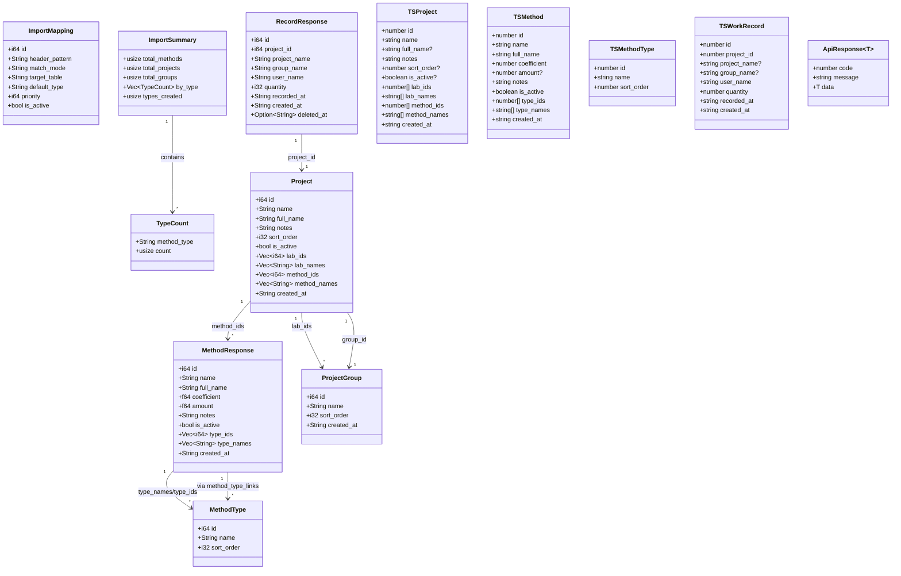
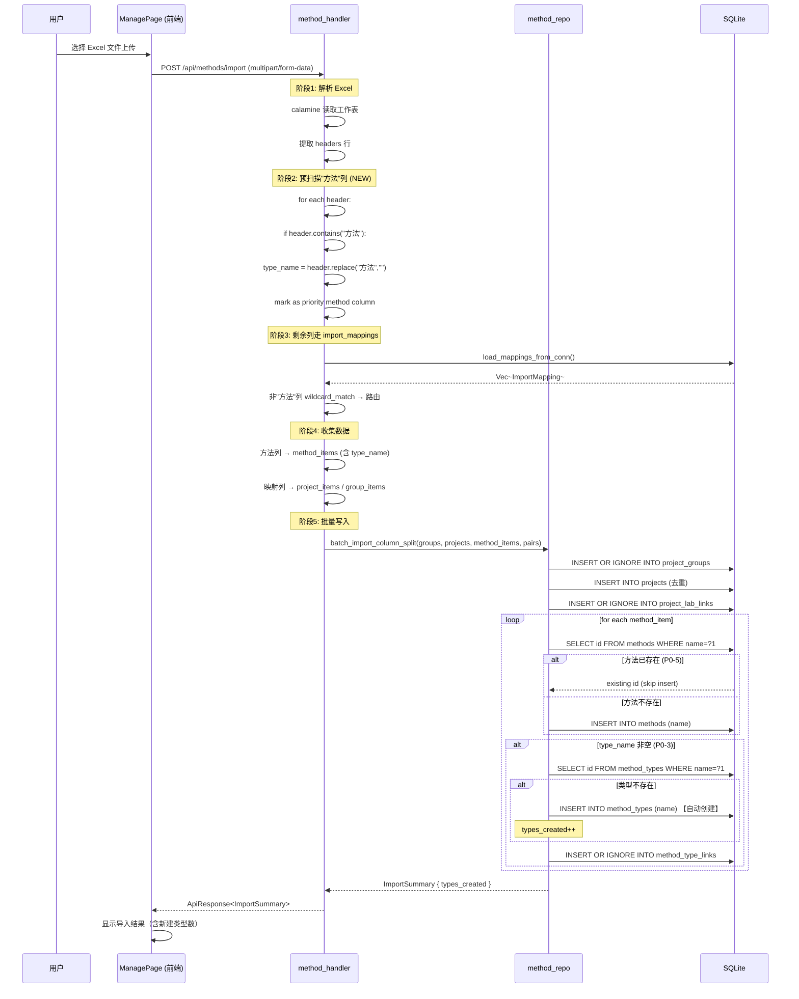
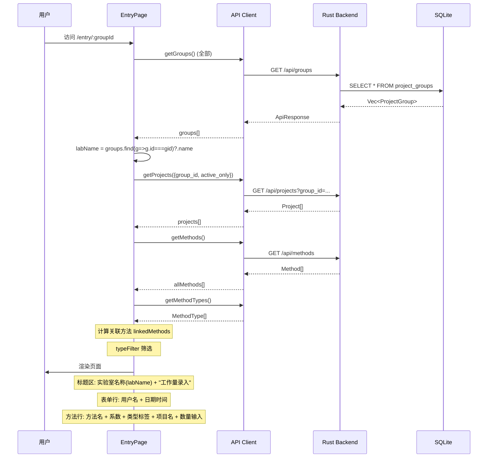
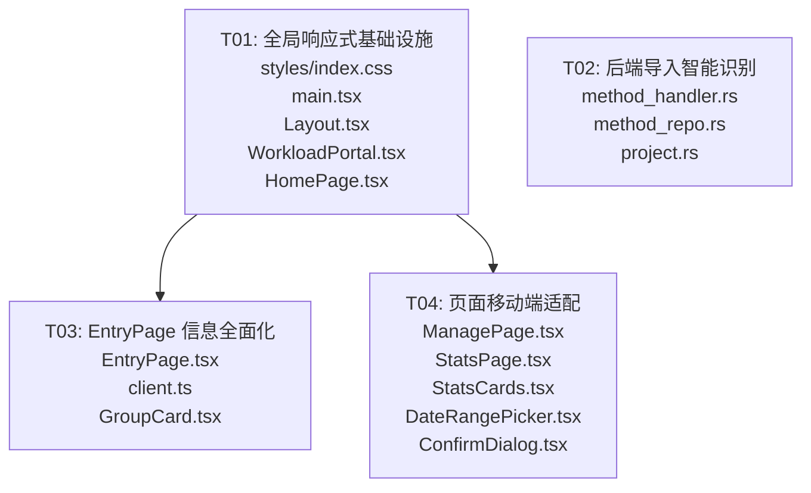

# 工作量统计工具 v0.4.0 系统设计文档

> **架构设计：Bob** | **日期：2026-01-23** | **范围：工作量录入（Workload Portal）**

---

## Part A: 系统设计

### 1. 实现方案

#### 1.1 核心技术挑战

| 挑战 | 分析 | 方案 |
|------|------|------|
| **移动端适配 320px-768px** | MUI v5 内置断点系统，配合 Tailwind 响应式工具 | CSS 全局规则 + MUI `sx` prop 响应式 + 组件内 `useMediaQuery` |
| **Excel 列头智能识别"方法"** | 当前仅靠 `import_mappings` 通配符匹配，无法提取类型名 | 在 import handler 中增加**预扫描阶段**：先检测含"方法"的列头，提取类型名后再走映射表 |
| **方法去重** | `batch_import_column_split` 已有 `SELECT id FROM methods WHERE name=?1` 检测 | 保持现有逻辑，确保 `INSERT OR IGNORE` 不产生重复 |
| **EntryPage 信息展示** | 当前缺少实验室名称显式展示 | 通过 `groupId` 反查 group name，在页面标题区展示 |

#### 1.2 框架与库选型

**前端（无新增依赖）**：
- **React 18** + **Vite 5**：现有技术栈，无需变更
- **MUI v5**：现有组件库，利用 `sx` prop 断点响应式（`{ xs, sm, md }`）
- **Tailwind CSS 3**：现有全局样式工具，用于 `overflow-x-hidden` 等全局规则
- **dayjs**：现有日期处理
- **axios**：现有 HTTP 客户端

**后端（无新增依赖）**：
- **axum 0.7** + **calamine 0.23**：现有 Excel 解析 → 无需新增 crate
- **rusqlite 0.31**：现有数据库层

#### 1.3 架构模式

前端：**组件化单页应用**（React + React Router），无全局状态管理库（使用组件内 useState）
后端：**三层架构** — `api/handler` → `repo` → `db`，通过 `DbPool` 连接池

---

### 2. 文件列表

```
工作量录入 (Workload Portal) — 本次改动范围
│
├── 后端 (Rust) — workload-tool-rust/v0.3.2/src/
│   ├── api/method_handler.rs          [修改] P0-2/P0-3: 预扫描"方法"列头
│   ├── repo/method_repo.rs            [修改] P0-3/P0-5: 自动创建类型 + 去重
│   └── models/project.rs             [修改] ImportSummary 增加 type_created 字段
│
└── 前端 (React) — project-root/frontend/src/
    ├── styles/index.css               [修改] P0-1: 全局响应式规则
    ├── main.tsx                       [修改] P0-1: 主题响应式微调
    ├── components/Layout.tsx          [修改] P0-1: 移动端容器 + 底部导航
    ├── pages/WorkloadPortal.tsx       [修改] P0-1: FAB 定位优化
    ├── pages/HomePage.tsx             [修改] P0-1: 卡片移动端布局
    ├── pages/EntryPage.tsx            [修改] P0-4 + P0-1: 实验室名称 + 7字段展示 + 移动端适配
    ├── pages/ManagePage.tsx           [修改] P0-1: 三卡片→单列 + 对话框全屏
    ├── pages/StatsPage.tsx            [修改] P0-1: 筛选折叠 + 表格横向滚动
    ├── components/StatsCards.tsx      [修改] P0-1: 统计卡片响应式
    ├── components/DateRangePicker.tsx [修改] P0-1: 日期选择器移动端适配
    └── api/client.ts                  [修改] P0-4: 新增 getGroupById 调用（如需要）
```

---

### 3. 数据结构和接口

#### 3.1 类图 (Mermaid classDiagram)



#### 3.2 API 契约（变更点）

**无新增路由，无 schema 变更。** 仅以下 endpoint 行为变更：

| 端点 | 方法 | 变更 |
|------|------|------|
| `POST /api/methods/import` | POST | **行为变更**：导入前预扫描列头含"方法"的列，优先于 import_mappings 路由 |
| `GET /api/method-types` | GET | 无变更（返回自动创建后的类型列表） |

**`POST /api/methods/import` 响应 `ImportSummary` 新增字段：**

```json
{
  "total_methods": 5,
  "total_projects": 0,
  "total_groups": 0,
  "by_type": [
    { "method_type": "液相", "count": 3 },
    { "method_type": "气相", "count": 2 }
  ],
  "types_created": 2
}
```

- `types_created` (新增, `usize`)：本次导入自动创建的方法类型数量

---

### 4. 程序调用流程

#### 4.1 方法导入智能识别流程 (P0-2/P0-3/P0-5)



#### 4.2 EntryPage 信息全面化流程 (P0-4)



---

### 5. 待明确事项

| # | 问题 | 当前假设 |
|---|------|----------|
| 1 | `import_mappings` 表中是否已有 `*方法*` 通配规则？ | 假设**没有**或**优先级不够高**——因此新增独立的预扫描逻辑，确保"方法"列优先匹配 |
| 2 | 自动创建的 `method_type` 的 `sort_order` 默认值 | 使用 `10`（与现有 `create_method_type` 一致） |
| 3 | 列头"方法"匹配是否区分大小写？ | 当前使用 `contains("方法")`，**区分大小写**（中文无大小写问题） |
| 4 | 如果同一个"方法"列在不同行有不同值，类型是否一致？ | 一列只有一个 type_name（从列头提取），该列所有方法归入同一类型 |
| 5 | EntryPage 中实验室名称如何获取？ | 通过已有的 `getGroups()` 调用 + 本地 `find` 匹配 `groupId`，**无需新增 API** |

---

## Part B: 任务分解

### 6. 依赖包列表

**无新增依赖。** v0.4.0 不引入任何新的第三方包。

现有依赖（供参考）：

**前端 `package.json`**：
```
- react@^18.2.0: UI 框架
- react-dom@^18.2.0: DOM 渲染
- react-router-dom@^6.20.0: 前端路由
- @mui/material@^5.14.20: 组件库
- @mui/icons-material@^5.14.19: 图标库
- @emotion/react@^11.11.1: MUI 样式引擎
- @emotion/styled@^11.11.0: MUI styled API
- axios@^1.6.2: HTTP 客户端
- dayjs@^1.11.10: 日期处理
```

**后端 `Cargo.toml`**：
```
- axum 0.7 (multipart): Web 框架
- rusqlite 0.31 (bundled): SQLite
- calamine 0.23: Excel 读取
- serde/serde_json: 序列化
```

---

### 7. 任务列表

| 任务 | 名称 | 文件数 | 依赖 | 优先级 |
|------|------|--------|------|--------|
| **T01** | 全局响应式基础设施 + 布局适配 | 5 | 无 | P0 |
| **T02** | 后端方法导入智能识别 | 3 | 无 | P0 |
| **T03** | EntryPage 信息全面化 + 移动端适配 | 3 | T01 | P0 |
| **T04** | ManagePage + StatsPage 移动端适配 | 5 | T01 | P0 |

---

#### T01: 全局响应式基础设施 + 布局适配

**目标**：建立移动端 320px-768px 无横向滚动条的基础 CSS 规则，适配全局布局组件。

**源文件**：
```
[修改] frontend/src/styles/index.css
[修改] frontend/src/main.tsx
[修改] frontend/src/components/Layout.tsx
[修改] frontend/src/pages/WorkloadPortal.tsx
[修改] frontend/src/pages/HomePage.tsx
```

**实现要点**：

1. **`styles/index.css`** — 全局响应式规则
   - `body { overflow-x: hidden; word-break: break-word; }`
   - 新增 `@media (max-width: 767px)` 全局规则块
   - 表格容器确保 `overflow-x: auto`（已有 `.table-responsive`，确保所有表格使用）
   - 图片/输入框 `max-width: 100%`
   - iOS safe-area 底部 padding 增强

2. **`main.tsx`** — 主题微调
   - MUI Theme 中确认 `breakpoints.values: { xs:0, sm:640, md:768, lg:1024, xl:1280 }`
   - 组件全局覆盖：`MuiTableCell { fontSize: { xs:'0.75rem', sm:'0.875rem' } }`
   - `MuiContainer { disableGutters: true }` 在移动端

3. **`components/Layout.tsx`** — 移动端布局
   - `<Container>` 在移动端 `disableGutters={true}` 已实现 ✓
   - `<BottomNavigation>` 已实现，增加 `safe-bottom` 类
   - 主内容区 `pb` 考虑底部导航高度：`pb: { xs: 8, md: 2 }`

4. **`pages/WorkloadPortal.tsx`** — FAB 优化
   - 移动端 FAB 位置已有 `bottom: 72`，确认不会遮挡内容
   - 实验室卡片网格 `gridTemplateColumns: { xs: '1fr', sm: 'repeat(2,1fr)', md: 'repeat(3,1fr)' }` 已实现 ✓

5. **`pages/HomePage.tsx`** — 入口卡片
   - 两张卡片 `flexDirection: { xs: 'column', sm: 'row' }` 已实现 ✓
   - 确认移动端不超出视口宽度

**依赖**：无

**优先级**：P0

---

#### T02: 后端方法导入智能识别

**目标**：Excel 导入时自动识别含"方法"的列头，提取类型名，自动创建类型，方法去重。

**源文件**：
```
[修改] workload-tool-rust/v0.3.2/src/api/method_handler.rs
[修改] workload-tool-rust/v0.3.2/src/repo/method_repo.rs
[修改] workload-tool-rust/v0.3.2/src/models/project.rs
```

**实现要点**：

1. **`models/project.rs`** — ImportSummary 扩展
   ```rust
   pub struct ImportSummary {
       // ... 现有字段不变 ...
       pub types_created: usize,  // 新增：自动创建的方法类型数量
   }
   ```

2. **`api/method_handler.rs`** — 预扫描"方法"列头（P0-2）
   
   在现有列头路由循环**之前**插入预扫描阶段：

   ```rust
   // 阶段1: 预扫描"方法"列头（P0-2）
   // 优先级高于 import_mappings 表
   let mut method_headers: HashSet<usize> = HashSet::new();
   let mut header_type_map: HashMap<usize, String> = HashMap::new();
   
   for col_idx in 0..ncols {
       let header = &headers[col_idx];
       if header.contains("方法") {
           method_headers.insert(col_idx);
           let type_name = header.replace("方法", "").trim().to_string();
           if !type_name.is_empty() {
               header_type_map.insert(col_idx, type_name);
           }
       }
   }
   
   // 阶段2: 收集数据（方法列优先）
   for col_idx in 0..ncols {
       if method_headers.contains(&col_idx) {
           // P0-2: "方法"列 → methods 表
           let method_type = header_type_map.get(&col_idx)
               .cloned()
               .unwrap_or_else(|| "其他".to_string());
           // 收集 method_items...
           continue;
       }
       // 原有 import_mappings 逻辑...
   }
   ```

3. **`repo/method_repo.rs`** — 自动创建类型 + 去重（P0-3/P0-5）
   
   在 `batch_import_column_split` 的方法处理循环中：

   ```rust
   // 方法去重 (P0-5)
   let existing: Option<i64> = conn.query_row(
       "SELECT id FROM methods WHERE name=?1",
       rusqlite::params![item_name], |r| r.get(0),
   ).ok();
   
   let mid = if let Some(pid) = existing {
       pid  // 已存在 → 跳过，不产生重复
   } else {
       conn.execute("INSERT INTO methods (name) VALUES (?1)",
           rusqlite::params![item_name])?;
       method_count += 1;
       conn.last_insert_rowid()
   };
   
   // 自动创建类型 (P0-3)
   if !method_type.is_empty() {
       // 先尝试查找
       let mt_id: Option<i64> = conn.query_row(
           "SELECT id FROM method_types WHERE name=?1",
           rusqlite::params![method_type], |r| r.get(0),
       ).ok();
       
       let tid = if let Some(existing_id) = mt_id {
           existing_id
       } else {
           // 自动创建
           conn.execute(
               "INSERT INTO method_types (name, sort_order) VALUES (?1, 10)",
               rusqlite::params![method_type],
           )?;
           types_created += 1;
           conn.last_insert_rowid()
       };
       
       conn.execute(
           "INSERT OR IGNORE INTO method_type_links (method_id, method_type_id) VALUES (?1,?2)",
           rusqlite::params![mid, tid],
       )?;
   }
   ```

**依赖**：无（后端独立）

**优先级**：P0

---

#### T03: EntryPage 信息全面化 + 移动端适配

**目标**：录入页完整展示 7 个信息字段（录入时间、实验室名称、研发项目、录入人、方法、类型、数量），移动端表单单列、按钮全宽。

**源文件**：
```
[修改] frontend/src/pages/EntryPage.tsx
[修改] frontend/src/api/client.ts
[修改] frontend/src/components/GroupCard.tsx
```

**实现要点**：

1. **`pages/EntryPage.tsx`** — 核心改动

   **信息全面化（P0-4）**：
   - 页面加载时调用 `getGroups()` 获取所有实验室，通过 `groupId` 反查实验室名称
   - 标题区改为：`实验室名称 — 工作量录入`
   - 方法行（MethodRow）增加项目名显式展示（当前在副标题 caption 中不够突出）
   - 确保 7 个字段全部可见：
     
     | 字段 | 展示位置 | 当前状态 |
     |------|----------|----------|
     | 录入时间 | 标题下方 TextField | ✅ 已有 |
     | 实验室名称 | **页面标题区（新增）** | ❌ 缺失 |
     | 研发项目 | 方法行副标题 | ⚠️ 需更突出 |
     | 录入人 | 标题下方 TextField | ✅ 已有 |
     | 方法 | 方法行主标题 | ✅ 已有 |
     | 类型 | 方法行 Chip 标签 | ✅ 已有 |
     | 数量 | 方法行 TextField | ✅ 已有 |

   **移动端适配（P0-1）**：
   - `<600px`：用户 & 时间输入框 → 堆叠单列（`flexDirection: { xs: 'column', sm: 'row' }`）
   - 按钮全宽（TextField `fullWidth` on mobile）
   - 类型筛选 Chip 栏可横向滚动：`overflow-x: auto; flex-wrap: nowrap`（移动端）
   - 方法行：文字过长时自动换行，不再 `whiteSpace: 'nowrap'`

2. **`api/client.ts`** — API 补充（如需要）
   - 如果 EntryPage 需要单独获取单个 group：新增 `getGroupById(id)` 调用 `GET /api/groups/:id`
   - 但实际上已有 `getGroups()` 可获取全量，通过本地查找即可，**可能无需新增 API**

3. **`components/GroupCard.tsx`** — 微调
   - 确认卡片在 320px 宽度下不溢出

**依赖**：T01（CSS 全局规则就绪后，EntryPage 响应式才能正确生效）

**优先级**：P0

---

#### T04: ManagePage + StatsPage 移动端适配

**目标**：管理页三卡片→单列堆叠，对话框移动端全屏；统计页筛选折叠、表格关键列优先。

**源文件**：
```
[修改] frontend/src/pages/ManagePage.tsx
[修改] frontend/src/pages/StatsPage.tsx
[修改] frontend/src/components/StatsCards.tsx
[修改] frontend/src/components/DateRangePicker.tsx
[修改] frontend/src/components/ConfirmDialog.tsx
```

**实现要点**：

1. **`pages/ManagePage.tsx`** — 管理页
   - 三卡片网格改为 `<768px` 单列：
     ```tsx
     gridTemplateColumns: { xs: '1fr', sm: '1fr 1fr', md: '1fr 1fr 1fr' }
     ```
   - 对话框在移动端全屏（`fullScreen` prop + `useMediaQuery`）：
     ```tsx
     const isMobile = useMediaQuery(theme.breakpoints.down('sm'));
     <Dialog fullScreen={isMobile} ...>
     ```
   - 表格列在移动端优先展示关键列（名称、操作），次要列可折叠

2. **`pages/StatsPage.tsx`** — 统计页
   - 日期筛选区移动端折叠为单行：`flexDirection: { xs: 'column', sm: 'row' }`
   - 统计卡片网格已有 `xs:12, sm:6, md:4` ✓
   - 表格使用 `.table-responsive` 类（已有），确认所有表格包裹在 `TableContainer` 中
   - 用户筛选下拉框移动端全宽

3. **`components/StatsCards.tsx`** — 统计概览卡片
   - 确认 320px 下 4 个指标卡片换行为 2×2 或单列

4. **`components/DateRangePicker.tsx`** — 日期选择器
   - 移动端日期输入框全宽、堆叠排列

5. **`components/ConfirmDialog.tsx`** — 确认对话框
   - 移动端全屏或至少不超出视口

**依赖**：T01（CSS 全局规则）

**优先级**：P0

---

### 8. 共享知识

以下为跨文件约定，供 Engineer 实现时参考：

```
## 响应式断点
- xs: 0~639px   → 移动端（单列、全宽按钮）
- sm: 640~767px → 小平板（2列网格）
- md: 768px+    → 桌面端（3列网格、正常布局）

## CSS 全局变量（建议在 index.css 中定义）
- --safe-bottom: env(safe-area-inset-bottom, 0px);
- --breakpoint-mobile: 767px;

## 全局 body 规则
- overflow-x: hidden;    ← 根级别禁止横向滚动
- word-break: break-word; ← 长文本自动换行

## MUI sx prop 响应式写法规范
使用对象格式：{ xs: value1, sm: value2, md: value3 }
不使用字符串模板。

## API 响应格式（不变）
{ code: 0, message: "success", data: T }

## 日期格式
- 前端：YYYY-MM-DDTHH:mm (datetime-local input)
- 后端：YYYY-MM-DDTHH:mm:ss (ISO 8601)
- 日界线：end 参数自动追加 T23:59:59

## ImportSummary 新增字段
- types_created: number  ← 本次导入自动创建的方法类型数
- 前端 ImportSummary 接口需同步新增此字段

## 方法去重规则
- 以 methods.name 为唯一键
- 已存在 → 跳过 INSERT，使用已有 id 建立 method_type_links

## 自动创建 method_type 规则
- sort_order 默认值：10
- 名称 = 列头去掉"方法"后缀（trim 后）
- 如已存在同名类型 → 复用已有 id
```

---

### 9. 任务依赖图



**说明**：
- **T01** 和 **T02** 完全独立，可并行开发
- **T03** 依赖 T01（需要全局 CSS 规则就绪后才能正确验证 EntryPage 的响应式效果）
- **T04** 依赖 T01（同理）
- **T03** 和 **T04** 并行（依赖同一基础 T01，但互不依赖）

**推荐实现顺序**：T01 → 并行 {T02, T03, T04}
