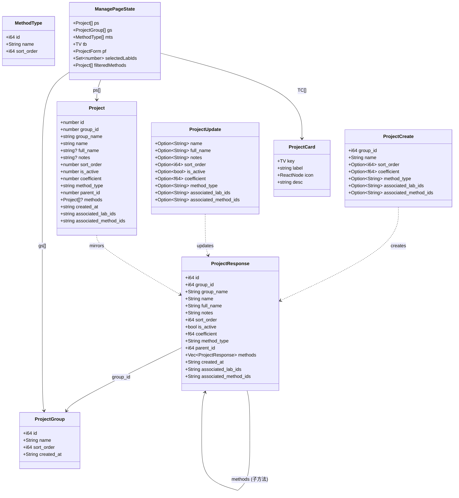
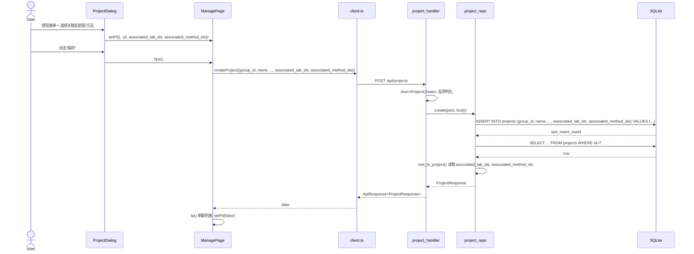
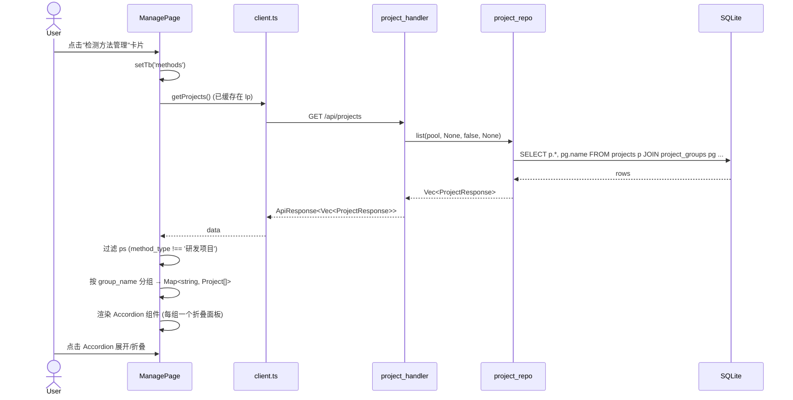
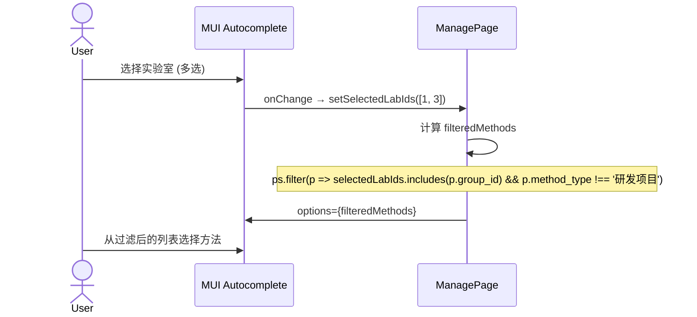
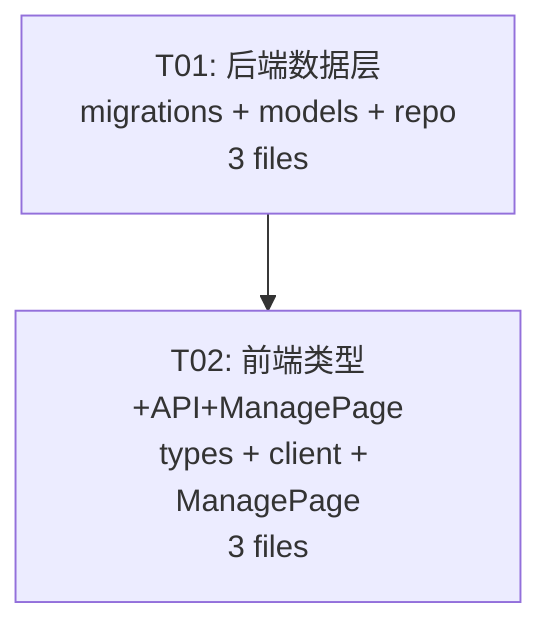

# v0.2.16 系统设计文档

> **设计师**: Bob (Architect)  
> **日期**: 2025-07-01  
> **范围**: 管理界面卡片合并 + 项目编辑页多选关联

---

## Part A: 系统设计

### 1. Implementation Approach

#### 核心技术挑战

| 挑战 | 分析 | 方案 |
|------|------|------|
| **卡片合并** | 当前 TC 数组有 10 个卡片入口，其中 physical/icp/thermal/other 4 个卡片冗余 | 删除 4 个卡片，methods 卡片内按 group_name 分组渲染 |
| **分组折叠展示** | methods 卡片需展示所有非"研发项目"类型的方法，按实验室分组 | 使用 MUI Accordion 组件实现折叠组，保持视觉一致性 |
| **多选关联字段** | projects 表需新增两个 JSON 数组字段存储关联 | TEXT 字段存 `serde_json` 序列化的 `Vec<i64>`，前端用 MUI Autocomplete 多选 |
| **级联过滤** | 关联检测方法的选项需根据已选实验室动态过滤 | 前端 state 联动：selectedLabIds 变化时重新计算可选 method 列表 |
| **向后兼容** | 旧数据无新字段 | SQLite `ALTER TABLE ADD COLUMN` 带 `DEFAULT '[]'`；Rust 端 `Option<String>` + `unwrap_or_default` |

#### 框架与库选择

- **后端**: axum 0.7.9 + rusqlite 0.31 (bundled) + serde_json (已有依赖)
- **前端**: React 18 + TypeScript + MUI 5 (已有)
- 无需新增第三方依赖

#### 架构模式

- 后端: Handler → Repo → SQLite 三层
- 前端: 单页面组件，状态在 ManagePage 组件内管理

### 2. File List

```
# ── 后端 (Rust) ──
v0.2.16/src/db/migrations.rs          # ALTER TABLE +2 列
v0.2.16/src/models/project.rs         # 3 个 struct 各 +2 字段
v0.2.16/src/repo/project_repo.rs      # row_to_project / create / update 各 +2 行

# ── 前端 (TypeScript/React) ──
project-root/frontend/src/types/index.ts       # Project 接口 +2 字段
project-root/frontend/src/api/client.ts        # createProject / updateProject 签名扩展
project-root/frontend/src/pages/ManagePage.tsx  # TC -4 卡片, methods 卡重写, 对话框 +Autocomplete
```

### 3. Data Structures and Interfaces



### 4. Program Call Flow

#### 4.1 项目创建（含关联字段）



#### 4.2 Methods 卡片分组展示



#### 4.3 级联过滤：选择实验室 → 过滤方法选项



### 5. Anything UNCLEAR

| 项目 | 疑问 | 假设 |
|------|------|------|
| **关联字段存储格式** | 存 ID 还是名称？PRD 说 `_ids` | 存 JSON 数组 `[1, 3, 5]`，为 group/project 的 id |
| **关联实验室范围** | 是否包含自身的 group_id？ | 包含，用户可自由选择任意实验室 |
| **关联方法范围** | 是否只显示非"研发项目"类型？ | 是，方法与实验室级联过滤 |
| **卡片删除后 TV 类型** | TV 联合类型需减少 4 个值 | 删除 `'physical' \| 'icp' \| 'thermal' \| 'other'` |
| **methods 卡片的 method_type 过滤** | 合并后展示哪些类型的方法？ | 所有 `method_type !== '研发项目'` 的项目 |

---

## Part B: 任务分解

### 6. Required Packages

无新增依赖。已有依赖足够：

```
- axum@0.7.9: Web 框架
- rusqlite@0.31 (bundled): SQLite 驱动
- serde@1 + serde_json@1: 序列化/反序列化
- react@^18: UI 框架
- @mui/material@^5: 组件库
- @mui/icons-material@^5: 图标
```

### 7. Task List (ordered by dependency)

#### T01: 后端数据层 — DB 迁移 + 模型 + Repo

| 字段 | 值 |
|------|-----|
| **Task ID** | T01 |
| **Priority** | P0 |
| **Dependencies** | 无 |

**源文件**:
- `v0.2.16/src/db/migrations.rs` — ALTER TABLE projects ADD COLUMN associated_lab_ids TEXT DEFAULT '[]' / associated_method_ids TEXT DEFAULT '[]'
- `v0.2.16/src/models/project.rs` — ProjectResponse +2 字段 (`associated_lab_ids: String`, `associated_method_ids: String`), ProjectCreate +2 (`Option<String>`), ProjectUpdate +2 (`Option<String>`)
- `v0.2.16/src/repo/project_repo.rs` — `row_to_project()` 读取索引 11/12; `create()` INSERT 含新字段; `update()` 新增 2 个 `if let Some` 分支; `PROJ_SQL` 常量追加 `COALESCE(p.associated_lab_ids,'[]'), COALESCE(p.associated_method_ids,'[]')` 到 SELECT

**变更详情**:

1. `migrations.rs` (第 83 行前追加):
```rust
conn.execute("ALTER TABLE projects ADD COLUMN associated_lab_ids TEXT NOT NULL DEFAULT '[]'", []).ok();
conn.execute("ALTER TABLE projects ADD COLUMN associated_method_ids TEXT NOT NULL DEFAULT '[]'", []).ok();
```

2. `models/project.rs`:
- `ProjectResponse`: 在 `created_at` 前加 `pub associated_lab_ids: String, pub associated_method_ids: String,`
- `ProjectCreate`: 加 `pub associated_lab_ids: Option<String>, pub associated_method_ids: Option<String>,`
- `ProjectUpdate`: 加 `pub associated_lab_ids: Option<String>, pub associated_method_ids: Option<String>,`

3. `project_repo.rs`:
- `PROJ_SQL`: 在 `COALESCE(p.created_at,'')` 前追加 `COALESCE(p.associated_lab_ids,'[]'), COALESCE(p.associated_method_ids,'[]'),`
- `row_to_project()`: 索引 11→associated_lab_ids, 12→associated_method_ids, 13→created_at
- `create()`: INSERT 语句加 `, associated_lab_ids, associated_method_ids` 和对应参数
- `update()`: 加两个 `if let Some(ref v) = body.associated_lab_ids { ... }` 和 `body.associated_method_ids { ... }`

---

#### T02: 前端类型 + API + ManagePage 改造

| 字段 | 值 |
|------|-----|
| **Task ID** | T02 |
| **Priority** | P0 |
| **Dependencies** | T01 (后端先完成字段支持，前端才能联调) |

**源文件**:
- `project-root/frontend/src/types/index.ts` — `Project` 接口追加 `associated_lab_ids: string` 和 `associated_method_ids: string`
- `project-root/frontend/src/api/client.ts` — `createProject()` 参数加 `associated_lab_ids?: string; associated_method_ids?: string`; `updateProject()` 参数加相同两个可选字段
- `project-root/frontend/src/pages/ManagePage.tsx` — 三处改动:
  - (a) TC 数组删除 4 个卡片: `physical`, `icp`, `thermal`, `other` 条目
  - (b) TV 类型删除 4 个值: `'physical' | 'icp' | 'thermal' | 'other'`
  - (c) methods 卡内容重写: 按 `group_name` 分组 → MUI Accordion 折叠面板
  - (d) 项目对话框新增 2 个 MUI Autocomplete 多选区域 + pf 状态扩展

**变更详情**:

1. `types/index.ts`:
```typescript
export interface Project {
  // ... existing fields ...
  associated_lab_ids: string;     // JSON 数组如 "[1,3,5]"
  associated_method_ids: string;  // JSON 数组如 "[12,15]"
}
```

2. `client.ts`:
```typescript
// createProject 参数加:
associated_lab_ids?: string;
associated_method_ids?: string;

// updateProject 参数加:
associated_lab_ids?: string;
associated_method_ids?: string;
```

3. `ManagePage.tsx` (三块改动):

**(a) TC 数组** (删 4 行):
```
删除: { key:'physical', ... }, { key:'icp', ... }, { key:'thermal', ... }, { key:'other', ... }
```

**(b) TV 类型** (改第 17 行):
```typescript
// Before:
type TV = 'projects' | 'groups' | 'methods' | 'physical' | 'icp' | 'thermal' | 'other' | 'trash' | 'audit' | 'backup';
// After:
type TV = 'projects' | 'groups' | 'methods' | 'trash' | 'audit' | 'backup';
```

**(c) methods 卡内容重写** (替换第 156-192 行):
- 过滤: `ps.filter(p => p.method_type !== '研发项目')`
- 分组: `Map<string, Project[]>` by `group_name`
- 渲染: 每个 `group_name` 一个 `<Accordion>`, 展开后展示该组下的方法列表 (复用现有 Paper 卡片样式)
- 保留导入按钮和编辑/删除功能

**(d) 项目对话框新增 Autocomplete** (第 246-265 行, 在"方法类型"Select 之后):
```tsx
// 关联实验室 (多选)
<Autocomplete multiple options={gs} getOptionLabel={g => g.name}
  value={gs.filter(g => JSON.parse(pf.associated_lab_ids || '[]').includes(g.id))}
  onChange={(_, vals) => setPf({...pf, associated_lab_ids: JSON.stringify(vals.map(v => v.id))})}
  renderInput={(params) => <TextField {...params} label="关联实验室" />} />

// 关联检测方法 (多选, 级联过滤)
<Autocomplete multiple options={ps.filter(p => {
  const labIds = JSON.parse(pf.associated_lab_ids || '[]');
  return p.method_type !== '研发项目' && (labIds.length === 0 || labIds.includes(p.group_id));
})} getOptionLabel={p => `${p.name} (${p.group_name})`}
  value={ps.filter(p => JSON.parse(pf.associated_method_ids || '[]').includes(p.id))}
  onChange={(_, vals) => setPf({...pf, associated_method_ids: JSON.stringify(vals.map(v => v.id))})}
  renderInput={(params) => <TextField {...params} label="关联检测方法" />} />
```

- pf 状态初始值加: `associated_lab_ids: '[]', associated_method_ids: '[]'`
- 编辑回填时加: `associated_lab_ids: p.associated_lab_ids || '[]', associated_method_ids: p.associated_method_ids || '[]'`

### 8. Shared Knowledge

```
- 所有 API 响应使用 {code, data, message} 格式，code=0 表示成功
- associated_lab_ids / associated_method_ids 字段存储格式: JSON 数组字符串，如 "[1,3,5]"
- 前端通过 JSON.parse() 解析，JSON.stringify() 序列化
- 空值统一为 "[]" (空 JSON 数组)
- axum 路由使用 :id 语法 (非 :id)
- SQLite ALTER TABLE 使用 .ok() 忽略"列已存在"错误（幂等迁移）
- MUI sx prop 使用 borderRadius: R (已定义 R='2px')
- 级联过滤: selectedLabIds 为空时显示所有方法；非空时按 group_id 过滤
```

### 9. Task Dependency Graph



**依赖说明**: T02 依赖 T01 完成后端字段支持。前端新增字段在 API 调用时传给后端，若后端未先完成则字段会被忽略或报错。但两个任务可并行开发（前端可先用 mock），联调时需 T01 先就绪。
