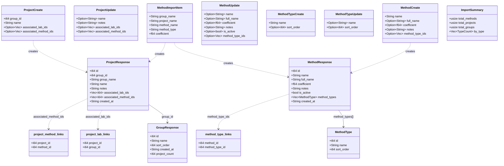
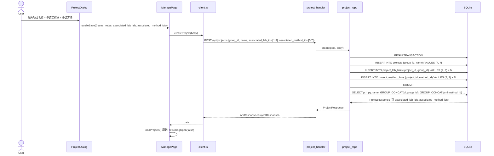
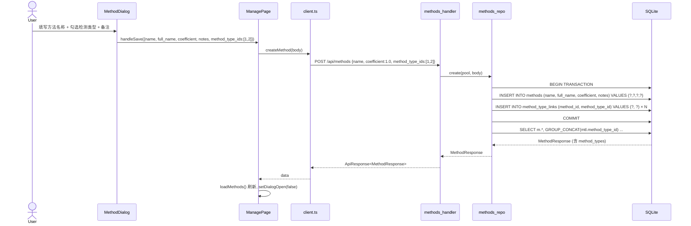
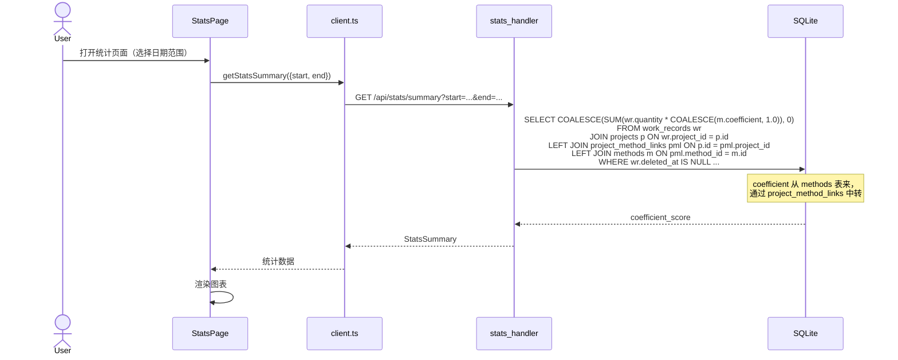
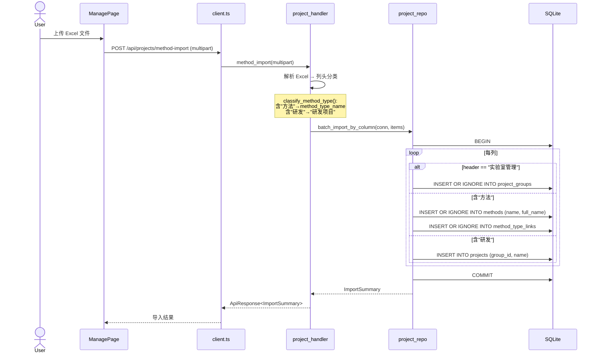
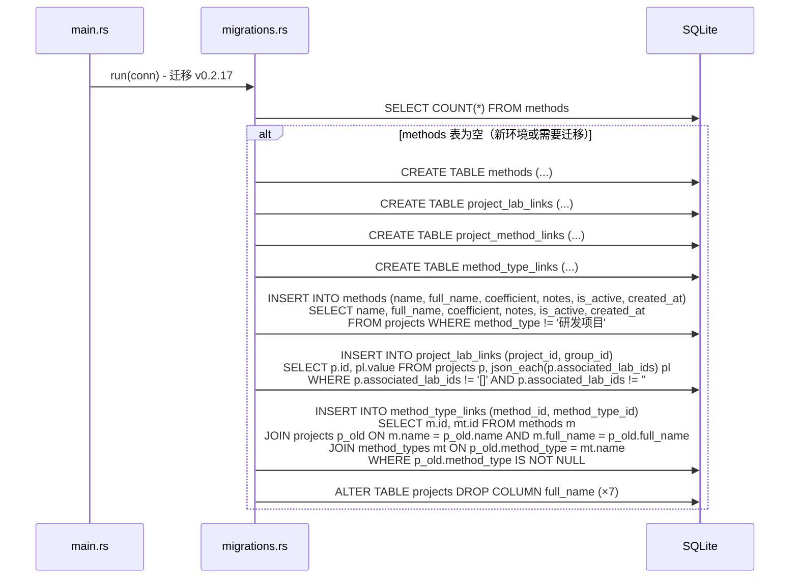
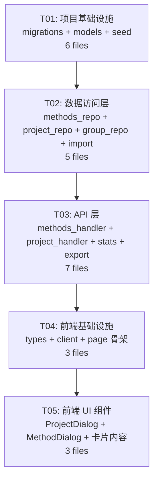

# v0.2.17 系统设计文档

> **设计师**: Bob (Architect)  
> **日期**: 2025-07-01  
> **范围**: 三卡片完全分离架构 — methods 表独立 + 关联表设计 + 前端重写

---

## Part A: 系统设计

### 1. Implementation Approach

#### 核心技术挑战

| 挑战 | 分析 | 方案 |
|------|------|------|
| **methods 表独立** | 当前"方法"伪装在 `projects` 表中，靠 `method_type` 列区分 | 新建 `methods` 表，旧数据通过迁移脚本 `method_type != '研发项目'` 搬家 |
| **多对多关联** | 项目↔实验室、项目↔方法、方法↔检测类型 需要多选 | 新建 3 张关联表 `project_lab_links`、`project_method_links`、`method_type_links` |
| **projects 列清理** | 删除 7 列 (`full_name, sort_order, is_active, coefficient, method_type, associated_lab_ids, associated_method_ids`) | SQLite 3.35+ 支持 `ALTER TABLE DROP COLUMN`，rusqlite bundled 足够新 |
| **统计功能适配** | `stats_handler` 的 `coefficient_score` 依赖 `p.coefficient` 列 | coefficient 移到 `methods` 表后，统计需 JOIN `project_method_links` → `methods` 获取系数；**但 work_records 仍关联 projects，不直接关联 methods** — 这意味着系数计算链路变长 |
| **向后兼容** | 旧 DB 有 migration 路径，新 DB 直接按新 schema 建表 | 迁移脚本幂等：检测 `methods` 表是否存在 → 存在则跳过；迁移逻辑在 Rust 启动时执行 |
| **导入功能** | `method_import` 当前直接写入 `projects` 表 | 改为：header 含"方法" → 创建/更新 `methods` 表记录 + `method_type_links` |

#### 框架与库选择

- **后端**: axum 0.7.9 + rusqlite 0.31 (bundled, 含 SQLite ≥ 3.39) + serde_json (已有)
- **前端**: React 18 + TypeScript 5 + MUI 5 + Vite (已有)
- **无需新增第三方依赖**

#### 架构模式

- 后端: Handler → Repo → SQLite (三层)
- 前端: 单页面应用，状态在 ManagePage 组件内管理
- 新路由分组: `/api/methods` 独立于 `/api/projects`

### 2. File List

```
# ══ 后端 (Rust) ══

# — 新建 —
v0.2.17/src/models/methods.rs           # MethodResponse, MethodCreate, MethodUpdate, MethodType 等
v0.2.17/src/repo/methods_repo.rs        # methods CRUD + link table 操作
v0.2.17/src/api/methods_handler.rs      # /api/methods, /api/method-types 路由

# — 修改 —
v0.2.17/src/db/migrations.rs            # DDL: methods + 3 张关联表; ALTER TABLE projects DROP 7 列; 数据迁移
v0.2.17/src/db/seed.rs                  # 种子数据适配（methods 替代 method_type 写入）
v0.2.17/src/models/mod.rs               # 注册 methods 模块
v0.2.17/src/models/project.rs           # ProjectResponse/ProjectCreate/ProjectUpdate 大幅精简
v0.2.17/src/repo/mod.rs                 # 注册 methods_repo 模块
v0.2.17/src/repo/project_repo.rs        # SQL 删除旧列; 新增 link table JOIN; create/update 重写
v0.2.17/src/repo/group_repo.rs          # project_count 口径调整（只计非方法项目）
v0.2.17/src/api/mod.rs                  # 注册 methods_handler 路由
v0.2.17/src/api/project_handler.rs      # 删除 batch_coefficient / method_types CRUD; method_import 重写
v0.2.17/src/api/stats_handler.rs        # coefficient_score 计算链路改为 JOIN methods
v0.2.17/src/service/stats_service.rs    # 同上
v0.2.17/src/api/export_handler.rs       # 导出可能引用 coefficient，需适配
v0.2.17/src/api/export_data.rs          # 同上
v0.2.17/src/db/import.rs                # upsert_project 可能不需要改动

# ══ 前端 (TypeScript/React) ══
frontend/src/types/index.ts             # Project 接口精简; 新增 Method 接口
frontend/src/api/client.ts              # methods API; project API 更新
frontend/src/pages/ManagePage.tsx       # 三卡片全部重写; TC 数组; 对话框
frontend/src/components/MethodDialog.tsx # 新增：方法编辑对话框
frontend/src/components/ProjectDialog.tsx # 重写：简化项目编辑对话框
```

### 3. Data Structures and Interfaces

#### 3.1 数据库 DDL (新表)

```sql
-- 方法表 (全新独立)
CREATE TABLE IF NOT EXISTS methods (
    id INTEGER PRIMARY KEY AUTOINCREMENT,
    name TEXT NOT NULL,
    full_name TEXT DEFAULT '',
    coefficient REAL NOT NULL DEFAULT 1.0,
    notes TEXT DEFAULT '',
    is_active INTEGER NOT NULL DEFAULT 1,
    created_at TEXT NOT NULL DEFAULT (datetime('now'))
);

-- 项目 ↔ 实验室 多对多
CREATE TABLE IF NOT EXISTS project_lab_links (
    project_id INTEGER NOT NULL REFERENCES projects(id) ON DELETE CASCADE,
    group_id INTEGER NOT NULL REFERENCES project_groups(id) ON DELETE CASCADE,
    PRIMARY KEY (project_id, group_id)
);

-- 项目 ↔ 方法 多对多
CREATE TABLE IF NOT EXISTS project_method_links (
    project_id INTEGER NOT NULL REFERENCES projects(id) ON DELETE CASCADE,
    method_id INTEGER NOT NULL REFERENCES methods(id) ON DELETE CASCADE,
    PRIMARY KEY (project_id, method_id)
);

-- 方法 ↔ 检测类型 多对多
CREATE TABLE IF NOT EXISTS method_type_links (
    method_id INTEGER NOT NULL REFERENCES methods(id) ON DELETE CASCADE,
    method_type_id INTEGER NOT NULL REFERENCES method_types(id) ON DELETE CASCADE,
    PRIMARY KEY (method_id, method_type_id)
);

-- projects 表清理 (ALTER TABLE)
ALTER TABLE projects DROP COLUMN full_name;
ALTER TABLE projects DROP COLUMN sort_order;
ALTER TABLE projects DROP COLUMN is_active;
ALTER TABLE projects DROP COLUMN coefficient;
ALTER TABLE projects DROP COLUMN method_type;
ALTER TABLE projects DROP COLUMN associated_lab_ids;
ALTER TABLE projects DROP COLUMN associated_method_ids;
```

#### 3.2 Rust 模型



#### 3.3 前端 TypeScript 类型

```typescript
// 项目（精简后）
interface Project {
  id: number;
  group_id: number;
  group_name: string;
  name: string;
  notes: string;
  associated_lab_ids: number[];    // 整数数组，不再 JSON 字符串
  associated_method_ids: number[]; // 整数数组
  created_at: string;
}

// 方法（新增）
interface Method {
  id: number;
  name: string;
  full_name: string;
  coefficient: number;
  notes: string;
  is_active: boolean;
  method_types: MethodType[];
  created_at: string;
}

// 方法类型（不变）
interface MethodType {
  id: number;
  name: string;
  sort_order: number;
}

// 实验室分组
interface ProjectGroup {
  id: number;
  name: string;
  sort_order: number;
  project_count: number;
}
```

### 4. Program Call Flow

#### 4.1 项目创建（含关联实验室/方法多选）



#### 4.2 方法创建（含检测类型复选框多选）



#### 4.3 统计（系数从 methods 表 JOIN）



#### 4.4 导入（method_import 适配新 tables）



#### 4.5 数据迁移（启动时执行一次）



### 5. Anything UNCLEAR

| 项目 | 疑问 | 假设/决策 |
|------|------|-----------|
| **coefficient 归属** | 一个项目关联多个方法时，统计用哪个系数？ | 使用关联方法的**第一个**系数，或对所有关联方法系数取平均值。**当前设计：AVG(COALESCE(m.coefficient, 1.0))** |
| **projects.sort_order 删除** | 删除后排序依据？ | 按 `created_at DESC`；列表排序由前端自行处理 |
| **projects.is_active 删除** | 如何标记停用项目？ | 项目不再有启用/停用状态；若需停用则直接删除（或未来再加） |
| **methods 与 project_groups 的关系** | 方法是否还属于某个实验室？ | 旧数据 `full_name` 记录了 `实验室/研发项目`；新设计方法**不强制**关联 group，通过 `project_method_links` 间接关联 |
| **前端源码位置** | 当前仓库只有 `static/` 构建产物，`.tsx` 源文件不在仓库中 | 前端为独立项目；本次设计使用 `frontend/` 作为前端根目录（与 v0.2.16 文档约定一致） |
| **stats_handler 的 by_type / by_instrument** | 这些基于 `p.name LIKE '%LC-%' / '%GC-%'` 的分类逻辑是否保留？ | 保留现有启发式分类逻辑；未来可通过 `method_type_links` 改进，但本次变更范围限为"系数链路修复" |
| **旧 method_type_links 迁移** | `method_types` 表已有数据 (检测类型/液相/气相/理化/其他)，旧 projects.method_type 如何映射？ | 通过 `method_type = method_types.name` 精确匹配；无法匹配的旧方法不创建 link |
| **project_lab_links 的旧数据** | `associated_lab_ids` 存的是 JSON `[1,3,5]`，SQLite 能否解析？ | 使用 `json_each()` 表值函数（SQLite 3.38+ 内置） |
| **work_records 与 methods 无直接关联** | PRD 明确：work_records 关联 projects，不直接关联 methods | 确认。统计系数计算需 project → project_method_links → methods 二级跳 |

---

## Part B: 任务分解

### 6. Required Packages

无新增依赖。所有功能基于已有依赖：

```
- axum@0.7.9: Web 框架 (multipart feature)
- rusqlite@0.31 (bundled): SQLite 驱动，内置 SQLite ≥ 3.39 (支持 DROP COLUMN, json_each)
- serde@1 + serde_json@1: 序列化/反序列化
- tokio@1 (full): 异步运行时
- calamine@0.23: Excel 解析 (导入用)
- react@^18: 前端 UI 框架
- @mui/material@^5: MUI 组件库
- @mui/icons-material@^5: MUI 图标
```

### 7. Task List (ordered by dependency)

---

#### T01: 项目基础设施 — DB Schema + 模型定义 + 迁移脚本

| 字段 | 值 |
|------|-----|
| **Task ID** | T01 |
| **Priority** | P0 |
| **Dependencies** | 无 |

**源文件**:
- `v0.2.17/src/db/migrations.rs` — 新建 methods / project_lab_links / project_method_links / method_type_links 四表；ALTER TABLE projects DROP COLUMN ×7；数据迁移 INSERT...SELECT
- `v0.2.17/src/models/mod.rs` — 注册 `pub mod methods;`
- `v0.2.17/src/models/methods.rs` — NEW：MethodResponse, MethodCreate, MethodUpdate, MethodType, MethodTypeCreate, MethodTypeUpdate, MethodImportItem, ImportSummary, TypeCount
- `v0.2.17/src/models/project.rs` — ProjectResponse 精简为 8 字段 (id, group_id, group_name, name, notes, associated_lab_ids, associated_method_ids, created_at)；ProjectCreate 精简；ProjectUpdate 精简；删除 MethodImportItem/ImportSummary/TypeCount（移到 methods.rs）
- `v0.2.17/src/db/seed.rs` — 种子数据适配：不再写 method_type 列；`full_name` 不再写入 projects
- `v0.2.17/Cargo.toml` — 版本已为 0.2.17（无需改动）

**变更要点**:
1. **migrations.rs** 完整 DDL + 迁移：
   - 检测 `SELECT name FROM sqlite_master WHERE type='table' AND name='methods'` → 已存在跳过
   - 创建 4 张新表
   - 数据迁移：`INSERT INTO methods SELECT ... FROM projects WHERE method_type != '研发项目'`
   - 数据迁移：`INSERT INTO project_lab_links SELECT p.id, json_each.value FROM projects p, json_each(p.associated_lab_ids) WHERE ...`
   - 数据迁移：`INSERT INTO method_type_links ... JOIN method_types ON projects.method_type = method_types.name`
   - 最后执行 7 个 `ALTER TABLE projects DROP COLUMN`

2. **methods.rs** (全新文件)：
   ```rust
   #[derive(Debug, Serialize)]
   pub struct MethodResponse {
       pub id: i64, pub name: String, pub full_name: String,
       pub coefficient: f64, pub notes: String, pub is_active: bool,
       pub method_types: Vec<MethodType>, pub created_at: String,
   }
   // MethodCreate: name, full_name?, coefficient?, notes?, method_type_ids?: Vec<i64>
   // MethodUpdate: name?, full_name?, coefficient?, notes?, is_active?, method_type_ids?: Vec<i64>
   // MethodType, MethodTypeCreate, MethodTypeUpdate (从 project.rs 移入)
   ```

3. **project.rs** — 删除 `full_name, sort_order, is_active, coefficient, method_type, parent_id, methods, associated_lab_ids, associated_method_ids`；新增 `associated_lab_ids: Vec<i64>, associated_method_ids: Vec<i64>`（JSON 数组 → 整数数组）

---

#### T02: 数据访问层 — Repos + 导入逻辑

| 字段 | 值 |
|------|-----|
| **Task ID** | T02 |
| **Priority** | P0 |
| **Dependencies** | T01 (模型必须先定义) |

**源文件**:
- `v0.2.17/src/repo/mod.rs` — 注册 `pub mod methods_repo;`
- `v0.2.17/src/repo/methods_repo.rs` — NEW：methods CRUD + method_type_links 批量操作 + list_method_types 等
- `v0.2.17/src/repo/project_repo.rs` — PROJ_SQL 重写（删除旧列）；row_to_project 重写；create/update 加入 link table 操作；batch_import_by_column 适配新表
- `v0.2.17/src/repo/group_repo.rs` — project_count SQL 调整：`COUNT(p.id) WHERE p.group_id = g.id`（不再过滤 method_type）
- `v0.2.17/src/db/import.rs` — upsert_project 移除 method_type/full_name 参数（简化）

**变更要点**:
1. **methods_repo.rs** (全新文件)：
   - `list(pool) → Vec<MethodResponse>` — JOIN method_type_links + method_types
   - `get_by_id(pool, id) → MethodResponse`
   - `create(pool, body) → MethodResponse` — 事务：INSERT methods + INSERT method_type_links
   - `update(pool, id, body) → MethodResponse` — 事务：UPDATE methods + DELETE/INSERT method_type_links
   - `delete(pool, id)` — 检查 work_records 是否通过 project_method_links 引用
   - `list_method_types / create_method_type / update_method_type / delete_method_type`（从 project_repo 移入）

2. **project_repo.rs** 重写：
   - `PROJ_SQL` 改为：`SELECT p.id, p.group_id, pg.name, p.name, COALESCE(p.notes,''), COALESCE(p.created_at,''), GROUP_CONCAT(DISTINCT pll.group_id), GROUP_CONCAT(DISTINCT pml.method_id) FROM projects p JOIN project_groups pg ON p.group_id=pg.id LEFT JOIN project_lab_links pll ON p.id=pll.project_id LEFT JOIN project_method_links pml ON p.id=pml.project_id WHERE 1=1 GROUP BY p.id`
   - `row_to_project()` 解析 GROUP_CONCAT 结果 → `Vec<i64>`
   - `create()` — 事务：INSERT projects → INSERT project_lab_links × N → INSERT project_method_links × N
   - `update()` — `associated_lab_ids/method_ids` 先 DELETE 旧 links 再 INSERT 新
   - `batch_import_by_column()` — 含"研发"的列→projects；含"方法"的列→methods + method_type_links

3. **group_repo.rs** — `list()` 的 `COUNT(p.id)` 自然只计 project_lab_links 里有的项目

---

#### T03: API 层 — Handlers + 路由注册 + 统计适配

| 字段 | 值 |
|------|-----|
| **Task ID** | T03 |
| **Priority** | P0 |
| **Dependencies** | T02 (repo 必须先就绪) |

**源文件**:
- `v0.2.17/src/api/mod.rs` — 注册 `methods_handler::router(pool.clone())`
- `v0.2.17/src/api/methods_handler.rs` — NEW：`/api/methods` CRUD + `/api/method-types` CRUD
- `v0.2.17/src/api/project_handler.rs` — 删除 `batch_coefficient` 路由；删除 `list_method_types/create_method_type/update_method_type/delete_method_type`；`method_import` 适配新 repo 接口
- `v0.2.17/src/api/stats_handler.rs` — `coeff_sql()` 改为 `COALESCE(AVG(m.coefficient), 1.0)` + 新增 JOIN project_method_links + methods
- `v0.2.17/src/service/stats_service.rs` — 同上，移除 `p.coefficient` 引用
- `v0.2.17/src/api/export_handler.rs` — 如有 coefficient 引用需适配
- `v0.2.17/src/api/export_data.rs` — 同上

**变更要点**:
1. **methods_handler.rs** (全新文件)：
   - `GET /api/methods` → list (支持 `?is_active=true` 过滤)
   - `POST /api/methods` → create
   - `PUT /api/methods/:id` → update
   - `DELETE /api/methods/:id` → delete
   - `GET /api/method-types` → list (从 project_handler 移入)
   - `POST /api/method-types` → create
   - `PUT /api/method-types/:id` → update
   - `DELETE /api/method-types/:id` → delete

2. **project_handler.rs** 改动：
   - 删除 `batch_coefficient` (整个函数 + BatchCoefficientPayload + 路由)
   - 删除 4 个 method_types 函数 + 路由
   - `method_import` 保持，但内部调用 `methods_repo::batch_import_methods()` 替代旧 `batch_import_by_column`

3. **stats_handler.rs** `coeff_sql()` 改变：
   ```sql
   -- Before:
   COALESCE(SUM(wr.quantity * p.coefficient), 0.0)
   
   -- After:
   COALESCE(SUM(wr.quantity * COALESCE(subq.avg_coeff, 1.0)), 0.0)
   -- subq: SELECT AVG(m.coefficient) FROM project_method_links pml JOIN methods m ON pml.method_id=m.id WHERE pml.project_id=p.id
   ```
   或简化为 LEFT JOIN + GROUP BY 在子查询中预处理。

---

#### T04: 前端基础设施 — 类型定义 + API Client + 页面骨架

| 字段 | 值 |
|------|-----|
| **Task ID** | T04 |
| **Priority** | P0 |
| **Dependencies** | T03 (API 接口必须先确定) |

**源文件**:
- `frontend/src/types/index.ts` — `Project` 接口精简（删除 full_name, sort_order, is_active, coefficient, method_type, parent_id, methods）；新增 `Method` 接口；`MethodType` 保持不变
- `frontend/src/api/client.ts` — 新增 `getMethods/createMethod/updateMethod/deleteMethod`；新增 `getMethodTypes/createMethodType/updateMethodType/deleteMethodType`；删除 `batchCoefficient`；`createProject/updateProject` 参数更新
- `frontend/src/pages/ManagePage.tsx` — TC 卡片数组重定义（6 卡片：研发项目/方法/实验室/回收站/审计/备份）；TV 类型更新

**变更要点**:
1. **types/index.ts**：
   ```typescript
   // 简化 Project
   interface Project {
     id: number; group_id: number; group_name: string; name: string;
     notes: string; associated_lab_ids: number[]; associated_method_ids: number[];
     created_at: string;
   }
   // 新增 Method
   interface Method {
     id: number; name: string; full_name: string; coefficient: number;
     notes: string; is_active: boolean; method_types: MethodType[];
     created_at: string;
   }
   ```

2. **client.ts** — 新增约 8 个 API 函数；更新 2 个 project API 函数签名

3. **ManagePage.tsx** 骨架：
   - TV 类型: `'projects' | 'methods' | 'groups' | 'trash' | 'audit' | 'backup'`
   - TC 数组: 6 个卡片入口（删 4 个，method → methods，projects → projects 语义不变）
   - 留出三个卡片渲染区域占位

---

#### T05: 前端 UI 组件 — 对话框 + 卡片内容 + 集成

| 字段 | 值 |
|------|-----|
| **Task ID** | T05 |
| **Priority** | P0 |
| **Dependencies** | T04 (类型 + API 必须先就绪) |

**源文件**:
- `frontend/src/components/ProjectDialog.tsx` — 重写：仅保留 项目名称/关联实验室(Autocomplete多选)/关联方法(Autocomplete多选)/备注 四个字段
- `frontend/src/components/MethodDialog.tsx` — NEW：方法名称/所属类型(CheckboxGroup)/备注
- `frontend/src/pages/ManagePage.tsx` — 三卡片内容完全重写 + 对话框集成

**变更要点**:
1. **ProjectDialog.tsx** 重写：
   - 删除字段：全称、管理系数、方法类型(Select)、排序、启用开关
   - 新增：关联实验室 Autocomplete（多选，来源 `/api/groups`）
   - 新增：关联方法 Autocomplete（多选，来源 `/api/methods`）
   - 保留：项目名称 (TextField)、备注 (TextField)
   - state 用 `number[]` 而非 JSON 字符串

2. **MethodDialog.tsx** (全新)：
   - 方法名称 (TextField, required)
   - 全称 (TextField, optional — 保留用于显示来源信息)
   - 管理系数 (TextField type=number, default 1.0)
   - 所属类型 (CheckboxGroup, 来源 `/api/method-types`)
   - 备注 (TextField, optional)
   - 启用开关 (Switch)

3. **ManagePage.tsx** 三卡片渲染：
   - **研发项目管理卡片**：加载 `/api/projects` → 按 group_name 分组 → Accordion 展示；每项显示名称 + 关联实验室数/方法数
   - **方法管理卡片**：加载 `/api/methods` → 平铺列表（不分组）；每项显示名称 + 类型标签(Chip) + 系数
   - **实验室管理卡片**：保持不变（加载 `/api/groups`）

### 8. Shared Knowledge

```
──────────────────────────────────────────────────────
  全局约定
──────────────────────────────────────────────────────
- 所有 API 响应使用 {code: 0, message: "ok", data: T} 格式
- code=0 成功；code=1001 参数/业务错误；code=2001 数据不存在；code=5000 内部错误
- HTTP 状态码统一返回 200（通过 AppError::into_response）
- SQLite 外键约束开启 (PRAGMA foreign_keys=ON)
- 关联表使用复合主键 (project_id, group_id/method_id) 防重
- ON DELETE CASCADE 保证引用完整性
- 所有日期/时间使用 SQLite datetime('now') 生成
- 前端 associated_lab_ids / associated_method_ids 改为 number[]（不再 JSON 字符串）
- Rust 端 Vec<i64> ↔ SQLite GROUP_CONCAT 逗号分隔字符串
──────────────────────────────────────────────────────
  coefficient 统计规则
──────────────────────────────────────────────────────
- work_records 通过 project_id → projects
- projects 通过 project_method_links → methods（多对多）
- 一个项目可能关联多个方法，每个方法有独立 coefficient
- 统计时取关联方法的 coefficient 平均值：
  COALESCE(AVG(m.coefficient), 1.0)
- 若项目未关联任何方法，coefficient 默认为 1.0
──────────────────────────────────────────────────────
  迁移幂等性
──────────────────────────────────────────────────────
- migrations.rs 中检测 methods 表是否已存在
- 已存在：跳过 DDL + 数据迁移
- 不存在：完整执行 DDL → 数据迁移 → ALTER TABLE DROP COLUMN
- 所有 ALTER TABLE 使用 .ok() 吞错误（幂等）
──────────────────────────────────────────────────────
  删除项目检查
──────────────────────────────────────────────────────
- 检查 work_records 是否有引用
- 检查 sample_records 是否有引用
- 不检查 project_lab_links / project_method_links（CASCADE 自动清理）
──────────────────────────────────────────────────────
  方法删除检查
──────────────────────────────────────────────────────
- 检查是否被 project_method_links 引用
- 若有项目引用，返回错误提示
- method_type_links 由 CASCADE 自动清理
```

### 9. Task Dependency Graph



**依赖说明**: 线性依赖链。T01 定义数据结构和表，T02 基于 T01 实现数据访问，T03 基于 T02 暴露 API，T04 基于 T03 定义前端类型和 API 调用，T05 基于 T04 实现完整 UI。每层完成后下一层才可开始。

**并行化可能**: T04 可在 T03 完成 API 路由定义（即使接口尚未实现）后并行启动（用 mock 数据开发 UI），但按保守估算建议串行。

---

## 附录 A: 涉及文件总清单

| # | 文件路径 | 操作 | 所属任务 |
|---|---------|------|---------|
| 1 | `src/db/migrations.rs` | 重写 | T01 |
| 2 | `src/models/mod.rs` | 修改 | T01 |
| 3 | `src/models/methods.rs` | **新建** | T01 |
| 4 | `src/models/project.rs` | 重写 | T01 |
| 5 | `src/db/seed.rs` | 修改 | T01 |
| 6 | `Cargo.toml` | 不变 (v0.2.17) | T01 |
| 7 | `src/repo/mod.rs` | 修改 | T02 |
| 8 | `src/repo/methods_repo.rs` | **新建** | T02 |
| 9 | `src/repo/project_repo.rs` | 重写 | T02 |
| 10 | `src/repo/group_repo.rs` | 修改 | T02 |
| 11 | `src/db/import.rs` | 修改 | T02 |
| 12 | `src/api/mod.rs` | 修改 | T03 |
| 13 | `src/api/methods_handler.rs` | **新建** | T03 |
| 14 | `src/api/project_handler.rs` | 重写 | T03 |
| 15 | `src/api/stats_handler.rs` | 修改 | T03 |
| 16 | `src/service/stats_service.rs` | 修改 | T03 |
| 17 | `src/api/export_handler.rs` | 修改 | T03 |
| 18 | `src/api/export_data.rs` | 修改 | T03 |
| 19 | `frontend/src/types/index.ts` | 修改 | T04 |
| 20 | `frontend/src/api/client.ts` | 修改 | T04 |
| 21 | `frontend/src/pages/ManagePage.tsx` | 重写 | T04+T05 |
| 22 | `frontend/src/components/ProjectDialog.tsx` | 重写 | T05 |
| 23 | `frontend/src/components/MethodDialog.tsx` | **新建** | T05 |

**总计**: 23 个文件（3 新建，8 重写，11 修改，1 不变）

## 附录 B: 待确认事项

| # | 事项 | 决策建议 | 影响 |
|---|------|---------|------|
| 1 | **coefficient 取平均还是首值** | 建议取平均 `AVG(m.coefficient)` | 影响 stats SQL |
| 2 | **methods 是否需要 is_active** | PRD DDL 有 `is_active`，前端编辑页有"启用开关" | 保留 |
| 3 | **methods.full_name 是否保留** | PRD 说"删除全称"但指 projects；methods DDL 有 `full_name`，MethodEdit 未列出 | 保留 DB 列但编辑页不展示（内部使用） |
| 4 | **前端 linter 规则** | 需确认 TypeScript strict 模式、ESLint 配置 | 类型安全 |
| 5 | **导出 Excel 兼容** | 旧导出可能依赖 coefficient 列，需确认是否需保留旧格式 | 功能性 |
| 6 | **删除项目时关联 method_links 行为** | ON DELETE CASCADE 自动清理 | 已确认 |
| 7 | **旧数据 `method_type='研发项目'` 的项目 `associated_method_ids` 如何处理** | 迁移时 `INSERT INTO project_method_links` 仅针对仍存的 projects | 数据完整性 |
