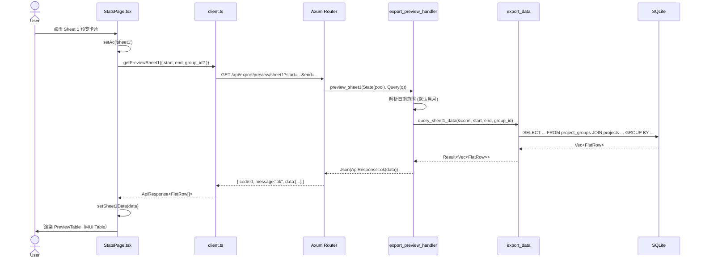
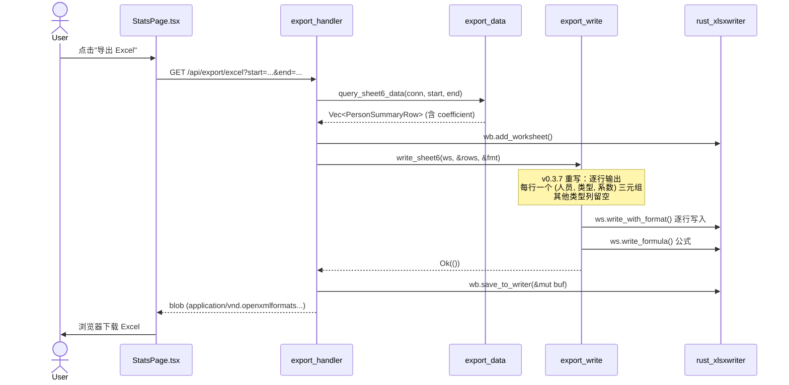
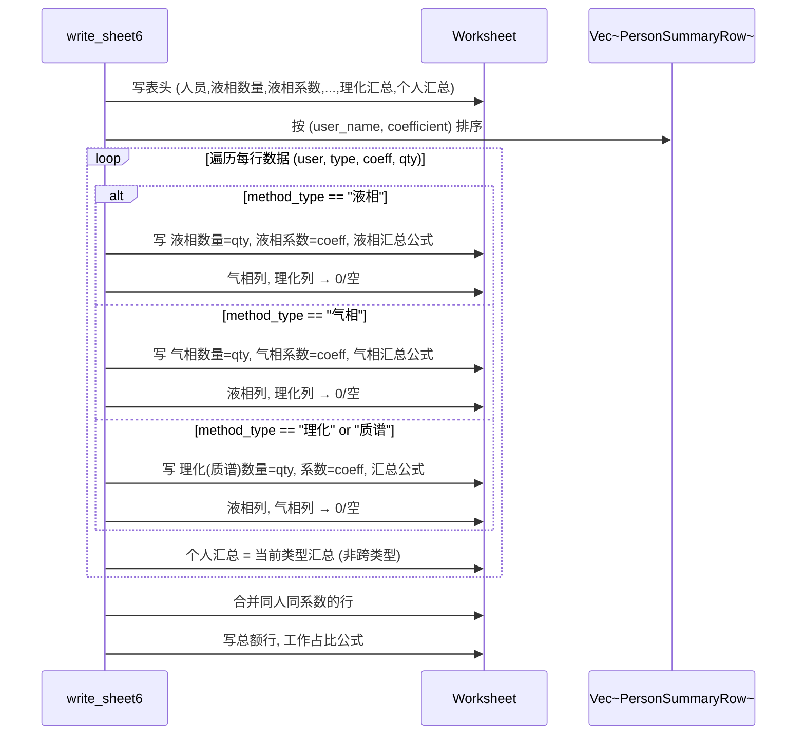
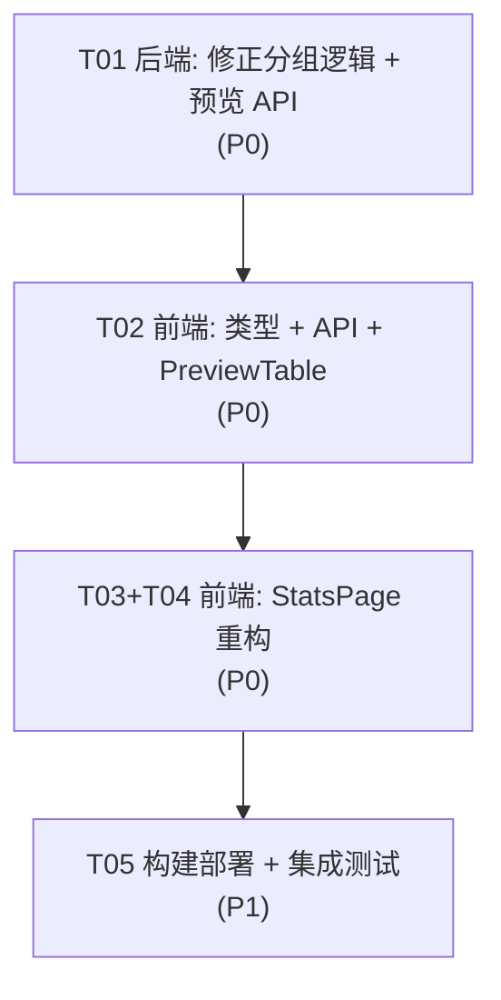

# v0.3.7 系统架构设计 + 任务分解

> **架构师**: 高见远 (Bob)
> **日期**: 2025-07-03
> **基于**: PRD v0.3.7 (产品经理 Alice)

---

## Part A: 系统设计

### 1. 实现方案 (Implementation Approach)

#### 1.1 核心技术挑战

| 挑战 | 分析 | 策略 |
|------|------|------|
| **Sheet 6/7/8 分组逻辑修正** | 当前 `export_write.rs` 的 HashMap 聚合逻辑与 SQL `GROUP BY` 不匹配：SQL 已正确分组（含 coefficient/amount），但 write 函数将同 person/lab/project 的多行合并为一行 | 修改 write 函数：直接逐行输出，不做跨行聚合 |
| **质谱类型支持** | Sheet 6 需要支持"质谱"作为新的 method_type | SQL 已通过 `method_types` 表动态读取，无需硬编码；write 函数需增加"质谱"列 |
| **10 个预览 API** | 新增 10 个 REST 端点，每个对应一个 Sheet 的数据查询 | 直接复用 `export_data::query_sheetN_data()` 函数，薄封装 |
| **StatsPage 从 7 卡→12 卡** | 现有卡片架构 `TabValue` 仅支持 7 种视图 | 扩展 `TabValue` 类型，新增 10 个 Sheet 预览卡片 |

#### 1.2 架构决策

- **后端框架**: 沿用 Axum 0.7 + rusqlite 0.31 + r2d2 连接池
- **前端框架**: 沿用 React 18 + TypeScript + MUI 5 + dayjs
- **导出库**: 沿用 `rust_xlsxwriter` 0.78（注意 `write_formula()` 只接受 `&str`，需 `.as_str()`）
- **路由模式**: 继续使用 `.merge()` 模式注册子路由
- **数据一致性**: 预览 API 直接调用 `export_data::query_sheetN_data()`，与导出共用同一 SQL

#### 1.3 分组逻辑修正详解

**Sheet 6（人员汇总表）— write_sheet6 修正**:

当前问题：HashMap `user_data` 按 user_name 聚合，每个类型只存一个 coefficient（后值覆盖前值）。

修正后：
- SQL 已正确 GROUP BY `(user_name, mt.name, m.coefficient)`
- write 函数改为逐行输出，一行对应一个 `(user, type, coefficient)` 三元组
- 每行只填其 type 对应的列，其他 type 列留空/为 0
- 新增"质谱"列支持（C/D 列对）

**Sheet 7（实验室总表）— write_sheet7 修正**:

当前问题：HashMap `grouped` 按 `(lab, project)` 聚合，amount 被覆盖。

修正后：
- SQL 已正确 GROUP BY `(pg.id, p.id, mt.name, m.amount)`
- 直接逐行输出，一行对应一个 `(lab, project, type, amount)` 四元组
- 合并逻辑仅用于实验室列的视觉合并

**Sheet 8（项目总表）— write_sheet8 修正**:

当前问题：HashMap `grouped` 按 `project` 聚合，amount 被覆盖。

修正后：
- SQL 已正确 GROUP BY `(p.id, mt.name, m.amount)`
- 直接逐行输出，一行对应一个 `(project, type, amount)` 三元组
- 合并逻辑仅用于项目名的视觉合并

---

### 2. 文件列表 (File List)

#### 2.1 新增文件

```
src/api/export_preview_handler.rs    ← 10 个预览 API 端点
```

#### 2.2 修改文件 (后端)

```
src/api/mod.rs                        ← 注册 export_preview_handler 路由
src/api/export_data.rs                ← 修正 Sheet 6/7/8 查询（极小改动，SQL 已正确）
src/api/export_write.rs               ← 重写 write_sheet6/7/8，修正分组逻辑
```

#### 2.3 修改文件 (前端)

```
project-root/frontend/src/types/index.ts           ← 新增预览数据类型 + 扩展 TabValue
project-root/frontend/src/api/client.ts            ← 新增 10 个预览 API 函数
project-root/frontend/src/pages/StatsPage.tsx       ← 重构：7 卡 → 12 卡
project-root/frontend/src/components/PreviewTable.tsx  ← 新增：通用预览表格组件
```

---

### 3. 数据结构和接口 (Data Structures & Interfaces)

#### 3.1 Rust 后端类型

```mermaid
classDiagram
    direction TB

    class FlatRow {
        <<type alias>>
        (String, String, String, String, i64, bool, f64)
        实验室, 项目代号, 仪器, 方法, 数量, 是否气相, 系数
    }

    class InstrumentDailyRow {
        +String date
        +String instrument
        +String lab
        +String project
        +String method
        +i64 quantity
    }

    class ProjectSummaryRow {
        +String project
        +String lab
        +String instrument
        +String method
        +i64 quantity
        +f64 amount
    }

    class LabSummaryRow {
        +String lab
        +String project
        +String instrument
        +String method
        +i64 quantity
        +f64 amount
    }

    class PersonRecordRow {
        +String recorded_at
        +String lab
        +String project
        +String method
        +String method_type
        +i64 quantity
        +String user_name
    }

    class PersonSummaryRow {
        +String user_name
        +String method_type
        +f64 coefficient
        +i64 quantity
    }

    class LabTotalRow {
        +String lab
        +String project
        +String method_type
        +f64 amount
        +i64 quantity
    }

    class ProjectTotalRow {
        +String project
        +String method_type
        +f64 amount
        +i64 quantity
    }

    class InstrumentSummaryRow {
        +String instrument
        +i64 quantity
        +String instrument_type
    }

    class PhysChemRow {
        +String method
        +i64 quantity
    }

    class PreviewQuery {
        +Option~String~ start
        +Option~String~ end
        +Option~i64~ group_id
    }

    class ExportPreviewHandler {
        +router(pool) Router
        +preview_sheet1() Json~ApiResponse~Vec~FlatRow~~~
        +preview_sheet2() Json~ApiResponse~Vec~InstrumentDailyRow~~~
        +preview_sheet3() Json~ApiResponse~Vec~ProjectSummaryRow~~~
        +preview_sheet4() Json~ApiResponse~Vec~LabSummaryRow~~~
        +preview_sheet5() Json~ApiResponse~Vec~PersonRecordRow~~~
        +preview_sheet6() Json~ApiResponse~Vec~PersonSummaryRow~~~
        +preview_sheet7() Json~ApiResponse~Vec~LabTotalRow~~~
        +preview_sheet8() Json~ApiResponse~Vec~ProjectTotalRow~~~
        +preview_sheet9() Json~ApiResponse~Vec~InstrumentSummaryRow~~~
        +preview_sheet10() Json~ApiResponse~Vec~PhysChemRow~~~
    }

    ExportPreviewHandler ..> FlatRow : returns
    ExportPreviewHandler ..> InstrumentDailyRow : returns
    ExportPreviewHandler ..> ProjectSummaryRow : returns
    ExportPreviewHandler ..> LabSummaryRow : returns
    ExportPreviewHandler ..> PersonRecordRow : returns
    ExportPreviewHandler ..> PersonSummaryRow : returns
    ExportPreviewHandler ..> LabTotalRow : returns
    ExportPreviewHandler ..> ProjectTotalRow : returns
    ExportPreviewHandler ..> InstrumentSummaryRow : returns
    ExportPreviewHandler ..> PhysChemRow : returns
```

#### 3.2 前端 TypeScript 类型

```typescript
// === 扩展 TabValue（types/index.ts） ===
export type TabValue =
  | 'week' | 'month'           // 概览卡片（保留）
  | 'user' | 'project' | 'type' | 'instrument' | 'user-log'  // 原有（保留）
  | 'sheet1' | 'sheet2' | 'sheet3' | 'sheet4' | 'sheet5'    // 新增预览
  | 'sheet6' | 'sheet7' | 'sheet8' | 'sheet9' | 'sheet10';  // 新增预览

// === 预览数据行类型（与 Rust 结构体一一对应） ===
export interface FlatRow {
  lab: string;
  project_code: string;
  instrument: string;
  method: string;
  quantity: number;
  is_gc: boolean;
  coefficient: number;
}

export interface InstrumentDailyRow {
  date: string;
  instrument: string;
  lab: string;
  project: string;
  method: string;
  quantity: number;
}

export interface ProjectSummaryRow {
  project: string;
  lab: string;
  instrument: string;
  method: string;
  quantity: number;
  amount: number;
}

export interface LabSummaryRow {
  lab: string;
  project: string;
  instrument: string;
  method: string;
  quantity: number;
  amount: number;
}

export interface PersonRecordRow {
  recorded_at: string;
  lab: string;
  project: string;
  method: string;
  method_type: string;
  quantity: number;
  user_name: string;
}

export interface PersonSummaryRow {
  user_name: string;
  method_type: string;
  coefficient: number;
  quantity: number;
}

export interface LabTotalRow {
  lab: string;
  project: string;
  method_type: string;
  amount: number;
  quantity: number;
}

export interface ProjectTotalRow {
  project: string;
  method_type: string;
  amount: number;
  quantity: number;
}

export interface InstrumentSummaryRow {
  instrument: string;
  quantity: number;
  instrument_type: string;
}

export interface PhysChemRow {
  method: string;
  quantity: number;
}

// === 预览卡片配置类型 ===
export interface PreviewCardDef {
  key: TabValue;
  label: string;
  icon: React.ReactNode;
  color: string;
  desc: string;
  category: 'overview' | 'preview';
  columns: ColumnDef[];
}

export interface ColumnDef {
  field: string;
  headerName: string;
  width?: number;
  align?: 'left' | 'right' | 'center';
}
```

#### 3.3 API 端点定义

| 方法 | 路径 | 查询参数 | 返回类型 |
|------|------|----------|----------|
| GET | `/api/export/preview/sheet1` | `start?`, `end?`, `group_id?` | `ApiResponse<FlatRow[]>` |
| GET | `/api/export/preview/sheet2` | `start?`, `end?` | `ApiResponse<InstrumentDailyRow[]>` |
| GET | `/api/export/preview/sheet3` | `start?`, `end?` | `ApiResponse<ProjectSummaryRow[]>` |
| GET | `/api/export/preview/sheet4` | `start?`, `end?` | `ApiResponse<LabSummaryRow[]>` |
| GET | `/api/export/preview/sheet5` | `start?`, `end?` | `ApiResponse<PersonRecordRow[]>` |
| GET | `/api/export/preview/sheet6` | `start?`, `end?` | `ApiResponse<PersonSummaryRow[]>` |
| GET | `/api/export/preview/sheet7` | `start?`, `end?` | `ApiResponse<LabTotalRow[]>` |
| GET | `/api/export/preview/sheet8` | `start?`, `end?` | `ApiResponse<ProjectTotalRow[]>` |
| GET | `/api/export/preview/sheet9` | `start?`, `end?` | `ApiResponse<InstrumentSummaryRow[]>` |
| GET | `/api/export/preview/sheet10` | `start?`, `end?` | `ApiResponse<PhysChemRow[]>` |

#### 3.4 CardDef 配置表（12 张卡片）

```typescript
const PREVIEW_CARDS: PreviewCardDef[] = [
  // === 概览类（2 张，沿用现有） ===
  { key: 'week',  category: 'overview', label: '按周统计',  icon: <ViewWeekIcon />,          color: '#667eea', desc: '每月第几周汇总',       columns: [...] },
  { key: 'month', category: 'overview', label: '按月统计',  icon: <CalendarMonthIcon />,      color: '#43a047', desc: '每月汇总数据',         columns: [...] },

  // === 导出预览类（10 张，新增） ===
  { key: 'sheet1',  category: 'preview', label: '实验室-项目-方法',     icon: <ScienceIcon />,              color: '#1976D2', desc: 'Sheet 1 数据预览', columns: [
    { field: 'lab',          headerName: '使用实验室',   width: 120 },
    { field: 'project_code', headerName: '项目代号',     width: 140 },
    { field: 'instrument',   headerName: '液相仪器',     width: 120 },
    { field: 'method',       headerName: '检测方法',     width: 200 },
    { field: 'quantity',     headerName: '检测数量',     width: 100, align: 'right' },
  ]},
  { key: 'sheet2',  category: 'preview', label: '仪器-汇总',           icon: <PrecisionManufacturingIcon />, color: '#43A047', desc: 'Sheet 2 数据预览', columns: [
    { field: 'date',       headerName: '日期',   width: 110 },
    { field: 'instrument', headerName: '仪器',   width: 110 },
    { field: 'lab',        headerName: '实验室', width: 110 },
    { field: 'project',    headerName: '项目',   width: 160 },
    { field: 'method',     headerName: '方法',   width: 200 },
    { field: 'quantity',   headerName: '数量',   width: 80, align: 'right' },
  ]},
  { key: 'sheet3',  category: 'preview', label: '项目-汇总（含金额）',  icon: <FolderIcon />, color: '#FF9800', desc: 'Sheet 3 数据预览', columns: [
    { field: 'project',    headerName: '项目',         width: 160 },
    { field: 'lab',        headerName: '实验室',       width: 110 },
    { field: 'instrument', headerName: '仪器',         width: 110 },
    { field: 'method',     headerName: '方法',         width: 200 },
    { field: 'quantity',   headerName: '数量',         width: 80, align: 'right' },
    { field: 'amount',     headerName: '方法对应金额', width: 110, align: 'right' },
  ]},
  { key: 'sheet4',  category: 'preview', label: '实验室-汇总（含金额）', icon: <ScienceIcon />, color: '#9C27B0', desc: 'Sheet 4 数据预览', columns: [
    { field: 'lab',        headerName: '实验室',       width: 110 },
    { field: 'project',    headerName: '项目',         width: 160 },
    { field: 'instrument', headerName: '仪器',         width: 110 },
    { field: 'method',     headerName: '方法',         width: 200 },
    { field: 'quantity',   headerName: '数量',         width: 80, align: 'right' },
    { field: 'amount',     headerName: '方法对应金额', width: 110, align: 'right' },
  ]},
  { key: 'sheet5',  category: 'preview', label: '人员-汇总（原始记录）', icon: <HistoryIcon />, color: '#E91E63', desc: 'Sheet 5 数据预览', columns: [
    { field: 'recorded_at', headerName: '录入时间', width: 150 },
    { field: 'lab',         headerName: '实验室',   width: 110 },
    { field: 'project',     headerName: '研发项目', width: 160 },
    { field: 'method',      headerName: '方法',     width: 200 },
    { field: 'method_type', headerName: '检测类型', width: 90 },
    { field: 'quantity',    headerName: '数量',     width: 80, align: 'right' },
    { field: 'user_name',   headerName: '录入人',   width: 100 },
  ]},
  { key: 'sheet6',  category: 'preview', label: '人员汇总表（含系数）',  icon: <PeopleIcon />, color: '#00BCD4', desc: 'Sheet 6 数据预览', columns: [
    { field: 'user_name',   headerName: '人员',     width: 90 },
    { field: 'method_type', headerName: '检测类型', width: 80 },
    { field: 'coefficient', headerName: '系数',     width: 70, align: 'right' },
    { field: 'quantity',    headerName: '数量',     width: 80, align: 'right' },
  ]},
  { key: 'sheet7',  category: 'preview', label: '实验室总表',           icon: <ScienceIcon />, color: '#4CAF50', desc: 'Sheet 7 数据预览', columns: [
    { field: 'lab',         headerName: '实验室',     width: 110 },
    { field: 'project',     headerName: '项目',       width: 160 },
    { field: 'method_type', headerName: '检测类型',   width: 80 },
    { field: 'amount',      headerName: '金额',       width: 90, align: 'right' },
    { field: 'quantity',    headerName: '数量',       width: 80, align: 'right' },
  ]},
  { key: 'sheet8',  category: 'preview', label: '项目总表',             icon: <FolderIcon />, color: '#FFC107', desc: 'Sheet 8 数据预览', columns: [
    { field: 'project',     headerName: '项目',       width: 200 },
    { field: 'method_type', headerName: '检测类型',   width: 80 },
    { field: 'amount',      headerName: '金额',       width: 90, align: 'right' },
    { field: 'quantity',    headerName: '数量',       width: 80, align: 'right' },
  ]},
  { key: 'sheet9',  category: 'preview', label: '仪器类型汇总',         icon: <PrecisionManufacturingIcon />, color: '#9E9E9E', desc: 'Sheet 9 数据预览', columns: [
    { field: 'instrument',      headerName: '仪器编号', width: 130 },
    { field: 'quantity',        headerName: '检测量',   width: 80, align: 'right' },
    { field: 'instrument_type', headerName: '类型',     width: 80 },
  ]},
  { key: 'sheet10', category: 'preview', label: '理化汇总',             icon: <ScienceIcon />, color: '#795548', desc: 'Sheet 10 数据预览', columns: [
    { field: 'method',   headerName: '方法', width: 300 },
    { field: 'quantity', headerName: '数量', width: 80, align: 'right' },
  ]},
];
```

---

### 4. 程序调用流程 (Program Call Flow)

#### 4.1 StatsPage 预览流程



#### 4.2 导出流程（Excel 写入层修正）



#### 4.3 write_sheet6 新逻辑



---

### 5. 待明确事项 (Anything UNCLEAR)

| # | 事项 | 假设/处理方式 |
|---|------|---------------|
| 1 | **Sheet 6 的"质谱"列位置**：模板中质谱是第 4 种类型（液相/气相/理化/质谱），还是替换理化？ | 假设为第 4 种类型，增加质谱数量+系数+汇总三列，表格变为 17 列 |
| 2 | **Sheet 6 "同人不同系数分行"** 时，同一人员多行的"工作占比"如何计算？ | 工作占比 = 本行个人汇总 / 所有人汇总总额 |
| 3 | **Frontend 源码位置**：`project-root/frontend/src/` 与 `workload-tool-rust/v0.3.7/static/` 的关系？ | 假设构建后从 `project-root/frontend/dist/` 复制到 `static/` |
| 4 | **预览 API 是否也需要按 `method_type` 表动态发现新类型？** | 当前 SQL 通过 LEFT JOIN `method_types`，自动支持新类型 |
| 5 | **预览表格是否需要分页？** | 首版不分页，纯数据列表；如数据量大（>1000 行）后续可加分页 |

---

## Part B: 任务分解

### 6. 依赖包列表 (Required Packages)

所有包已在 `Cargo.toml` 中声明，无新增 Rust 依赖。前端无新增 npm 依赖。

```
- axum@0.7: HTTP 框架 (已有)
- rusqlite@0.31: SQLite 驱动 (已有)
- rust_xlsxwriter@0.78: Excel 写入 (已有)
- serde@1: 序列化 (已有)
- react@^18: UI 框架 (已有)
- @mui/material@^5: 组件库 (已有)
- dayjs@^1: 日期处理 (已有)
```

### 7. 任务列表 (Task List)

> **硬约束**: 不超过 5 个任务，每个任务至少 3 个相关文件

| Task ID | 任务名称 | 源文件 | 依赖 | 优先级 |
|---------|----------|--------|------|--------|
| **T01** | **后端：修正导出分组逻辑 + 预览 API** | `src/api/export_data.rs` (改), `src/api/export_write.rs` (改), `src/api/export_preview_handler.rs` (新), `src/api/mod.rs` (改) | — | P0 |
| **T02** | **前端：类型定义 + API 客户端 + 预览表格组件** | `types/index.ts` (改), `api/client.ts` (改), `components/PreviewTable.tsx` (新) | T01 | P0 |
| **T03** | **前端：StatsPage 重构 — 卡片网格 + 路由状态** | `pages/StatsPage.tsx` (改) | T02 | P0 |
| **T04** | **前端：StatsPage 重构 — 各 Sheet 表格视图** | `pages/StatsPage.tsx` (改, 同 T03 同一文件不同部分) | T03 | P0 |
| **T05** | **构建部署：编译后端 + 编译前端 + 集成测试** | `Cargo.toml` (验证), `static/` (部署), `docs/system_design.md` (最终审查) | T04 | P1 |

**注意**：由于 T03 和 T04 修改同一个文件，实际实现时应合并。这里拆分是为了展示逻辑分组。如需严格遵守 5 任务上限，可将 T03+T04 合并为单任务。

> **工程建议**: 将 T03 和 T04 合并为 **T03: 前端 StatsPage 重构（卡片 + 表格视图）**，实际共 4 个任务。

#### 任务详情

**T01: 后端：修正导出分组逻辑 + 预览 API**

| 文件 | 改动内容 |
|------|----------|
| `src/api/export_data.rs` | ① 为 Sheet 6 查询增加 `CASE WHEN` 按系数分组，支持质谱类型；② 确认 Sheet 7/8 GROUP BY 已含 amount（当前 SQL 已正确） |
| `src/api/export_write.rs` | ① 重写 `write_sheet6()`：移除 HashMap 聚合，逐行写入；每行按 method_type 填对应列；新增质谱列；② 重写 `write_sheet7()`：移除 HashMap 聚合，逐行输出；仅合并实验室列；③ 重写 `write_sheet8()`：移除 HashMap 聚合，逐行输出；仅合并项目名列 |
| `src/api/export_preview_handler.rs` | 新建文件：10 个 handler 函数，每个直接调用 `export_data::query_sheetN_data()`，返回 `Json<ApiResponse<Vec<T>>>` |
| `src/api/mod.rs` | 添加 `pub mod export_preview_handler;` 并在 `api_router()` 中 `.merge(export_preview_handler::router(pool.clone()))` |

**T02: 前端类型定义 + API 客户端 + 预览表格组件**

| 文件 | 改动内容 |
|------|----------|
| `types/index.ts` | ① 扩展 `TabValue`：新增 `'sheet1'` ~ `'sheet10'`；② 新增 10 个预览数据接口；③ 新增 `PreviewCardDef` 和 `ColumnDef` 类型 |
| `api/client.ts` | 新增 10 个导出函数：`getPreviewSheet1()` ~ `getPreviewSheet10()` |
| `components/PreviewTable.tsx` | 新建通用预览表格组件：接收 `columns: ColumnDef[]` + `rows: any[]`，渲染 MUI Table |

**T03+T04 (合并): 前端 StatsPage 重构**

| 文件 | 改动内容 |
|------|----------|
| `pages/StatsPage.tsx` | ① 12 张卡片配置（2 概览 + 10 预览）；② 点击卡片切换视图；③ 保留原有概览表格逻辑；④ 10 个 Sheet 预览表格渲染；⑤ 加载状态/错误处理 |

**T05: 构建部署 + 集成测试**

| 文件 | 改动内容 |
|------|----------|
| `Cargo.toml` | 确认版本 0.3.7，依赖无变化 |
| `static/` | 前端构建产物复制到 static/ 目录 |
| 端到端验证 | 启动服务 → 进入 StatsPage → 点击各预览卡片 → 数据一致性验证 → 导出 Excel 验证 |

### 8. 共享知识 (Shared Knowledge)

```
- 所有 API 响应格式: { code: i32, message: String, data: T | null }
- code=0 表示成功，code=1001 参数错误，code=2001 数据错误，code=5000 内部错误
- 日期格式: start/end 统一使用 YYYY-MM-DD，后端内部拼接 T23:59:59 作为结束时刻
- 路由注册: axum 0.7 使用 .merge() 模式，路由参数使用 :param 语法（非 {param}）
- rust_xlsxwriter write_formula() 只接受 &str，format!() 结果需 .as_str()
- 所有写操作通过事务包裹，审计日志使用 log_on_conn
- 预览 API 复用 export_data 查询函数，与导出使用完全相同 SQL
- 前端 MUI sx prop 中使用自定义 borderRadius: R = '2px'
- 前端使用 dayjs + isoWeek 插件处理 ISO 周
- Sheet 6 写函数新逻辑: 一行对应一个 (人员, 检测类型, 系数) 三元组，不跨类型聚合
- Sheet 7/8 写函数新逻辑: 一行对应一个 (lab/project, type, amount) 四/三元组，不跨金额聚合
- module 路径: 后端在 workload-tool-rust/v0.3.7/src/; 前端在 project-root/frontend/src/
- 前端构建输出: project-root/frontend/dist/ → 复制到 static/
```

### 9. 任务依赖图 (Task Dependency Graph)



### 附录 A: write_sheet6 修正前/后对比

**修正前**（v0.3.6）:
```
HashMap<user_name, (lc_qty, lc_coef, gc_qty, gc_coef, ph_qty, ph_coef)>
→ 每个用户一行，同类型不同系数的数据被合并（系数被覆盖）
```

**修正后**（v0.3.7）:
```
直接遍历 Vec<PersonSummaryRow>，逐行输出
→ (张三, 液相, 1.0, 10) → 一行，仅填液相列
→ (张三, 液相, 2.0, 5)  → 另一行，仅填液相列
→ (张三, 气相, 1.5, 8)  → 另一行，仅填气相列
→ 同人同系数多类型的行可合并（共享人员名单元格）
```

### 附录 B: write_sheet7/8 修正前/后对比

**Sheet 7 修正前**:
```
HashMap<(lab, project), (lc_qty, lc_amt, gc_qty, gc_amt, ph_qty, ph_amt)>
→ 每个(lab,project)一行，不同amount被覆盖
```

**Sheet 7 修正后**:
```
直接遍历 Vec<LabTotalRow>，逐行输出
→ (labA, projX, 液相, 100.0, 10) → 一行
→ (labA, projX, 液相, 200.0, 5)  → 另一行（不同金额独立分行）
→ 仅合并实验室列的单元格
```

