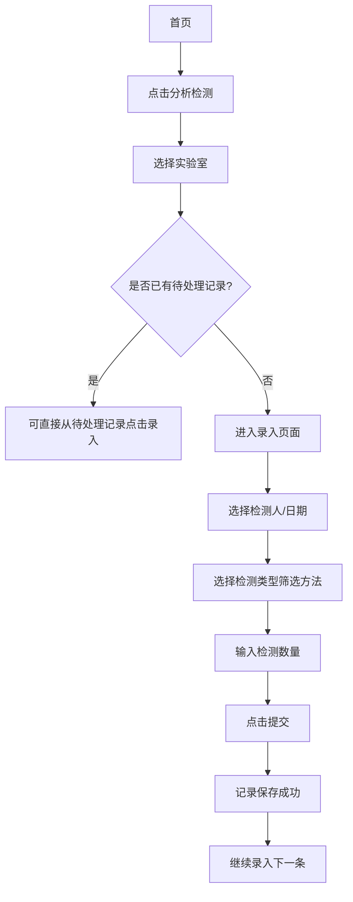

# 样品管理系统（知微）用户使用说明书

> 软件版本：v0.4.47 | 适用对象：实验室检测人员、研发送样人员、管理人员

---

## 目录

- [1. 系统简介](#1-系统简介)
- [2. 安装与启动](#2-安装与启动)
- [3. 登录与退出](#3-登录与退出)
- [4. 系统界面导航](#4-系统界面导航)
- [5. 检测记录录入](#5-检测记录录入)
- [6. 研发送样登记](#6-研发送样登记)
- [7. 样品信息登记](#7-样品信息登记)
- [8. 工作量统计查看](#8-工作量统计查看)
- [9. Excel 导出](#9-excel-导出)
- [10. Excel 导入](#10-excel-导入)
- [11. 用户与权限管理](#11-用户与权限管理)
- [12. 系统设置](#12-系统设置)
- [13. 数据备份与恢复](#13-数据备份与恢复)
- [14. 常见问题排查](#14-常见问题排查)

---

## 1. 系统简介

**样品管理系统（知微）** 是一款面向检测实验室的样品管理及工作量统计工具。系统覆盖三大业务板块：

| 板块 | 说明 |
|------|------|
| **分析检测** | 检测人员在实验室中录入检测数据（液相、气相、理化等） |
| **研发送样** | 研发部门提交样品给实验室检测，跟踪样品状态 |
| **样品信息登记** | 全面的样品台账管理，支持从接收到出报告的全流程跟踪 |

系统基于 Web 浏览器访问，支持 Windows 桌面安装，数据存储在本地，无需联网即可使用。

---

## 2. 安装与启动

### 2.1 安装方式

系统提供两种使用方式：

**方式一：绿色免安装版（推荐）**

双击 `workload-tool.exe` 即可启动，数据文件自动创建在同目录下的 `data/` 文件夹中。

**方式二：InnoSetup 安装包**

1. 双击运行 `workload-tool_Setup.exe`
2. 按照安装向导提示，选择安装目录（建议保持默认）
3. 安装完成后，桌面上会生成快捷方式图标
4. 双击快捷方式启动系统

### 2.2 启动与访问

```
┌──────────────────────────────────────────────────┐
│                                                  │
│  启动程序后，程序会在系统托盘（任务栏右下角）     │
│  显示图标 [知微]。左键双击托盘图标可在默认       │
│  浏览器中打开系统。                              │
│                                                  │
│  默认访问地址：http://127.0.0.1:3001            │
│                                                  │
└──────────────────────────────────────────────────┘
```

### 2.3 系统托盘操作

系统最小化后不会退出，而是缩小到系统托盘区域：

```
┌─────────────┐
│  系统托盘图标  │  右键点击显示菜单：
│     知微     │  ├─ 打开浏览器
│             │  ├─ 查看版本信息
│             │  └─ 退出系统
└─────────────┘
```

> 注意：退出托盘程序后系统将停止运行，浏览器页面将无法访问。

---

## 3. 登录与退出

### 3.1 登录界面

```
┌─────────────────────────────────────────────────────┐
│   ┌─────────────────────────────────────────────┐   │
│   │             知  微                            │   │
│   │         样品管理系统                          │   │
│   │                                              │   │
│   │  ┌─────────────────────────────────┐        │   │
│   │  │ 用户名                         │        │   │
│   │  └─────────────────────────────────┘        │   │
│   │  ┌─────────────────────────────────┐        │   │
│   │  │ 密码                           │        │   │
│   │  └─────────────────────────────────┘        │   │
│   │  ┌─────────────────────────────────┐        │   │
│   │  │ ☐ 记住密码                     │        │   │
│   │  └─────────────────────────────────┘        │   │
│   │                                              │   │
│   │  ┌─────────────────────────────────┐        │   │
│   │  │         登  录                  │        │   │
│   │  └─────────────────────────────────┘        │   │
│   └─────────────────────────────────────────────┘   │
└─────────────────────────────────────────────────────┘
```

### 3.2 默认账号

首次安装后系统提供管理员账号：

| 项目 | 内容 |
|------|------|
| 用户名 | `admin` |
| 密码 | `admin123` |
| 权限 | 管理员（拥有全部操作权限） |

> 建议首次登录后立即修改密码。

### 3.3 退出登录

点击页面右上角的用户头像或名称，在弹出的菜单中选择"退出登录"即可。

---

## 4. 系统界面导航

### 4.1 全局布局

```
┌──────────────────────────────────────────────────┐
│  [知微]      首页  检测  送样  统计  [管理员]🔻  │  ← 顶部导航栏
├──────────────────────────────────────────────────┤
│                                                  │
│                页面主要内容区域                     │
│                                                  │
│                                                  │
├──────────────────────────────────────────────────┤
│              底部（版权信息）                     │
└──────────────────────────────────────────────────┘
```

### 4.2 首页功能入口

登录后进入首页，您会看到三个功能卡片：

```
┌──────────────────────────────────────────────────┐
│                                                  │
│        ┌──────┐    ┌────────┐    ┌──────────┐   │
│        │研发送样│    │分析检测 │    │样品信息登记│   │
│        │  🧪  │    │   🧪  │    │   🧪   │   │
│        │ 橙色  │    │  蓝色  │    │   绿色   │   │
│        └──────┘    └────────┘    └──────────┘   │
│                                                  │
└──────────────────────────────────────────────────┘
```

- **研发送样**（橙色）：研发部门提交样品送样
- **分析检测**（蓝色）：检测人员录入检测数据
- **样品信息登记**（绿色）：全面的样品台账管理

> 注意：根据您的权限，某些卡片可能不可见。

### 4.3 帮助页面

点击页面顶部导航栏中的"帮助"按钮（或从管理页进入），可以查看系统管理员上传的帮助文档和操作教程文章。

```
┌──────────────────────────────────────────────────┐
│  教程与帮助                                        │
│                                                  │
│  ┌─────────┐  ┌─────────┐  ┌─────────┐          │
│  │ 入门指南  │  │ 操作手册  │  │ 常见问题  │          │
│  │  📄     │  │  📄     │  │  📄     │          │
│  │ 2026-07 │  │ 2026-07 │  │ 2026-07 │          │
│  │ [阅读]  │  │ [阅读]  │  │ [阅读]  │          │
│  └─────────┘  └─────────┘  └─────────┘          │
│                                                  │
└──────────────────────────────────────────────────┘
```

---

## 5. 检测记录录入

### 5.1 选择实验室

从首页点击"分析检测"后，进入实验室选择页面：

```
┌──────────────────────────────────────────────────┐
│  分析检测  [搜索实验室...]                        │
│                                                  │
│  事业部筛选: [全部] [色谱中心] [物性室] [质谱室]  │
│                                                  │
│  ┌──────────┐  ┌──────────┐  ┌──────────┐      │
│  │  液相室   │  │  气相室   │  │  理化室   │      │
│  │ 5条待处理 │  │ 3条待处理 │  │ 0条待处理 │      │
│  └──────────┘  └──────────┘  └──────────┘      │
│                                                  │
│  [查看统计]  [待处理记录]                        │
└──────────────────────────────────────────────────┘
```

### 5.2 录入检测数据

点击具体实验室卡片后，进入检测记录录入页面：

```
┌──────────────────────────────────────────────────┐
│  ← 返回  液相室 - 检测录入                       │
│                                                  │
│  检测人: [张工]      日期: [2026-07-13]          │
│                                                  │
│  检测类型: [全部] [液相] [气相] [理化]           │
│                                                  │
│  ┌────────────────────────────────────────────┐  │
│  │ 方法名称     系数 类型 关联项目     数量    │  │
│  │ ────────────────────────────────────────── │  │
│  │ 含量测定@LC[LC1]  1.2  液相 HPC    [5] [提交]│  │
│  │ 有关物质@LC[LC1]  1.0  液相 HPC    [3] [提交]│  │
│  │ 残留溶剂@GC[GC1]  0.8  气相 API    [2] [提交]│  │
│  └────────────────────────────────────────────┘  │
│                                                  │
│  ┌─ 今日已录入记录 ─────────────────────────┐    │
│  │ 时间     实验室  项目  检测人  方法  数量  │    │
│  │ 09:30   液相室  HPC   张工   含量测定  5  │    │
│  │ 10:15   气相室  API   李工   残留溶剂  2  │    │
│  └──────────────────────────────────────────┘    │
└──────────────────────────────────────────────────┘
```

**录入步骤：**

1. **选择检测人**：从下拉列表中选择您的姓名（或手动输入）
2. **选择日期**：默认为当天，可修改
3. **筛选检测类型**：点击类型标签（液相/气相/理化）筛选方法列表
4. **输入数量**：在每个方法行右侧的输入框中填写检测样品数量
5. **提交**：点击方法行右侧的"提交"按钮，该条记录即被保存

### 5.3 操作流程示意图



### 5.4 关于"系数"和"单价倍率"

每条检测方法都对应一个**系数**，代表该检测项目的复杂程度（权重）。例如：

- 简单检测：系数 = 1.0
- 复杂检测：系数 = 1.5
- 特殊检测：系数 = 2.0

系统会自动将"检测数量 × 系数 × 单价倍率"计算出**系数分**，作为工作量核算的依据。

---

## 6. 研发送样登记

### 6.1 进入送样页面

从首页点击"研发送样"（橙色卡片）进入。

### 6.2 选择实验室

与检测录入类似，先选择目标实验室（送样到哪个实验室检测）。

### 6.3 送样录入

```
┌──────────────────────────────────────────────────┐
│  ← 返回  液相室 - 研发送样                       │
│                                                  │
│  送样人: [张三]   日期: [2026-07-13]             │
│                                                  │
│  ┌────────────────────────────────────────────┐  │
│  │  #  项目  检测类型  方法    数量  批号  备注 │  │
│  │ ────────────────────────────────────────── │  │
│  │  1  HPC    液相    含量测定  5   B001      │  │
│  │     [项目▼] [类型▼] [方法▼] [ ] [ ] [  ] │  │
│  │ ────────────────────────────────────────── │  │
│  │  2  API    气相    残留溶剂  3   B002      │  │
│  │     [项目▼] [类型▼] [方法▼] [ ] [ ] [  ] │  │
│  │ ────────────────────────────────────────── │  │
│  │  [+] 添加一行                              │  │
│  └────────────────────────────────────────────┘  │
│                                                  │
│  [提交送样]                                      │
└──────────────────────────────────────────────────┘
```

**操作步骤：**

1. 每行填写一个样品的送样信息
2. 选择项目、检测类型、检测方法
3. 填写数量、批号、注意事项等
4. 点击"添加一行"可增加多个送样条目
5. 确认无误后点击底部"提交送样"

### 6.4 送样跟踪

```
┌──────────────────────────────────────────────────┐
│  ← 返回  研发送样记录                           │
│                                                  │
│  #  项目  实验室  方法  送样人  状态        操作  │
│  1  HPC    液相室 含量测定  张三  [已取样]  ✓   │
│  2  API    气相室 残留溶剂  张三  [待取样] [取样] │
│  3  HPC    液相室 有关物质  张三  [待取样] [取样] │
│                                                  │
└──────────────────────────────────────────────────┘
```

送样记录包含状态跟踪：

| 状态 | 说明 |
|------|------|
| **待取样** | 已送样，实验室尚未取样 |
| **已取样** | 实验室已完成取样，样品进入检测流程 |

> 有"取样"权限的用户可点击"取样"按钮，将状态从"待取样"变为"已取样"。

---

## 7. 样品信息登记

### 7.1 进入样品登记

从首页点击"样品信息登记"（绿色卡片）进入。

### 7.2 选择检测类型

```
┌──────────────────────────────────────────────────┐
│  样品信息登记   [查看统计]                       │
│                                                  │
│  ┌──────────┐  ┌──────────┐  ┌──────────┐      │
│  │  ICP-MS  │  │  热分析   │  │  质谱    │      │
│  │ 6条记录  │  │ 3条记录  │  │ 0条记录  │      │
│  └──────────┘  └──────────┘  └──────────┘      │
│                                                  │
│  查看全部登记记录 >                              │
└──────────────────────────────────────────────────┘
```

### 7.3 样品登记录入

选择检测类型后进入登记页面：

```
┌──────────────────────────────────────────────────┐
│  ← 返回  ICP-MS - 样品登记                      │
│                                                  │
│  送样日期: [2026-07-13 14:30]                    │
│                                                  │
│  ┌────────────────────────────────────────────┐  │
│  │  送样人   [张三]                           │  │
│  │  部门     [色谱中心▼]                      │  │
│  │  实验室   [液相室▼]                        │  │
│  │  项目     [HPC▼]                           │  │
│  │  方法     [含量测定▼]                      │  │
│  │  数量     [5]                              │  │
│  │  批号     [B001]                           │  │
│  │  主要成分  [XXXX]                          │  │
│  │  注意事项  [请避光保存]                    │  │
│  │ ─────────────────────────────────────────  │  │
│  │ [自定义字段1] [    ]   [自定义字段2] [   ] │  │
│  └────────────────────────────────────────────┘  │
│                                                  │
│  [+] 添加一行   [提交]                           │
│                                                  │
│  ┌─ 已登记记录 ────────────────────────────┐    │
│  │  # 送样人 项目 方法  状态    操作       │    │
│  │  1 张三   HPC  含量测定 ✅待检测 [编辑] │    │
│  │  2 李四   API  残留溶剂 ✅待检测 [编辑] │    │
│  └──────────────────────────────────────────┘    │
└──────────────────────────────────────────────────┘
```

### 7.4 状态流转与附件功能

样品信息登记支持完整的全流程状态跟踪：

```
待检测 ──→ 待取样 ──→ 已取样 ──→ 检测完成
  ↑          ↑          ↑            ↑
  送样后     取样通知  实验室取样    报告出具
```

**附件上传**：每条记录可以上传附件（如谱图、检测报告等），点击记录旁的"附件"按钮即可上传。

---

## 8. 工作量统计查看

### 8.1 分析检测统计

从任意实验室页面点击"查看统计"按钮，或在导航栏中点击"统计"进入。

```
┌──────────────────────────────────────────────────┐
│  ← 返回  工作量统计                             │
│                                                  │
│  日期范围: [2026-07-01] ~ [2026-07-13]          │
│  事业部过滤: [全部]                              │
│                                                  │
│  ┌──────┐ ┌──────┐ ┌──────┐ ┌──────┐ ┌──────┐ │
│  │汇总   │ │按人员 │ │按项目 │ │按仪器 │ │按部门 │ │
│  └──────┘ └──────┘ └──────┘ └──────┘ └──────┘ │
│                                                  │
│  ┌─ 汇总概览 ───────────────────────────────┐    │
│  │  总检测数量: 1,234    总记录数: 567       │    │
│  │  参与人数: 12       涉及项目: 8           │    │
│  │  总系数分: 2,345.6                        │    │
│  └──────────────────────────────────────────┘    │
│                                                  │
│  按日趋势: [图表]                                │
│                                                  │
│  明细表格:                                        │
│  ┌──────┬──────┬──────┬──────┬──────┐          │
│  │ 日期  │ 液相  │ 气相  │ 理化  │ 合计  │          │
│  ├──────┼──────┼──────┼──────┼──────┤          │
│  │ 07-01 │  45  │  23  │  12  │  80  │          │
│  │ 07-02 │  52  │  18  │  15  │  85  │          │
│  └──────┴──────┴──────┴──────┴──────┘          │
│                                                  │
│  [导出 Excel]                                    │
└──────────────────────────────────────────────────┘
```

### 8.2 统计维度

| 维度 | 说明 |
|------|------|
| **汇总概览** | 总数量、总记录数、参与人数、系数分 |
| **按人员** | 每位检测人员的检测数量汇总 |
| **按项目** | 每个项目的检测数量汇总 |
| **按仪器** | 每台仪器的使用量统计 |
| **按部门（事业部）** | 各部门的检测工作量统计 |
| **按日/周/月** | 按时间维度查看趋势 |

### 8.3 研发送样统计

在研发送样页面同样有独立的统计入口，统计维度和分析检测类似，但数据来源为研发送样记录。

### 8.4 样品信息登记统计

```
┌──────────────────────────────────────────────────┐
│  样品信息登记统计                                │
│                                                  │
│  ┌────────┐ ┌────────┐ ┌────────┐ ┌────────┐   │
│  │按状态   │ │按类型   │ │按实验室 │ │按项目   │   │
│  └────────┘ └────────┘ └────────┘ └────────┘   │
│  ┌────────┐ ┌────────┐ ┌────────┐               │
│  │按送样人 │ │按月统计 │ │导出Excel│              │
│  └────────┘ └────────┘ └────────┘               │
│                                                  │
│  共 156 条记录                                   │
│                                                  │
│  状态分布:                                        │
│  ████████████ 待检测  80  51%                   │
│  ██████       待取样  30  19%                   │
│  ████         已取样  25  16%                   │
│  ████         检测完成 21  13%                  │
└──────────────────────────────────────────────────┘
```

---

## 9. Excel 导出

系统支持将统计结果导出为 Excel 文件，包含丰富的数据表格。

### 9.1 分析检测导出

在统计页面点击"导出 Excel"按钮，系统将生成一个包含 **11 个 Sheet** 的 Excel 文件：

| Sheet | 名称 | 说明 |
|-------|------|------|
| 1 | 各实验室项目方法对应表 | 按实验室、项目、方法列出的详细检测清单 |
| 2 | 仪器-汇总 | 按日期、仪器列出的每日检测汇总 |
| 3 | 项目-汇总 | 每个项目的检测总量和金额 |
| 4 | 实验室-汇总 | 每个实验室的检测总量和金额 |
| 5 | 检测人汇总 | 每位检测人的原始记录明细 |
| 6 | 检测人汇总表 | 人员维度的液相/气相/理化分项汇总 |
| 7 | 实验室总表 | 实验室维度的分类型汇总（含金额） |
| 8 | 项目总表 | 项目维度的分类型汇总 |
| 9 | 仪器汇总表 | 按仪器统计的使用量 |
| 10 | 理化汇总表 | 理化检测专项汇总 |
| 11 | 事业部汇总 | 各部门的检测工作量汇总 |

### 9.2 研发送样导出

在研发送样统计页面导出，同样包含多 Sheet 的 Excel 文件，字段包括送样人、项目、方法、状态等。

### 9.3 样品信息登记导出

在样品信息登记统计页面选择"导出 Excel"，生成 7 个 Sheet 的统计报表。

### 9.4 导出操作流程

```mermaid
graph TD
    A[进入统计页面] --> B[设置日期范围]
    B --> C[点击"导出 Excel"]
    C --> D{系统生成 Excel}
    D --> E[浏览器自动下载]
    E --> F[文件命名: 样品管理_开始日期_结束日期.xlsx]
```

---

## 10. Excel 导入

### 10.1 检测记录导入

对于大量数据的批量录入，系统支持从 Excel 文件导入检测记录：

1. 进入管理后台 → **检测方法管理** → 点击"导入映射"
2. 查看当前导入映射规则（列名对应关系）
3. 准备符合映射规则的 Excel 文件
4. 在相应页面执行导入操作

```
┌──────────────────────────────────────────────────┐
│  导入映射预览                                    │
│                                                  │
│  Excel列名 → 系统字段                          │
│  ──────────────────────────────────────          │
│  实验室    → lab/group_name                     │
│  项目代号  → project_name                       │
│  检测方法  → method_name                         │
│  检测数量  → quantity                            │
│  检测日期  → recorded_at                         │
│  检测人    → user_name                           │
│                                                  │
│  [确认导入]                                      │
└──────────────────────────────────────────────────┘
```

### 10.2 导入注意事项

- 仅支持 `.xlsx` 格式文件
- 文件第一行必须是列标题（表头）
- 导入前请先查看"导入映射"，确保列名匹配
- 导入失败时，系统会返回详细的错误信息，指明哪行哪列有问题

---

## 11. 用户与权限管理

### 11.1 用户管理入口

管理员登录后，在页面右上角点击用户头像 → "管理后台" → "用户管理"。

### 11.2 用户管理界面

```
┌──────────────────────────────────────────────────┐
│  ← 管理后台  用户管理                           │
│                                                  │
│  [注册新用户]                                    │
│                                                  │
│  ┌──────┬──────┬──────┬──────┬──────┬────────┐ │
│  │ 用户名 │ 角色  │ 部门  │ 状态  │ 注册时间 │ 操作   │ │
│  ├──────┼──────┼──────┼──────┼──────┼────────┤ │
│  │ admin │ 管理员 │ -    │ 启用  │ 2026-01 │ [编辑] │ │
│  │ 张工  │ 检测员 │ 色谱 │ 启用  │ 2026-03 │ [编辑] │ │
│  │ 李工  │ 检测员 │ 物性 │ 禁用  │ 2026-04 │ [编辑] │ │
│  │ 张三  │ 送样人 │ 研发 │ 启用  │ 2026-06 │ [编辑] │ │
│  └──────┴──────┴──────┴──────┴──────┴────────┘ │
└──────────────────────────────────────────────────┘
```

### 11.3 角色与权限

系统内置三种角色层次：

| 角色 | 说明 | 典型用户 |
|------|------|---------|
| **管理员** | 拥有全部权限，包括用户管理、系统设置、备份恢复 | IT 管理员 |
| **检测员** | 可以录入检测数据、查看统计，部分管理功能 | 实验室人员 |
| **送样人** | 可以提交研发送样、查看自己的送样记录 | 研发人员 |

> 管理员可以在"角色管理"中自定义角色的权限，精确控制每个功能的访问。

### 11.4 注册新用户

点击"注册新用户"按钮，填写：

- **用户名**：登录时使用的账号
- **密码**：初始密码，用户首次登录后可在个人信息中修改
- **角色**：选择检测员、送样人或管理员
- **所属部门**：选择所属事业部

---

## 12. 系统设置

### 12.1 进入管理后台

管理员点击页面右上角头像 → "管理后台"，即可看到管理功能 Tab 页：

```
┌──────────────────────────────────────────────────┐
│  管理后台                                         │
│                                                  │
│  项目管理 | 实验室管理 | 部门管理 | 检测方法      │
│  回收站  | 审计日志  | 数据备份 | 教程帮助        │
│  样品管理 | 用户管理  | 角色管理 | 布局设置       │
│                                                  │
└──────────────────────────────────────────────────┘
```

### 12.2 研发项目管理

管理研发项目及其关联的检测方法：

```
┌──────────────────────────────────────────────────┐
│  研发项目管理                                    │
│                                                  │
│  ┌──────┬──────┬──────┬──────┬─────────────────┐│
│  │ 项目名 │ 代号 │ 系数 │ 单价  │ 关联方法        ││
│  ├──────┼──────┼──────┼──────┼─────────────────┤│
│  │ HPC  │ HPC  │ 1.2  │ 150  │ 含量测定, 有关物质││
│  │ API  │ API  │ 1.0  │ 120  │ 残留溶剂          ││
│  └──────┴──────┴──────┴──────┴─────────────────┘│
│                                                  │
│  [新增项目]                                      │
└──────────────────────────────────────────────────┘
```

### 12.3 实验室管理

管理实验室信息，每个实验室对应一个检测录入入口。

### 12.4 部门（事业部）管理

管理部门及下属实验室的对应关系，用于按部门维度统计工作量。

### 12.5 检测方法管理

```
┌──────────────────────────────────────────────────┐
│  检测方法管理                                    │
│                                                  │
│  检测类型: [液相] [气相] [理化] [ICP] [热分析]   │
│                                                  │
│  [新增方法]  [新增检测类型]                      │
│                                                  │
│  ┌──────┬──────┬──────┬──────┬────────────────┐ │
│  │ 方法名 │ 类型 │ 系数 │ 仪器  │ 关联项目        │ │
│  ├──────┼──────┼──────┼──────┼────────────────┤ │
│  │ 含量测定│ 液相 │ 1.2  │ LC1  │ HPC, API       │ │
│  │ 有关物质│ 液相 │ 1.0  │ LC1  │ HPC            │ │
│  │ 残留溶剂│ 气相 │ 0.8  │ GC1  │ API            │ │
│  └──────┴──────┴──────┴──────┴────────────────┘ │
│                                                  │
└──────────────────────────────────────────────────┘
```

**关于方法名中的仪器标签：** 方法名中使用 `@[仪器代号]` 的格式标注仪器，例如 `含量测定@LC[LC1]` 表示该方法使用 LC1 号液相色谱仪。

### 12.6 审计日志

记录系统中所有关键操作的日志，用于追溯：

| 信息 | 说明 |
|------|------|
| 操作时间 | 操作发生的具体时间 |
| 操作用户 | 谁执行的操作 |
| 操作类型 | 创建/更新/删除/导出/导入 |
| 操作对象 | 操作了哪张表、哪条记录 |
| 详细内容 | 操作的具体描述 |

### 12.7 布局与主题设置

管理员可以自定义系统的外观：

- **主题色**：系统主色调（默认蓝色）
- **Logo 文字**：左上角显示的品牌名称（默认"知微"）
- **登录页背景**：登录页的背景样式
- **首页卡片配置**：首页显示的入口卡片及顺序

---

## 13. 数据备份与恢复

### 13.1 备份管理入口

管理员 → 管理后台 → "数据备份"

```
┌──────────────────────────────────────────────────┐
│  数据备份                                        │
│                                                  │
│  数据库大小: 12.5 MB                            │
│  备份目录: C:\Users\xxx\...\backups\            │
│                                                  │
│  ┌─ 自动备份设置 ──────────────────────────┐    │
│  │  开启自动备份: [是/否]                   │    │
│  │  备份间隔: [24] 小时                     │    │
│  │  最大保留份数: [10]                      │    │
│  │  [保存设置]                              │    │
│  └──────────────────────────────────────────┘    │
│                                                  │
│  [立即备份]                                      │
│                                                  │
│  数据表概况:                                      │
│  分析检测记录: 1,234 条                          │
│  研发送样记录: 567 条                            │
│                                                  │
│  ┌─ 现有备份文件 ──────────────────────────┐    │
│  │  文件名                      大小   日期    │    │
│  │  workload_20260713_083000.db  8.2M  07-13  │    │
│  │  workload_20260712_083000.db  8.1M  07-12  │    │
│  │  workload_20260711_083000.db  7.9M  07-11  │    │
│  │  [恢复] [下载] [删除]                      │    │
│  └──────────────────────────────────────────┘    │
└──────────────────────────────────────────────────┘
```

### 13.2 手动备份

点击"立即备份"按钮，系统立即创建当前数据库的完整备份。

### 13.3 自动备份

开启自动备份后：

1. 系统会按设定的时间间隔自动创建备份
2. 超过最大保留份数时，最旧的备份会被自动删除
3. 系统托盘会显示最近一次备份时间

### 13.4 恢复备份

> ⚠️ **警告：恢复操作会覆盖当前数据！操作前请确认！**

1. 在备份文件列表中找到需要恢复的备份
2. 点击"恢复"按钮
3. 系统会弹出确认对话框，确认后开始恢复
4. 恢复完成后系统会提示，建议刷新页面

### 13.5 备份文件位置

默认备份文件存储在程序运行目录下的 `backups/` 文件夹中，文件名为 `workload_YYYYMMDD_HHMMSS.db`。

---

## 14. 常见问题排查

### 14.1 登录问题

| 问题 | 可能原因 | 解决方法 |
|------|---------|---------|
| 忘记密码 | — | 联系管理员在用户管理中重置密码 |
| 提示"用户不存在" | 用户名输入错误 | 检查用户名大小写和拼写 |
| 提示"密码错误" | 密码输入错误 | 重新输入，注意 Caps Lock |
| 无法访问页面 | 权限不足 | 联系管理员分配对应权限 |

### 14.2 启动问题

| 问题 | 可能原因 | 解决方法 |
|------|---------|---------|
| 启动后浏览器未自动打开 | 默认浏览器策略 | 手动打开浏览器，访问 http://127.0.0.1:3001 |
| 提示端口被占用 | 3001 端口已被其他程序使用 | 关闭占用端口的程序，或修改配置文件中的端口 |
| 程序启动闪退 | 缺少运行库 | 检查是否安装 VC++ Redistributable |
| 页面加载空白 | 前端资源未加载 | 按 F12 打开开发者工具查看错误信息 |

### 14.3 录入问题

| 问题 | 可能原因 | 解决方法 |
|------|---------|---------|
| 找不到某个检测方法 | 方法未关联到当前实验室/项目 | 联系管理员在方法管理中配置关联 |
| 提交后数据未显示 | 页面未刷新 | 点击"刷新"按钮或切换 Tab 页后再返回 |
| 无法选择某个实验室 | 权限不足或实验室未分配 | 联系管理员检查实验室权限 |
| 送样后状态没变化 | 需要对方取样后才能变更 | 联系实验室人员点击"取样" |

### 14.4 导出/导入问题

| 问题 | 可能原因 | 解决方法 |
|------|---------|---------|
| Excel 导出后无法打开 | 文件损坏 | 重新导出，检查日期范围是否过大 |
| 导出数据为空 | 所选日期范围内无记录 | 调整日期范围后重试 |
| 导入失败 | 格式不匹配 | 检查列名是否与导入映射一致 |
| 导入提示"列名不匹配" | Excel 表头与系统要求不一致 | 查看导入映射，调整 Excel 表头 |
| Excel 文件上传后无响应 | 文件过大或格式问题 | 确保文件为 .xlsx 格式，单文件不超过 10MB |

### 14.5 备份恢复问题

| 问题 | 可能原因 | 解决方法 |
|------|---------|---------|
| 备份失败 | 磁盘空间不足 | 检查磁盘空间，清理临时文件 |
| 恢复后数据不完整 | 备份文件损坏 | 尝试使用其他日期的备份文件 |
| 自动备份未执行 | 程序已退出运行 | 确保程序在后台运行（检查系统托盘） |
| 备份文件找不到 | 备份目录被误删 | 检查 backups/ 目录是否存在 |

### 14.6 性能问题

| 问题 | 建议 |
|------|------|
| 页面操作卡顿 | 关闭不必要的浏览器标签页，或重启程序 |
| 数据量过大导致查询慢 | 缩小统计日期范围，或联系管理员清理历史数据 |
| Excel 导出耗时长 | 导出的数据量大时需耐心等待，避免重复点击 |

### 14.7 其他问题

| 问题 | 解决方法 |
|------|---------|
| 页面显示异常（布局错乱） | 按 Ctrl+F5 强制刷新浏览器缓存 |
| 某些功能按钮不可见 | 请联系管理员检查您的角色权限 |
| 误删了数据 | 到管理后台 → "回收站"中恢复 |
| 系统日期时间不对 | 前往管理后台 → "设置"中调整 |
| 需要反馈问题或建议 | 联系系统维护人员 |

---

## 附录

### A. 快捷键

| 快捷键 | 功能 |
|--------|------|
| Enter | 提交当前输入 |
| Tab | 在录入表单中切换到下一个输入框 |
| Ctrl+F5 | 强制刷新页面 |

### B. 数据存储说明

系统所有数据存储在程序运行目录下的 `data/workload.db` 文件中，这是一个 SQLite 数据库文件。日常使用建议：

- 定期手动备份（建议每周至少一次）
- 开启自动备份功能
- 不要直接编辑或删除数据库文件
- 如需迁移数据，复制整个 `data/` 目录即可

### C. 版本更新日志

| 版本 | 主要更新 |
|------|---------|
| v0.4.47 | 当前版本 |
| v0.4.45 | 优化权限管理，管理员走 JWT 认证 |
| v0.4.35 | 布局设置、主题自定义 |
| v0.4.34 | 研发送样记录行内编辑 |
| v0.4.30 | 样品附件批量查询 |
| v0.4.28 | 事业部统计、事业部汇总 Sheet |
| v0.4.27 | 样品附件上传功能 |
| v0.4.24 | 部门（事业部）管理 |
| v0.4.0  | Excel 导入功能 |
| v0.3.18 | 方法、项目一览弹窗 |
| v0.3.8  | Excel 导出 10 Sheet 重写 |
| v0.3.6  | 角色权限系统 |
| v0.2.17 | 基础功能完成 |
